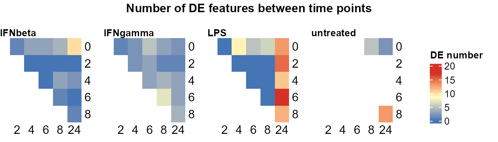
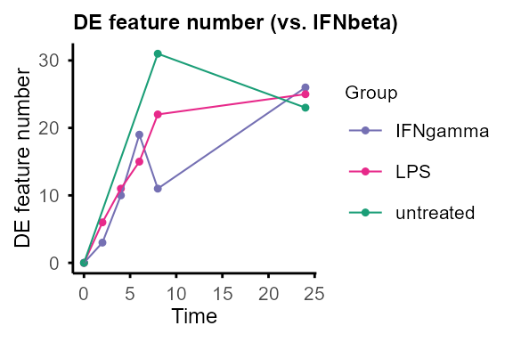
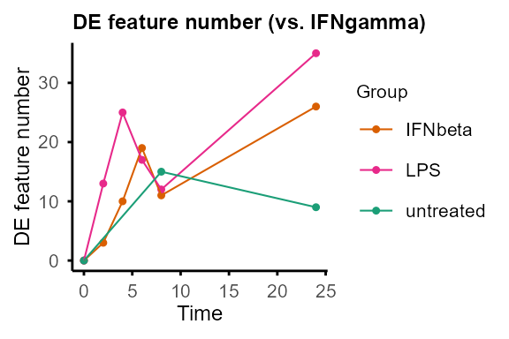
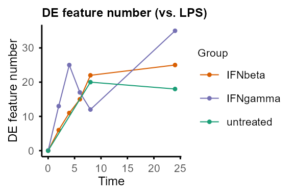
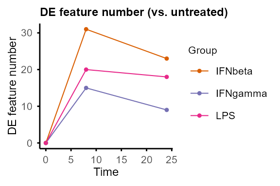
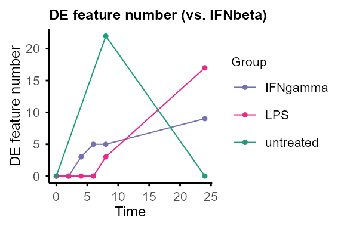
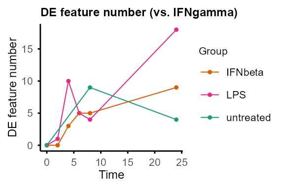
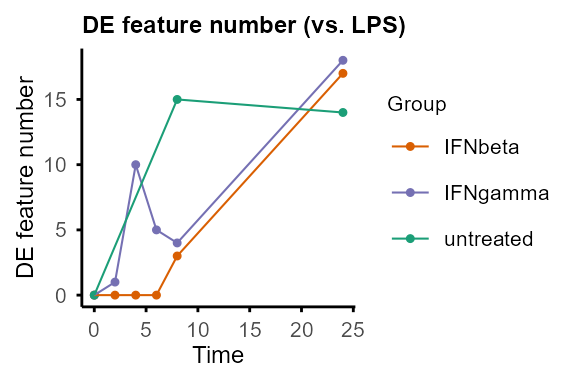
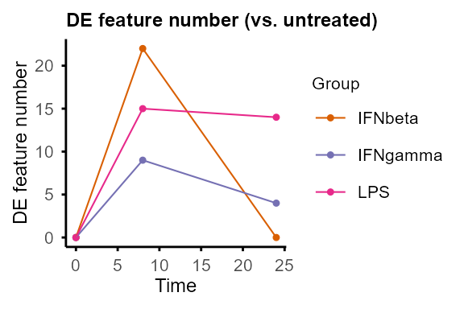
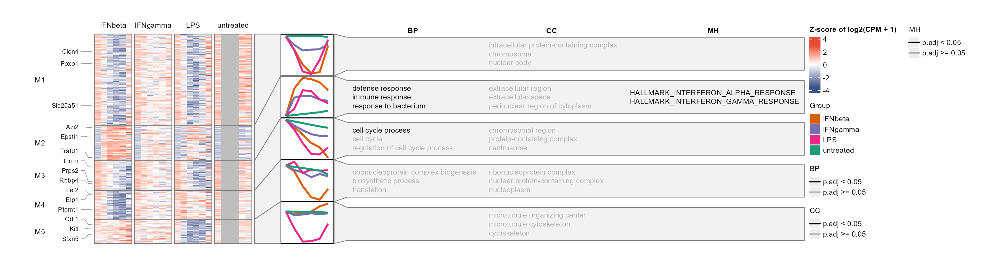

# TiDEomics Tutorial

## Introduction

[**TiDEomics**](https://github.com/hte123/TiDEomics) (Time-course
Differential Expression analysis of omics data) is an R package for
**multi-group time-course omics analysis** built on
`SummarizedExperiment`, especially for comparison of more than two
conditions across time.

`TiDEomics` provides:

- An integrated workflow from data processing to functional
  interpretation, on different omics data types in feature x sample
  matrix format, with handling of missing values.

- An approach to separate **time-dominant**, **group-dominant**, and
  **group-specific temporal** effects through the combination of
  pairwise differential expression, variance decomposition, and
  co-expression module analysis (WGCNA).

- A filtering strategy based on **residual variance** after mixed-model
  variance decomposition, prioritising features with structured
  differential expression over unexplained variation. In comparison,
  traditional filtering by total variance or coefficient of variation is
  less appropriate when biological variation across groups and time
  course is expected.

Existing packages on time-course omics analysis are available, typically
designed for transcriptomics data. Some packages are limited to
two-group comparisons (e.g. `splineTimeR`) or expect raw sequencing
counts (e.g. `ImpulseDE2`, `TCseq`). `maSigPro` supports multi-group
time-course DE analysis via polynomial regression, complementary to
`TiDEomics` with fewer assumptions about temporal trends. `TiDEomics`
also integrates QC, filtering and downstream functional enrichment
within the same workflow.

TiDEomics incorporates `Trendy` (Bacher et al. 2018) which operates on
single time series to estimate breakpoints per group per feature, and
derived variance decomposition from `PALMO` (Vasaikar et al. 2023) and
introduced residual variance as a filtering criterion.

This tutorial demonstrates a basic workflow, explains key parameters,
and gives practical tips.

Key features covered:

- *Preparing input*: Create a `SummarizedExperiment` object with the
  data matrix and sample annotation, with checks for correct formatting.

- *Quality control*: Visualise value distributions and missingness
  patterns.

- *Normalisation, grouping and merging replicates*: Normalise each
  feature to the starting time point when focused on changes from
  baseline. Transform the data for analyses that require single groups
  or single time series.

- *Sample relationships visualisation (correlation matrix, PCA, UMAP)*:
  Explore global structure and major sources of variance, check for
  batch effects, and identify features driving PCs.

- *Pairwise differential expression (by time or group)*: Identify DE
  features between pairs of time points within each group, and between
  pairs of groups at each time point.

- *Classification by feature property (randomness and overall fold
  change)*: Classify features into different categories (e.g.,
  non-random vs. random, differentially expressed vs. stable) based on
  properties including trend significance and maximum fold change.

- *Segmented regression with Trendy*: Estimate breakpoints for each
  feature in each group and summarise dynamic patterns.

- *Variance decomposition modified from PALMO*: Quantify relative
  contributions from `Time`, `Group`, and `Residual`, distinguish time
  or group-dependent DE features and “noisy” features.

- *Module identification with WGCNA*: Identify co-expression modules
  with different temporal and group-specific patterns.

- *Functional enrichment (gene ontology, drugs, etc.)*: Interpret
  biological meaning of identified DE features and modules.

## Installation

``` r
if (!requireNamespace("BiocManager", quietly = TRUE)) {
    install.packages("BiocManager")
}

BiocManager::install("TiDEomics")
```

``` r
library(TiDEomics)
#> Warning: multiple methods tables found for 'transform'
#> Warning: replacing previous import 'BiocGenerics::transform' by
#> 'S4Vectors::transform' when loading 'SummarizedExperiment'
#> Warning: replacing previous import 'BiocGenerics::transform' by
#> 'S4Vectors::transform' when loading 'IRanges'
#> Warning: multiple methods tables found for 'transform'
#> Warning: replacing previous import 'BiocGenerics::transform' by
#> 'S4Vectors::transform' when loading 'Seqinfo'
#> Warning: replacing previous import 'BiocGenerics::transform' by
#> 'S4Vectors::transform' when loading 'GenomicRanges'
#> Warning: replacing previous import 'BiocGenerics::transform' by
#> 'S4Vectors::transform' when loading 'S4Arrays'
#> Warning: replacing previous import 'BiocGenerics::transform' by
#> 'S4Vectors::transform' when loading 'DelayedArray'
#> Warning: replacing previous import 'BiocGenerics::transform' by
#> 'S4Vectors::transform' when loading 'SparseArray'
#> Warning: replacing previous import 'BiocGenerics::transform' by
#> 'S4Vectors::transform' when loading 'XVector'
library(SummarizedExperiment)
#> Loading required package: MatrixGenerics
#> Loading required package: matrixStats
#> 
#> Attaching package: 'MatrixGenerics'
#> The following objects are masked from 'package:matrixStats':
#> 
#>     colAlls, colAnyNAs, colAnys, colAvgsPerRowSet, colCollapse,
#>     colCounts, colCummaxs, colCummins, colCumprods, colCumsums,
#>     colDiffs, colIQRDiffs, colIQRs, colLogSumExps, colMadDiffs,
#>     colMads, colMaxs, colMeans2, colMedians, colMins, colOrderStats,
#>     colProds, colQuantiles, colRanges, colRanks, colSdDiffs, colSds,
#>     colSums2, colTabulates, colVarDiffs, colVars, colWeightedMads,
#>     colWeightedMeans, colWeightedMedians, colWeightedSds,
#>     colWeightedVars, rowAlls, rowAnyNAs, rowAnys, rowAvgsPerColSet,
#>     rowCollapse, rowCounts, rowCummaxs, rowCummins, rowCumprods,
#>     rowCumsums, rowDiffs, rowIQRDiffs, rowIQRs, rowLogSumExps,
#>     rowMadDiffs, rowMads, rowMaxs, rowMeans2, rowMedians, rowMins,
#>     rowOrderStats, rowProds, rowQuantiles, rowRanges, rowRanks,
#>     rowSdDiffs, rowSds, rowSums2, rowTabulates, rowVarDiffs, rowVars,
#>     rowWeightedMads, rowWeightedMeans, rowWeightedMedians,
#>     rowWeightedSds, rowWeightedVars
#> Loading required package: GenomicRanges
#> Loading required package: stats4
#> Loading required package: BiocGenerics
#> Loading required package: generics
#> Warning: package 'generics' was built under R version 4.6.1
#> 
#> Attaching package: 'generics'
#> The following objects are masked from 'package:base':
#> 
#>     as.difftime, as.factor, as.ordered, intersect, is.element, setdiff,
#>     setequal, union
#> 
#> Attaching package: 'BiocGenerics'
#> The following objects are masked from 'package:stats':
#> 
#>     IQR, mad, sd, var, xtabs
#> The following object is masked from 'package:utils':
#> 
#>     data
#> The following objects are masked from 'package:base':
#> 
#>     anyDuplicated, aperm, append, as.data.frame, basename, cbind,
#>     colnames, dirname, do.call, duplicated, eval, evalq, Filter, Find,
#>     get, grep, grepl, is.unsorted, lapply, Map, mapply, match, mget,
#>     order, paste, pmax, pmax.int, pmin, pmin.int, Position, rank,
#>     rbind, Reduce, rownames, sapply, saveRDS, scale, sequence, table,
#>     tapply, transform, unique, unsplit, which.max, which.min
#> Loading required package: S4Vectors
#> 
#> Attaching package: 'S4Vectors'
#> The following object is masked from 'package:utils':
#> 
#>     findMatches
#> The following objects are masked from 'package:base':
#> 
#>     expand.grid, I, unname
#> Loading required package: IRanges
#> 
#> Attaching package: 'IRanges'
#> The following object is masked from 'package:grDevices':
#> 
#>     windows
#> Loading required package: Seqinfo
#> Loading required package: Biobase
#> Welcome to Bioconductor
#> 
#>     Vignettes contain introductory material; view with
#>     'browseVignettes()'. To cite Bioconductor, see
#>     'citation("Biobase")', and for packages 'citation("pkgname")'.
#> 
#> Attaching package: 'Biobase'
#> The following object is masked from 'package:MatrixGenerics':
#> 
#>     rowMedians
#> The following objects are masked from 'package:matrixStats':
#> 
#>     anyMissing, rowMedians
library(org.Mm.eg.db)
#> Loading required package: AnnotationDbi
#> Warning: replacing previous import 'BiocGenerics::transform' by
#> 'S4Vectors::transform' when loading 'AnnotationDbi'
#> Warning: replacing previous import 'utils::data' by 'BiocGenerics::data' when
#> loading 'Biostrings'
#> Warning: replacing previous import 'BiocGenerics::transform' by
#> 'S4Vectors::transform' when loading 'Biostrings'
#> 
```

## Example input

TiDEomics expects:

- `data`: log2-transformed data.frame
  - rows: features (e.g. genes, proteins)
  - columns: First column should be feature identifiers. Other columns
    are numeric measurements of features for each sample.
  - Missing values (NA) are allowed.
- `sample_ann`: data.frame with columns:
  - `Sample`: sample names, match column names of `data`
  - `Group`: experimental group
  - `Time`: numeric time point
  - `Replicate`: replicate ID (optional, auto-generated if absent)
  - `Batch`: batch ID (optional)
  - `Subject`: biological subject ID for repeated-measures designs
    (optional, set via `subject_col`)

Example: subset of
[GSE263759](https://www.ncbi.nlm.nih.gov/geo/query/acc.cgi?acc=GSE263759)
data set published in Traxler et al. (2025).

- Ensembl IDs were mapped to symbols, genes with all zero counts were
  excluded.
- Use time 0 untreated samples for other groups’ time 0.
- Sample 500 random genes.
- Normalised to `log2(CPM + 1)`

``` r
data("tutorial_sample_info", package = "TiDEomics")
data("tutorial_data", package = "TiDEomics")
```

### Preprocessing for different data types

TiDEomics expects log-transformed, normalised data as input. The core
workflow is compatible with any quantitative omics data in a feature x
sample matrix. Enrichment analysis (`enrichGO_list`, `enrichGO_rank`,
`enrichR_list`, `enrich_msigdb`) requires gene identifiers and is not
applicable to non-gene features (e.g., metabolites, lipids).

Batch correction should be applied before input if batch effects are
present.

For the most common scenarios in transcriptomics and proteomics:

- RNA-seq data should be normalised for sequencing depth and composition
  bias before TiDEomics, e.g. with TMM. The tutorial uses
  `log2(CPM + 1)` for simplicity. For pairwise differential expression,
  `trend = TRUE` can be used to account for the mean-variance
  relationship. See below section on [pairwise differential
  expression](#pairwise-de) for details.

- MS-based proteomics data processing software may include normalisation
  when producing protein x sample matrix. Depending on software and
  settings, manual normalisation and log transformation may be required,
  e.g. median normalisation. Missing values are accepted in most
  TiDEomics functions, and a basic imputation function
  [`impute_groups()`](https://hte123.github.io/TiDEomics/reference/impute_groups.md)
  is provided.

## Workflow

We present the workflow as below sections, explaining the usage and
parameters.

### Data preparation

``` r
data_obj <- create_input(
    data = tutorial_data,
    sample_ann = tutorial_sample_info)
#> No Subject column specified. Samples treated as independent. For repeated-measures designs, set subject_col to the column identifying biological subjects.
#> Converting 'Group' column to factor. Default order is alphabetical.
#> Converting 'Replicate' column to factor. Default order is numerical.
#> Converting 'Batch' column to factor. Default order is numerical.

data_obj
```

```
#> class: SummarizedExperiment 
#> dim: 500 40 
#> metadata(0):
#> assays(1): orig
#> rownames(500): Scpep1 Dbt ... Rps2-ps8 Gm30082
#> rowData names(0):
#> colnames(40): RNA_IFNbeta_0h_R1_1 RNA_IFNbeta_0h_R2_1 ...
#>   RNA_untreated_24h_R1_2 RNA_untreated_24h_R2_2
#> colData names(5): Sample Group Time Replicate Batch
```

The `SummarizedExperiment` stores data in named **assays**: `"orig"`
(assay 1) for the original input and `"norm"` (assay 2) for
time-0-normalised values (added by
[`normalise_to_start()`](https://hte123.github.io/TiDEomics/reference/normalise_to_start.md)).
Downstream functions accept either the name or the index.

``` r
assays(data_obj)[["orig"]] |> as.data.frame() |> utils::head()
```

```
#>          RNA_IFNbeta_0h_R1_1 RNA_IFNbeta_0h_R2_1 RNA_IFNbeta_2h_R1_1
#> Scpep1             14.348367           14.574630           14.182225
#> Dbt                 9.808077            9.532127            9.253170
#> Tmigd3              0.000000            4.934295            8.669389
#> Clcn4              11.690389           11.769377           11.296892
#> Serpinf1            0.000000            5.910507            4.054922
#> Sema6b              9.705103            9.794837            9.055578
#>          RNA_IFNbeta_2h_R2_1 RNA_IFNbeta_4h_R1_1 RNA_IFNbeta_4h_R2_1
#> Scpep1             14.545857           13.781762           14.170209
#> Dbt                 9.726259            9.203447            9.301467
#> Tmigd3              9.142147            7.402197            8.434599
#> Clcn4              11.320065           10.577808           11.026495
#> Serpinf1            0.000000            3.908127            0.000000
#> Sema6b              9.142147            7.517018            7.614681
#>          RNA_IFNbeta_6h_R1_1 RNA_IFNbeta_6h_R2_1 RNA_IFNbeta_8h_R1_2
#> Scpep1             14.006141           14.003146           14.224451
#> Dbt                 8.617414            8.170372            7.195334
#> Tmigd3              7.492487            8.905333            7.694936
#> Clcn4              10.085694           10.403460            9.791947
#> Serpinf1            0.000000            3.874887            3.714783
#> Sema6b              7.194774            7.866695            7.070698
#>          RNA_IFNbeta_8h_R2_2 RNA_IFNbeta_24h_R1_2 RNA_IFNbeta_24h_R2_2
#> Scpep1             13.956227            14.973840            14.772619
#> Dbt                 8.613311             9.078798             9.041766
#> Tmigd3              6.433764             5.603607             0.000000
#> Clcn4              10.378891            11.179112            11.547849
#> Serpinf1            0.000000             0.000000             0.000000
#> Sema6b              6.943322             7.994333             7.190952
#>          RNA_IFNgamma_0h_R1_1 RNA_IFNgamma_0h_R2_1 RNA_IFNgamma_2h_R1_1
#> Scpep1              14.348367            14.574630            14.319784
#> Dbt                  9.808077             9.532127             9.942459
#> Tmigd3               0.000000             4.934295             9.108667
#> Clcn4               11.690389            11.769377            11.451702
#> Serpinf1             0.000000             5.910507             3.990353
#> Sema6b               9.705103             9.794837             9.985484
#>          RNA_IFNgamma_2h_R2_1 RNA_IFNgamma_4h_R1_1 RNA_IFNgamma_4h_R2_1
#> Scpep1              14.708510            14.449378            14.983128
#> Dbt                  9.741476             9.349289             9.283574
#> Tmigd3               9.989137             7.036182             7.552000
#> Clcn4               11.468219            11.113262            11.272795
#> Serpinf1             5.194766             0.000000             0.000000
#> Sema6b              10.156092             8.488601             9.049517
#>          RNA_IFNgamma_6h_R1_1 RNA_IFNgamma_6h_R2_1 RNA_IFNgamma_8h_R1_2
#> Scpep1              14.426760            14.805496            14.940393
#> Dbt                  9.453073             9.408082             9.696059
#> Tmigd3               5.068399             6.579816             4.838746
#> Clcn4               11.091499            11.274895            11.036043
#> Serpinf1             0.000000             0.000000             3.888301
#> Sema6b               7.617078             8.790309             8.834985
#>          RNA_IFNgamma_8h_R2_2 RNA_IFNgamma_24h_R1_2 RNA_IFNgamma_24h_R2_2
#> Scpep1              14.512159             14.769962             14.688943
#> Dbt                  9.748959             10.044613              9.980503
#> Tmigd3               6.686073              6.042928              5.137996
#> Clcn4               11.274612             11.735548             11.718911
#> Serpinf1             3.960425              0.000000              0.000000
#> Sema6b               8.261664              7.834568              8.800111
#>          RNA_LPS_0h_R1_1 RNA_LPS_0h_R2_1 RNA_LPS_2h_R1_1 RNA_LPS_2h_R2_1
#> Scpep1         14.348367       14.574630       14.187414       14.552229
#> Dbt             9.808077        9.532127        9.247198        9.225632
#> Tmigd3          0.000000        4.934295        0.000000        0.000000
#> Clcn4          11.690389       11.769377       11.222706       11.275642
#> Serpinf1        0.000000        5.910507        0.000000        0.000000
#> Sema6b          9.705103        9.794837        7.423177        8.956039
#>          RNA_LPS_4h_R1_1 RNA_LPS_4h_R2_1 RNA_LPS_6h_R1_1 RNA_LPS_6h_R2_1
#> Scpep1         13.858015       14.273547       13.754104       14.049972
#> Dbt             9.476616        9.255937        9.216234        9.666725
#> Tmigd3          5.974161        6.364303        7.124646        7.950900
#> Clcn4          10.506608       10.762553       10.238848       10.572787
#> Serpinf1        4.041417        0.000000        0.000000        0.000000
#> Sema6b          4.996930        7.094247        5.915972        6.679097
#>          RNA_LPS_8h_R1_2 RNA_LPS_8h_R2_2 RNA_LPS_24h_R2_2 RNA_untreated_0h_R1_1
#> Scpep1         14.011343       13.585415        14.048681             14.348367
#> Dbt             9.764987       10.061661         9.515293              9.808077
#> Tmigd3          7.013723        6.615666         7.978484              0.000000
#> Clcn4          10.740325       10.976635        12.083509             11.690389
#> Serpinf1        3.930458        0.000000         0.000000              0.000000
#> Sema6b          8.964764        7.608292         7.978484              9.705103
#>          RNA_untreated_0h_R2_1 RNA_untreated_8h_R2_2 RNA_untreated_24h_R1_2
#> Scpep1               14.574630             13.817449              14.077291
#> Dbt                   9.532127              9.847373               9.868152
#> Tmigd3                4.934295              0.000000               0.000000
#> Clcn4                11.769377             11.560529              11.988953
#> Serpinf1              5.910507              0.000000               5.805180
#> Sema6b                9.794837              9.307516               8.590248
#>          RNA_untreated_24h_R2_2
#> Scpep1                13.778019
#> Dbt                   10.699739
#> Tmigd3                 5.802129
#> Clcn4                 12.310301
#> Serpinf1               5.230037
#> Sema6b                 9.100597
```

``` r
colData(data_obj) # sample annotation
```

```
#> DataFrame with 40 rows and 5 columns
#>                                        Sample     Group      Time Replicate
#>                                   <character>  <factor> <numeric>  <factor>
#> RNA_IFNbeta_0h_R1_1       RNA_IFNbeta_0h_R1_1   IFNbeta         0         1
#> RNA_IFNbeta_0h_R2_1       RNA_IFNbeta_0h_R2_1   IFNbeta         0         2
#> RNA_IFNbeta_2h_R1_1       RNA_IFNbeta_2h_R1_1   IFNbeta         2         1
#> RNA_IFNbeta_2h_R2_1       RNA_IFNbeta_2h_R2_1   IFNbeta         2         2
#> RNA_IFNbeta_4h_R1_1       RNA_IFNbeta_4h_R1_1   IFNbeta         4         1
#> ...                                       ...       ...       ...       ...
#> RNA_untreated_0h_R1_1   RNA_untreated_0h_R1_1 untreated         0         1
#> RNA_untreated_0h_R2_1   RNA_untreated_0h_R2_1 untreated         0         2
#> RNA_untreated_8h_R2_2   RNA_untreated_8h_R2_2 untreated         8         2
#> RNA_untreated_24h_R1_2 RNA_untreated_24h_R1_2 untreated        24         1
#> RNA_untreated_24h_R2_2 RNA_untreated_24h_R2_2 untreated        24         2
#>                           Batch
#>                        <factor>
#> RNA_IFNbeta_0h_R1_1           1
#> RNA_IFNbeta_0h_R2_1           1
#> RNA_IFNbeta_2h_R1_1           1
#> RNA_IFNbeta_2h_R2_1           1
#> RNA_IFNbeta_4h_R1_1           1
#> ...                         ...
#> RNA_untreated_0h_R1_1         1
#> RNA_untreated_0h_R2_1         1
#> RNA_untreated_8h_R2_2         2
#> RNA_untreated_24h_R1_2        2
#> RNA_untreated_24h_R2_2        2
```

### Optional: custom color palette

By default, TiDEomics generates a default color palette
([`scales::pal_hue()`](https://scales.r-lib.org/reference/pal_hue.html))
based on the number of groups. A custom palette for each group can be
set with
[`set_custom_palette()`](https://hte123.github.io/TiDEomics/reference/set_custom_palette.md),
which will be used in all subsequent plotting functions where
applicable.

``` r
custom_palette <- c(
    "untreated" = "#1b9e77", "IFNbeta" = "#d95f02",
    "IFNgamma" = "#7570b3", "LPS" = "#e7298a"
)
set_custom_palette(custom_palette)
#> Custom palette has been set successfully for groups untreated, IFNbeta, IFNgamma, LPS.
```

### Quality control

``` r
plot_distribution(data_obj, facet_by = "Group")
#> Picking joint bandwidth of 1.3
#> Picking joint bandwidth of 1.31
#> Picking joint bandwidth of 1.3
#> Picking joint bandwidth of 1.32
```


If distributions differ significantly, consider global normalisation
(e.g., quantile, median) *before* using TiDEomics.

For data with missing values (e.g., proteomics),
[`plot_ID()`](https://hte123.github.io/TiDEomics/reference/plot_ID.md)
and
[`plot_missing()`](https://hte123.github.io/TiDEomics/reference/plot_missing.md)
can be used to check missingness patterns.

### Normalisation to starting time point

[`normalise_to_start()`](https://hte123.github.io/TiDEomics/reference/normalise_to_start.md)
subtracts the baseline value from each feature at starting time point
(referred to as time 0) or the first available time point if the feature
is missing at time 0.

Two modes are available for defining the baseline:

- `by_subject = FALSE` (default): group-level baseline, mean of all
  samples at starting time point in the group. This is used when no
  subject-level information is available or when between-subject
  baseline differences are of interest.

- `by_subject = TRUE`: subject-level baseline, mean of all samples at
  starting time point for each subject. This is used when subject-level
  information is available and the focus is on subject-specific changes
  from baseline.

``` r
data_obj <- normalise_to_start(data_obj)
#> Normalising to group baseline at each feature's first non-NA time point.
```

Both original and time-0 normalised data are stored in the
`SummarizedExperiment` object and downstream functions allow the user to
specify which to use for each analysis (`assay = 1 or 'orig'` for
original, `assay = 2 or 'norm'` for time-0 normalised).

Use original data when absolute abundance differences across groups are
of interest (e.g., constitutively different baseline levels). Use time-0
normalised data when relative changes from baseline are of interest.

### Splitting groups and merging replicates

Use
[`split_groups()`](https://hte123.github.io/TiDEomics/reference/split_groups.md)
to obtain group-specific `SummarizedExperiment` objects and
[`merge_replicates()`](https://hte123.github.io/TiDEomics/reference/merge_replicates.md)
to average replicates for analyses / visualisation that require single
time series for features, including
[`calc_feature_property()`](https://hte123.github.io/TiDEomics/reference/calc_feature_property.md),
[`run_Trendy()`](https://hte123.github.io/TiDEomics/reference/run_Trendy.md),
[`plot_modules_v()`](https://hte123.github.io/TiDEomics/reference/plot_modules_v.md)
and
[`plot_modules_h()`](https://hte123.github.io/TiDEomics/reference/plot_modules_h.md).

``` r
data_obj_list <- split_groups(data_obj)
```

``` r
data_obj_merged_list <- merge_replicates(data_obj_list)
```

``` r
data_obj_merged <- merge_groups(data_obj_merged_list)
```

### Sample relationships (correlation, PCA, UMAP)

Correlation matrix can be plotted with
[`plot_cor_matrix()`](https://hte123.github.io/TiDEomics/reference/plot_cor_matrix.md)
to check sample relationships and potential batch effects.

``` r
plot_cor_matrix(data_obj,
    method = "spearman",
    label_rep = TRUE, label_batch = TRUE,
    cellwidth = 2, cellheight = 2
)
```


High within-replicate correlation and clustering by `Group` or `Time`
increase confidence in data quality and downstream analysis. If batch
effects are present, consider batch correction before using TiDEomics.

There are multiple functions for PCA and UMAP:

- Use
  [`plot_pca()`](https://hte123.github.io/TiDEomics/reference/plot_pca.md)
  to visualise sample relationships in 2D. Output loadings can be used
  to identify features driving the principal components.

- Use
  [`plot_pca_3D()`](https://hte123.github.io/TiDEomics/reference/plot_pca_3D.md)
  to visualise sample relationships in 3D.

- Use
  [`PCAtools::eigencorplot()`](https://rdrr.io/pkg/PCAtools/man/eigencorplot.html)
  to correlate PCs with Group and Time.

- Use
  [`plot_umap()`](https://hte123.github.io/TiDEomics/reference/plot_umap.md)
  for UMAP and set `seed` for reproducibility.

Features with missing values (NA) are automatically excluded from PCA
and UMAP. Consider imputation (e.g., group-wise minimum imputation with
[`split_groups()`](https://hte123.github.io/TiDEomics/reference/split_groups.md),
[`impute_groups()`](https://hte123.github.io/TiDEomics/reference/impute_groups.md)
and
[`merge_groups()`](https://hte123.github.io/TiDEomics/reference/merge_groups.md))
to include features with missing values in PCA and UMAP.

``` r
PC <- plot_pca(data_obj,
    # pc1 = 1, pc2 = 2, # default to plot PC1 and PC2
    plot_screeplot = TRUE,
    plot_loadings = FALSE,
    plot_morepc = TRUE,
    circle = FALSE,
    morepc = 1:5
)
#> Warning: Using `size` aesthetic for lines was deprecated in ggplot2 3.4.0.
#> ℹ Please use `linewidth` instead.
#> ℹ The deprecated feature was likely used in the PCAtools package.
#>   Please report the issue to the authors.
#> This warning is displayed once per session.
#> Call `lifecycle::last_lifecycle_warnings()` to see where this warning was
#> generated.
#> Warning: Using size for a discrete variable is not advised.
#> Scale for colour is already present.
#> Adding another scale for colour, which will replace the existing scale.
#> Scale for colour is already present.
#> Adding another scale for colour, which will replace the existing scale.
#> Scale for colour is already present.
#> Adding another scale for colour, which will replace the existing scale.
#> Scale for colour is already present.
#> Adding another scale for colour, which will replace the existing scale.
#> Scale for colour is already present.
#> Adding another scale for colour, which will replace the existing scale.
#> Scale for colour is already present.
#> Adding another scale for colour, which will replace the existing scale.
#> Scale for colour is already present.
#> Adding another scale for colour, which will replace the existing scale.
#> Scale for colour is already present.
#> Adding another scale for colour, which will replace the existing scale.
#> Scale for colour is already present.
#> Adding another scale for colour, which will replace the existing scale.
#> Scale for colour is already present.
#> Adding another scale for colour, which will replace the existing scale.
PC$p_list
```

```
#> $p3
```


```
#> 
#> $p1
```


```
#> 
#> $p5
```


``` r
plot_pca_3D(PC$pca, pcs = 1:3)
#> Warning: `line.width` does not currently support multiple values.
#> Warning: `line.width` does not currently support multiple values.
#> Warning: `line.width` does not currently support multiple values.
#> Warning: `line.width` does not currently support multiple values.
```

Note: the 3D plot may not display properly in some html, but should work
in an interactive R session.

``` r
PCAtools::eigencorplot(PC$pca,
    metavars = c("Group", "Time"),
    components = paste0("PC", 1:5),
    col = colorRampPalette(c("#3C5488FF", "white", "#E64B35FF"))(100),
    colCorval = "black"
)
#> Warning in PCAtools::eigencorplot(PC$pca, metavars = c("Group", "Time"), :
#> Group is not numeric - please check the source data as non-numeric variables
#> will be coerced to numeric
```


``` r
umap <- plot_umap(data_obj, seed = 1234)
#> Using n_neighbors = 8
#> Warning: Using size for a discrete variable is not advised.
umap$p_list
```

```
#> $p3
```


```
#> 
#> $p1
```


PCA and UMAP can also be performed separately on each group to explore
within-group structure and dynamics.

By default, when plotting PCA by group, circles and arrows are added to
show the trajectory of samples along time course. Set `circle = FALSE`
or `arrow = FALSE` to remove circles and arrows.

``` r
plot_pca_by_group(data_obj, circle = TRUE, arrow = TRUE, legend_pos = "top")
#> Warning: Using size for a discrete variable is not advised.
#> Using size for a discrete variable is not advised.
#> Using size for a discrete variable is not advised.
#> Using size for a discrete variable is not advised.
```


``` r
# also accepts a list: plot_pca_by_group(data_obj_list)

plot_umap_by_group(data_obj, seed = 1234, legend_pos = "top")
#> Using n_neighbors = 5
#> Warning: Using size for a discrete variable is not advised.
#> Using n_neighbors = 5
#> Warning: Using size for a discrete variable is not advised.
#> Using n_neighbors = 5
#> Warning: Using size for a discrete variable is not advised.
#> Using n_neighbors = 4
#> Warning: Using size for a discrete variable is not advised.
```


``` r
# also accepts a list: plot_umap_by_group(data_obj_list)
```

### Pairwise differential expression

The two DE functions for pairwise comparison between time points and
groups are built based on the limma package (Ritchie et al. 2015).

[`DE_between_time()`](https://hte123.github.io/TiDEomics/reference/DE_between_time.md):

- Compare pairs of time points within each group.

- Output: Nested lists of DE statistics tables, including all features
  or only significant features.

- Use
  [`plot_DE_between_time()`](https://hte123.github.io/TiDEomics/reference/plot_DE_between_time.md)
  to summarise number of DE features per pair of time points per group.

- When a Subject column is provided via `subject_col` in
  [`create_input()`](https://hte123.github.io/TiDEomics/reference/create_input.md),
  [`DE_between_time()`](https://hte123.github.io/TiDEomics/reference/DE_between_time.md)
  automatically uses a paired design via
  `limma::duplicateCorrelation(block = Subject)`.

[`DE_between_group()`](https://hte123.github.io/TiDEomics/reference/DE_between_group.md):

- Compare pairs of groups at each time point.

- Output: Nested lists of DE statistics tables, including all features
  or only significant features.

- Use
  [`plot_DE_between_group()`](https://hte123.github.io/TiDEomics/reference/plot_DE_between_group.md)
  to summarise number of DE features per pair of groups with line plots.

Common parameters for both functions:

- `assay`: index of assay to use (1 = original, 2 = time0-normalised if
  available)

- `filter`: minimal number of non-NA replicates for the feature to be
  included in DE testing (e.g., `filter = 1` means requiring features to
  have at least 1 non-NA value at both time points in the specific
  group, or in both groups at the specific time point).

- `trend`: passed to
  [`limma::eBayes()`](https://rdrr.io/pkg/limma/man/ebayes.html). Set to
  `TRUE` for RNA-seq count-derived data to model the mean-variance
  trend. `FALSE` (default) is usually appropriate for other types of
  data, where the trend is typically weak. The trend can be visualised
  with [`limma::plotSA()`](https://rdrr.io/pkg/limma/man/plotSA.html)
  with elements of `$fit_list` of both functions’ output.

- Default thresholds for DE are `p.adj < 0.05` and `|log2FC| > 1`.

- [`plot_DE_between_time()`](https://hte123.github.io/TiDEomics/reference/plot_DE_between_time.md)
  and
  [`plot_DE_between_group()`](https://hte123.github.io/TiDEomics/reference/plot_DE_between_group.md)
  allow re-filtering DE by setting new thresholds.

Please note that the example data only has two replicates per time
point. More replicates are recommended for robust pairwise DE analysis.

DE_between_time():

``` r
DE_between_time_out <- DE_between_time(data_obj, assay = 1,
    filter = 1, trend = FALSE)
#> Comparing group IFNbeta time 2 to 0: keeping 500 of 500 features (100.0%)
#> Comparing group IFNbeta time 4 to 0: keeping 500 of 500 features (100.0%)
#> Comparing group IFNbeta time 6 to 0: keeping 500 of 500 features (100.0%)
#> Comparing group IFNbeta time 8 to 0: keeping 500 of 500 features (100.0%)
#> Comparing group IFNbeta time 24 to 0: keeping 500 of 500 features (100.0%)
#> Comparing group IFNbeta time 4 to 2: keeping 500 of 500 features (100.0%)
#> Comparing group IFNbeta time 6 to 2: keeping 500 of 500 features (100.0%)
#> Comparing group IFNbeta time 8 to 2: keeping 500 of 500 features (100.0%)
#> Comparing group IFNbeta time 24 to 2: keeping 500 of 500 features (100.0%)
#> Comparing group IFNbeta time 6 to 4: keeping 500 of 500 features (100.0%)
#> Comparing group IFNbeta time 8 to 4: keeping 500 of 500 features (100.0%)
#> Comparing group IFNbeta time 24 to 4: keeping 500 of 500 features (100.0%)
#> Comparing group IFNbeta time 8 to 6: keeping 500 of 500 features (100.0%)
#> Comparing group IFNbeta time 24 to 6: keeping 500 of 500 features (100.0%)
#> Comparing group IFNbeta time 24 to 8: keeping 500 of 500 features (100.0%)
#> Comparing group IFNgamma time 2 to 0: keeping 500 of 500 features (100.0%)
#> Comparing group IFNgamma time 4 to 0: keeping 500 of 500 features (100.0%)
#> Comparing group IFNgamma time 6 to 0: keeping 500 of 500 features (100.0%)
#> Comparing group IFNgamma time 8 to 0: keeping 500 of 500 features (100.0%)
#> Comparing group IFNgamma time 24 to 0: keeping 500 of 500 features (100.0%)
#> Comparing group IFNgamma time 4 to 2: keeping 500 of 500 features (100.0%)
#> Comparing group IFNgamma time 6 to 2: keeping 500 of 500 features (100.0%)
#> Comparing group IFNgamma time 8 to 2: keeping 500 of 500 features (100.0%)
#> Comparing group IFNgamma time 24 to 2: keeping 500 of 500 features (100.0%)
#> Comparing group IFNgamma time 6 to 4: keeping 500 of 500 features (100.0%)
#> Comparing group IFNgamma time 8 to 4: keeping 500 of 500 features (100.0%)
#> Comparing group IFNgamma time 24 to 4: keeping 500 of 500 features (100.0%)
#> Comparing group IFNgamma time 8 to 6: keeping 500 of 500 features (100.0%)
#> Comparing group IFNgamma time 24 to 6: keeping 500 of 500 features (100.0%)
#> Comparing group IFNgamma time 24 to 8: keeping 500 of 500 features (100.0%)
#> Comparing group LPS time 2 to 0: keeping 500 of 500 features (100.0%)
#> Comparing group LPS time 4 to 0: keeping 500 of 500 features (100.0%)
#> Comparing group LPS time 6 to 0: keeping 500 of 500 features (100.0%)
#> Comparing group LPS time 8 to 0: keeping 500 of 500 features (100.0%)
#> Comparing group LPS time 24 to 0: keeping 500 of 500 features (100.0%)
#> Comparing group LPS time 4 to 2: keeping 500 of 500 features (100.0%)
#> Comparing group LPS time 6 to 2: keeping 500 of 500 features (100.0%)
#> Comparing group LPS time 8 to 2: keeping 500 of 500 features (100.0%)
#> Comparing group LPS time 24 to 2: keeping 500 of 500 features (100.0%)
#> Comparing group LPS time 6 to 4: keeping 500 of 500 features (100.0%)
#> Comparing group LPS time 8 to 4: keeping 500 of 500 features (100.0%)
#> Comparing group LPS time 24 to 4: keeping 500 of 500 features (100.0%)
#> Comparing group LPS time 8 to 6: keeping 500 of 500 features (100.0%)
#> Comparing group LPS time 24 to 6: keeping 500 of 500 features (100.0%)
#> Comparing group LPS time 24 to 8: keeping 500 of 500 features (100.0%)
#> Comparing group untreated time 8 to 0: keeping 500 of 500 features (100.0%)
#> Comparing group untreated time 24 to 0: keeping 500 of 500 features (100.0%)
#> Comparing group untreated time 24 to 8: keeping 500 of 500 features (100.0%)
```

``` r
DE_between_time_out$all_list$IFNbeta$`t2-t0` |> utils::head()
```

```
#>         Feature Comparison   Group Cond1 Cond2 RNA_IFNbeta_0h_R1_1
#> 1 0610005C13Rik      t2-t0 IFNbeta     0     2            0.000000
#> 2 1500015L24Rik      t2-t0 IFNbeta     0     2            0.000000
#> 3 1700010I14Rik      t2-t0 IFNbeta     0     2            7.656096
#> 4 1700018A04Rik      t2-t0 IFNbeta     0     2            0.000000
#> 5 1700029J03Rik      t2-t0 IFNbeta     0     2            0.000000
#> 6 1700066O22Rik      t2-t0 IFNbeta     0     2            0.000000
#>   RNA_IFNbeta_0h_R2_1 RNA_IFNbeta_2h_R1_1 RNA_IFNbeta_2h_R2_1     logFC
#> 1            0.000000            4.054922            0.000000  2.027461
#> 2            0.000000            0.000000            0.000000  0.000000
#> 3            7.217972            5.010856            6.958593 -1.452310
#> 4            0.000000            0.000000            0.000000  0.000000
#> 5            0.000000            0.000000            0.000000  0.000000
#> 6            0.000000            0.000000            0.000000  0.000000
#>     P.Value adj.P.Val
#> 1 0.3758562 0.7863101
#> 2 1.0000000 1.0000000
#> 3 0.2359316 0.6980226
#> 4 1.0000000 1.0000000
#> 5 1.0000000 1.0000000
#> 6 1.0000000 1.0000000
```

``` r
DE_between_time_out$de_list$IFNbeta$`t2-t0` |> utils::head()
```

```
#>   Feature Comparison   Group Cond1 Cond2     logFC   adj.P.Val
#> 1  Angpt1      t2-t0 IFNbeta     0     2  3.763680 0.023617547
#> 2 Atg16l2      t2-t0 IFNbeta     0     2 -1.243503 0.024626716
#> 3  B4gat1      t2-t0 IFNbeta     0     2 -5.248955 0.038112839
#> 4   Ccrl2      t2-t0 IFNbeta     0     2  3.360865 0.018112467
#> 5  Cldn23      t2-t0 IFNbeta     0     2  4.137065 0.013642453
#> 6    Hes1      t2-t0 IFNbeta     0     2 -4.009877 0.005005953
```

``` r
# Filtered with thresholds in `DE_between_time()`
plot_DE_between_time(DE_between_time_out,
    fontsize = 8, value = FALSE, nrow = 1, heatmap_width = 3
)
```


``` r

# Re-filtering with new thresholds
plot_DE_between_time(DE_between_time_out,
    fontsize = 8, value = FALSE, nrow = 1, heatmap_width = 3,
    adjP_thres = 0.01, logFC_thres = 1
)
#> Re-filtering DE features with adjP_thres = 0.01 and logFC_thres = 1.
```



DE_between_group():

``` r
DE_between_group_out <- DE_between_group(data_obj, assay = 2,
    filter = 1, trend = TRUE)
#> Comparing group IFNgamma to IFNbeta at Time 0: keeping 500 of 500 features (100.0%)
#> Warning: Zero sample variances detected, have been offset away from zero
#> Comparing group IFNgamma to IFNbeta at Time 2: keeping 500 of 500 features (100.0%)
#> Warning: Zero sample variances detected, have been offset away from zero
#> Comparing group IFNgamma to IFNbeta at Time 4: keeping 500 of 500 features (100.0%)
#> Warning: Zero sample variances detected, have been offset away from zero
#> Comparing group IFNgamma to IFNbeta at Time 6: keeping 500 of 500 features (100.0%)
#> Warning: Zero sample variances detected, have been offset away from zero
#> Comparing group IFNgamma to IFNbeta at Time 8: keeping 500 of 500 features (100.0%)
#> Warning: Zero sample variances detected, have been offset away from zero
#> Comparing group IFNgamma to IFNbeta at Time 24: keeping 500 of 500 features (100.0%)
#> Warning: Zero sample variances detected, have been offset away from zero
#> Comparing group LPS to IFNbeta at Time 0: keeping 500 of 500 features (100.0%)
#> Warning: Zero sample variances detected, have been offset away from zero
#> Comparing group LPS to IFNbeta at Time 2: keeping 500 of 500 features (100.0%)
#> Warning: Zero sample variances detected, have been offset away from zero
#> Comparing group LPS to IFNbeta at Time 4: keeping 500 of 500 features (100.0%)
#> Warning: Zero sample variances detected, have been offset away from zero
#> Comparing group LPS to IFNbeta at Time 6: keeping 500 of 500 features (100.0%)
#> Warning: Zero sample variances detected, have been offset away from zero
#> Comparing group LPS to IFNbeta at Time 8: keeping 500 of 500 features (100.0%)
#> Warning: Zero sample variances detected, have been offset away from zero
#> Comparing group LPS to IFNbeta at Time 24: keeping 500 of 500 features (100.0%)
#> Warning: Zero sample variances detected, have been offset away from zero
#> Comparing untreated vs IFNbeta: time points only in IFNbeta: 2, 4, 6; only in untreated: none
#> Comparing group untreated to IFNbeta at Time 0: keeping 500 of 500 features (100.0%)
#> Warning: Zero sample variances detected, have been offset away from zero
#> Comparing group untreated to IFNbeta at Time 8: keeping 500 of 500 features (100.0%)
#> Warning: Zero sample variances detected, have been offset away from zero
#> Comparing group untreated to IFNbeta at Time 24: keeping 500 of 500 features (100.0%)
#> Warning: Zero sample variances detected, have been offset away from zero
#> Comparing group IFNbeta to IFNgamma at Time 0: keeping 500 of 500 features (100.0%)
#> Warning: Zero sample variances detected, have been offset away from zero
#> Comparing group IFNbeta to IFNgamma at Time 2: keeping 500 of 500 features (100.0%)
#> Warning: Zero sample variances detected, have been offset away from zero
#> Comparing group IFNbeta to IFNgamma at Time 4: keeping 500 of 500 features (100.0%)
#> Warning: Zero sample variances detected, have been offset away from zero
#> Comparing group IFNbeta to IFNgamma at Time 6: keeping 500 of 500 features (100.0%)
#> Warning: Zero sample variances detected, have been offset away from zero
#> Comparing group IFNbeta to IFNgamma at Time 8: keeping 500 of 500 features (100.0%)
#> Warning: Zero sample variances detected, have been offset away from zero
#> Comparing group IFNbeta to IFNgamma at Time 24: keeping 500 of 500 features (100.0%)
#> Warning: Zero sample variances detected, have been offset away from zero
#> Comparing group LPS to IFNgamma at Time 0: keeping 500 of 500 features (100.0%)
#> Warning: Zero sample variances detected, have been offset away from zero
#> Comparing group LPS to IFNgamma at Time 2: keeping 500 of 500 features (100.0%)
#> Warning: Zero sample variances detected, have been offset away from zero
#> Comparing group LPS to IFNgamma at Time 4: keeping 500 of 500 features (100.0%)
#> Warning: Zero sample variances detected, have been offset away from zero
#> Comparing group LPS to IFNgamma at Time 6: keeping 500 of 500 features (100.0%)
#> Warning: Zero sample variances detected, have been offset away from zero
#> Comparing group LPS to IFNgamma at Time 8: keeping 500 of 500 features (100.0%)
#> Warning: Zero sample variances detected, have been offset away from zero
#> Comparing group LPS to IFNgamma at Time 24: keeping 500 of 500 features (100.0%)
#> Warning: Zero sample variances detected, have been offset away from zero
#> Comparing untreated vs IFNgamma: time points only in IFNgamma: 2, 4, 6; only in untreated: none
#> Comparing group untreated to IFNgamma at Time 0: keeping 500 of 500 features (100.0%)
#> Warning: Zero sample variances detected, have been offset away from zero
#> Comparing group untreated to IFNgamma at Time 8: keeping 500 of 500 features (100.0%)
#> Warning: Zero sample variances detected, have been offset away from zero
#> Comparing group untreated to IFNgamma at Time 24: keeping 500 of 500 features (100.0%)
#> Warning: Zero sample variances detected, have been offset away from zero
#> Comparing group IFNbeta to LPS at Time 0: keeping 500 of 500 features (100.0%)
#> Warning: Zero sample variances detected, have been offset away from zero
#> Comparing group IFNbeta to LPS at Time 2: keeping 500 of 500 features (100.0%)
#> Warning: Zero sample variances detected, have been offset away from zero
#> Comparing group IFNbeta to LPS at Time 4: keeping 500 of 500 features (100.0%)
#> Warning: Zero sample variances detected, have been offset away from zero
#> Comparing group IFNbeta to LPS at Time 6: keeping 500 of 500 features (100.0%)
#> Warning: Zero sample variances detected, have been offset away from zero
#> Comparing group IFNbeta to LPS at Time 8: keeping 500 of 500 features (100.0%)
#> Warning: Zero sample variances detected, have been offset away from zero
#> Comparing group IFNbeta to LPS at Time 24: keeping 500 of 500 features (100.0%)
#> Warning: Zero sample variances detected, have been offset away from zero
#> Comparing group IFNgamma to LPS at Time 0: keeping 500 of 500 features (100.0%)
#> Warning: Zero sample variances detected, have been offset away from zero
#> Comparing group IFNgamma to LPS at Time 2: keeping 500 of 500 features (100.0%)
#> Warning: Zero sample variances detected, have been offset away from zero
#> Comparing group IFNgamma to LPS at Time 4: keeping 500 of 500 features (100.0%)
#> Warning: Zero sample variances detected, have been offset away from zero
#> Comparing group IFNgamma to LPS at Time 6: keeping 500 of 500 features (100.0%)
#> Warning: Zero sample variances detected, have been offset away from zero
#> Comparing group IFNgamma to LPS at Time 8: keeping 500 of 500 features (100.0%)
#> Warning: Zero sample variances detected, have been offset away from zero
#> Comparing group IFNgamma to LPS at Time 24: keeping 500 of 500 features (100.0%)
#> Warning: Zero sample variances detected, have been offset away from zero
#> Comparing untreated vs LPS: time points only in LPS: 2, 4, 6; only in untreated: none
#> Comparing group untreated to LPS at Time 0: keeping 500 of 500 features (100.0%)
#> Warning: Zero sample variances detected, have been offset away from zero
#> Comparing group untreated to LPS at Time 8: keeping 500 of 500 features (100.0%)
#> Warning: Zero sample variances detected, have been offset away from zero
#> Comparing group untreated to LPS at Time 24: keeping 500 of 500 features (100.0%)
#> Warning: Zero sample variances detected, have been offset away from zero
#> Comparing IFNbeta vs untreated: time points only in untreated: none; only in IFNbeta: 2, 4, 6
#> Comparing group IFNbeta to untreated at Time 0: keeping 500 of 500 features (100.0%)
#> Warning: Zero sample variances detected, have been offset away from zero
#> Comparing group IFNbeta to untreated at Time 8: keeping 500 of 500 features (100.0%)
#> Warning: Zero sample variances detected, have been offset away from zero
#> Comparing group IFNbeta to untreated at Time 24: keeping 500 of 500 features (100.0%)
#> Warning: Zero sample variances detected, have been offset away from zero
#> Comparing IFNgamma vs untreated: time points only in untreated: none; only in IFNgamma: 2, 4, 6
#> Comparing group IFNgamma to untreated at Time 0: keeping 500 of 500 features (100.0%)
#> Warning: Zero sample variances detected, have been offset away from zero
#> Comparing group IFNgamma to untreated at Time 8: keeping 500 of 500 features (100.0%)
#> Warning: Zero sample variances detected, have been offset away from zero
#> Comparing group IFNgamma to untreated at Time 24: keeping 500 of 500 features (100.0%)
#> Warning: Zero sample variances detected, have been offset away from zero
#> Comparing LPS vs untreated: time points only in untreated: none; only in LPS: 2, 4, 6
#> Comparing group LPS to untreated at Time 0: keeping 500 of 500 features (100.0%)
#> Warning: Zero sample variances detected, have been offset away from zero
#> Comparing group LPS to untreated at Time 8: keeping 500 of 500 features (100.0%)
#> Warning: Zero sample variances detected, have been offset away from zero
#> Comparing group LPS to untreated at Time 24: keeping 500 of 500 features (100.0%)
#> Warning: Zero sample variances detected, have been offset away from zero
```

``` r
# Filtered with thresholds in `DE_between_group()`
plot_DE_between_group(DE_between_group_out)
```

```
#> $IFNbeta
```



```
#> 
#> $IFNgamma
```



```
#> 
#> $LPS
```



```
#> 
#> $untreated
```



``` r

# Re-filtering with new thresholds
plot_DE_between_group(DE_between_group_out, adjP_thres = 0.01, logFC_thres = 1)
#> Re-filtering DE features with adjP_thres = 0.01 and logFC_thres = 1.
```

```
#> $IFNbeta
```



```
#> 
#> $IFNgamma
```



```
#> 
#> $LPS
```



```
#> 
#> $untreated
```



``` r
DE_between_group_out$all_list$`IFNgamma-untreated`$`24` |> utils::head()
```

```
#>         Feature         Comparison Time     Cond1    Cond2
#> 1 0610005C13Rik IFNgamma-untreated   24 untreated IFNgamma
#> 2 1500015L24Rik IFNgamma-untreated   24 untreated IFNgamma
#> 3 1700010I14Rik IFNgamma-untreated   24 untreated IFNgamma
#> 4 1700018A04Rik IFNgamma-untreated   24 untreated IFNgamma
#> 5 1700029J03Rik IFNgamma-untreated   24 untreated IFNgamma
#> 6 1700066O22Rik IFNgamma-untreated   24 untreated IFNgamma
#>   RNA_untreated_24h_R1_2 RNA_untreated_24h_R2_2 RNA_IFNgamma_24h_R1_2
#> 1              0.0000000               4.267973             0.0000000
#> 2              0.0000000               0.000000             0.0000000
#> 3              0.4357421               1.079914             0.5893888
#> 4              0.0000000               0.000000             0.0000000
#> 5              0.0000000               0.000000             0.0000000
#> 6              0.0000000               0.000000             0.0000000
#>   RNA_IFNgamma_24h_R2_2      logFC   P.Value adj.P.Val
#> 1              0.000000 -2.1339866 0.3764841 0.7715033
#> 2              0.000000  0.0000000 1.0000000 1.0000000
#> 3             -0.330099 -0.6281832 0.3324345 0.7715033
#> 4              0.000000  0.0000000 1.0000000 1.0000000
#> 5              0.000000  0.0000000 1.0000000 1.0000000
#> 6              0.000000  0.0000000 1.0000000 1.0000000
```

``` r
DE_between_group_out$de_list$`IFNgamma-untreated` |> utils::head()
```

```
#>         Feature         Comparison Time     Cond1    Cond2     logFC
#> 1 5930430L01Rik IFNgamma-untreated    8 untreated IFNgamma -5.463833
#> 2        Angpt1 IFNgamma-untreated    8 untreated IFNgamma  5.444523
#> 3       Gm12117 IFNgamma-untreated    8 untreated IFNgamma -3.942810
#> 4       Gm16793 IFNgamma-untreated    8 untreated IFNgamma -3.942810
#> 5       Gm18169 IFNgamma-untreated    8 untreated IFNgamma -3.942810
#> 6       Gm19829 IFNgamma-untreated    8 untreated IFNgamma -3.942810
#>     adj.P.Val
#> 1 0.007225514
#> 2 0.043289683
#> 3 0.007225514
#> 4 0.007225514
#> 5 0.007225514
#> 6 0.015990010
```

Output of
[`DE_between_group()`](https://hte123.github.io/TiDEomics/reference/DE_between_group.md)and
[`DE_between_time()`](https://hte123.github.io/TiDEomics/reference/DE_between_time.md)
can be plotted with
[`plot_volcano()`](https://hte123.github.io/TiDEomics/reference/plot_volcano.md)
to visualise DE features of selected group(s) and time point(s).

``` r
plot_volcano(DE_between_group_out,
    group1 = "untreated", group2 = "IFNgamma", time = 24,
    logFC_thres = 0.5, adjP_thres = 0.05, label = TRUE)
```


### Feature properties and classification

[`calc_feature_property()`](https://hte123.github.io/TiDEomics/reference/calc_feature_property.md)
computes per-feature properties:

- `P_trend`: calculated with
  [`randtests::bartels.rank.test()`](https://rdrr.io/pkg/randtests/man/bartels.rank.test.html),
  testing for non-randomness of the time profile (i.e., whether the
  feature shows a significant overall trend across time points).

- `Max_FC`: maximum fold change across time points, calculated as the
  difference between the feature’s maximum and minimum abundance across
  time points. This captures the overall magnitude of change across the
  time course, regardless of the specific time points at which changes
  occur.

- `Max_FC_time`: the difference between time points with maximum and
  minimum abundance, providing information about the direction (up or
  down) and duration of changing.

- `Exp_threshold`: user-set value threshold for a feature to be
  considered expressed in a sample. This can be used to filter features
  based on expression level, e.g. setting `threshold = 0` means that
  only values \> 0 (log2(CPM + 1) \> 0, i.e. CPM \> 0 in the tutorial
  dataset) are considered expressed. The default is NULL, which means
  all non-NA values are considered expressed.

- `T_total`, `T_exp` and `Exp_ratio`: number of total time points,
  number of expressed time points with values \> `Exp_threshold` (or
  non-NA values if `threshold = NULL`), and proportion of expressed time
  points (`T_exp` / `T_total`).

- `Rho_time`: Spearman correlation with time (positive = up, negative =
  down). Requires at least 3 expressed time points.

- `Peak_ratio`: proportion of time points that are local maxima (0 =
  monotonic, higher = more oscillatory).

- `Log2_CV`: `log2(1 + SD / |mean|)`, coefficient of variation for
  relative temporal variability.

- `AUC`: area under the time-0-normalised curve from assay 2. Positive =
  net increase from baseline, negative = net decrease. `NA` if assay 2
  is not available (run
  [`normalise_to_start()`](https://hte123.github.io/TiDEomics/reference/normalise_to_start.md)
  first).

The property values can be used to classify features into different
categories (e.g., non-random vs. random, differentially expressed
vs. stable) for downstream analysis and interpretation. For example,
features with `P_trend < 0.05` and `Max_FC >= 1` can be candidates for
non-randomly overall-changing DE features.

Note:

- When replicates are present, the input should be the mean of
  replicates at each time point, output of
  [`merge_replicates()`](https://hte123.github.io/TiDEomics/reference/merge_replicates.md).

- The function is set to require at least 3 values \> threshold to
  calculate `P_trend`.

``` r
data_obj_merged_list <- calc_feature_property(data_obj_merged_list,
    threshold = 0)
property_tb <- summarise_feature_property(data_obj_merged_list)

utils::head(property_tb)
```

```
#>         Feature   Group Exp_threshold T_exp T_total   P_trend   Max_FC
#> 1 0610005C13Rik IFNbeta             0     2       6        NA 2.038398
#> 2 1500015L24Rik IFNbeta             0     0       6        NA       NA
#> 3 1700010I14Rik IFNbeta             0     6       6 0.3111717 2.219149
#> 4 1700018A04Rik IFNbeta             0     1       6        NA 2.129232
#> 5 1700029J03Rik IFNbeta             0     0       6        NA       NA
#> 6 1700066O22Rik IFNbeta             0     1       6        NA 1.937443
#>   Max_FC_time  Rho_time Peak_ratio   Log2_CV        AUC Exp_ratio
#> 1          24        NA         NA        NA  20.362109 0.3333333
#> 2          NA        NA         NA        NA         NA 0.0000000
#> 3          20 0.3142857  0.1666667 0.1725568 -13.328532 1.0000000
#> 4          24        NA         NA        NA  17.033857 0.1666667
#> 5          NA        NA         NA        NA         NA 0.0000000
#> 6           6        NA         NA        NA   3.874887 0.1666667
```

Features expressed in only one group or a subset of groups can be
extracted with
[`group_specific_features()`](https://hte123.github.io/TiDEomics/reference/group_specific_features.md)
based on the output table of
[`summarise_feature_property()`](https://hte123.github.io/TiDEomics/reference/summarise_feature_property.md).

``` r
group_specific_features(property_tb, groups = c("untreated"),
    genename = FALSE, GO = FALSE
)
#> Filtering criteria: >=50% values >0 in >=1 of groups: untreated
```

```
#> $features
#> [1] "Gm12117" "Gm6689"  "Mmp17"
```

### Segmented regression analysis

`run_Trendy` fits segmented linear models to the time course for each
feature to estimate breakpoints with Trendy package (Bacher et al.
2018), see
[Trendy](https://bioconductor.org/packages/release/bioc/html/Trendy.html)
for details.

**Notes**:

- The function requires complete input (no NA). When data contains
  missing values (e.g. proteomics), use
  [`impute_groups()`](https://hte123.github.io/TiDEomics/reference/impute_groups.md)
  to impute (default: group minimum; pass `fun = function(x) min(x) / 2`
  for half-minimum, `fun = median` for median imputation, etc.), or
  restrict to features with complete data.

- If `feature` is not specified, the function will run on all features
  filtered by expression / missing rate, which requires running
  [`calc_feature_property()`](https://hte123.github.io/TiDEomics/reference/calc_feature_property.md)
  before
  [`impute_groups()`](https://hte123.github.io/TiDEomics/reference/impute_groups.md).

- Number of time points needed = \[# segments\] x \[minimum number of
  samples in a segment\]. For example, when \# segments = 2 (maxK = 1)
  and minNumInSeg = 2, at least 4 time points are needed.

``` r
data_obj_merged_imp_list <- impute_groups(data_obj_merged_list)
#> Group IFNbeta: no missing values.
#> Group IFNgamma: no missing values.
#> Group LPS: no missing values.
#> Group untreated: no missing values.
```

A subset of features is used for demonstration as
[`run_Trendy()`](https://hte123.github.io/TiDEomics/reference/run_Trendy.md)
can be time-consuming.

``` r
set.seed(1234)
random_features <- sample(rownames(data_obj_merged_imp_list[[1]]), 50)

example_res_list <- run_Trendy(data_obj_merged_imp_list,
    feature = random_features,
    minExp = 0.5,
    maxK = 1,
    minNumInSeg = 2, meanCut = 0, NCores = 2
)
#> Max number of breakpoints: 1
#> Min mean expression: 0
#> Min number of samples in each segment: 2
#> Running Trendy for group: IFNbeta
#> Using 50 specified features present in the data.
#> Warning in BiocParallel::MulticoreParam(workers = NCores): MulticoreParam() not
#> supported on Windows, use SnowParam()
```

```
#> breakpoint estimate(s): 8.885903 
#> breakpoint estimate(s): 8.000128 
#> breakpoint estimate(s): 9.519174 
#> breakpoint estimate(s): 8.000004
#> Running Trendy for group: IFNgamma
#> Using 50 specified features present in the data.
#> Warning in BiocParallel::MulticoreParam(workers = NCores): MulticoreParam() not
#> supported on Windows, use SnowParam()
```

```
#> breakpoint estimate(s): 8.885903 
#> breakpoint estimate(s): 9.519174 
#> breakpoint estimate(s): 9.519174 
#> breakpoint estimate(s): 9.519174 
#> breakpoint estimate(s): 9.519174
#> Running Trendy for group: LPS
#> Using 50 specified features present in the data.
#> Warning in BiocParallel::MulticoreParam(workers = NCores): MulticoreParam() not
#> supported on Windows, use SnowParam()
```

```
#> breakpoint estimate(s): 9.519174 
#> breakpoint estimate(s): 8.885903
#> Running Trendy for group: untreated
#> Trendy analysis is not performed for group untreated: number of time points (3) less than required ((maxK + 1) * minNumInSeg = 4
```

Use
[`plot_segments()`](https://hte123.github.io/TiDEomics/reference/plot_segments.md)to
plot the fitted segments and breakpoints for selected features.

``` r
plot_segments(data_obj_merged_imp_list,
    example_res_list,
    feature = c("Slc25a51", "Aunip"), # example features
    ylab = "Log2(CPM + 1)"
)
#> Plotting segmented regression for group: IFNbeta
```


    #> Plotting segmented regression for group: IFNgamma


    #> Plotting segmented regression for group: LPS


Plot the distribution of breakpoints across time points with
[`plot_breakpoints()`](https://hte123.github.io/TiDEomics/reference/plot_breakpoints.md)
in each group, and summarise the temporal patterns (combination of
trends of each segment) of features with
[`summarise_Trendy()`](https://hte123.github.io/TiDEomics/reference/summarise_Trendy.md)
and
[`extract_segment_trends()`](https://hte123.github.io/TiDEomics/reference/extract_segment_trends.md).

``` r
plot_breakpoints(example_res_list)
#> Warning in (function (..., deparse.level = 1) : number of columns of result is
#> not a multiple of vector length (arg 13)
#> Warning in (function (..., deparse.level = 1) : number of columns of result is
#> not a multiple of vector length (arg 7)
#> Warning in (function (..., deparse.level = 1) : number of columns of result is
#> not a multiple of vector length (arg 8)
```


``` r

trendy_summary <- summarise_Trendy(example_res_list)
#> Warning in (function (..., deparse.level = 1) : number of columns of result is
#> not a multiple of vector length (arg 13)
#> Warning in (function (..., deparse.level = 1) : number of columns of result is
#> not a multiple of vector length (arg 7)
#> Warning in (function (..., deparse.level = 1) : number of columns of result is
#> not a multiple of vector length (arg 8)
trendy_summary |> utils::head()
```

```
#>                    Group  Feature Segment1.Slope Segment2.Slope Segment1.Trend
#> IFNbeta.Epsti1   IFNbeta   Epsti1        0.40752      -0.033394             up
#> IFNbeta.Clcn4    IFNbeta    Clcn4       -0.24811       0.079879           down
#> IFNbeta.Slc25a51 IFNbeta Slc25a51       -0.34738       0.048946           down
#> IFNbeta.Sigmar1  IFNbeta  Sigmar1       -0.15605       0.026003           down
#> IFNbeta.Aunip    IFNbeta    Aunip       -1.02150      -0.052100           down
#> IFNbeta.Egln1    IFNbeta    Egln1       -0.38905       0.064994           down
#>                  Segment2.Trend Segment1.Pvalue Segment2.Pvalue Breakpoint
#> IFNbeta.Epsti1             down      0.01311011      0.03233940   4.563510
#> IFNbeta.Clcn4                up      0.01388632      0.01704393   7.070987
#> IFNbeta.Slc25a51             up      0.01740803      0.02502001   5.083190
#> IFNbeta.Sigmar1              up      0.02642960      0.06203984   7.989825
#> IFNbeta.Aunip              down      0.04579129      0.07903206   2.793181
#> IFNbeta.Egln1                up      0.02785063      0.06514190   6.590795
#>                  AdjustedR2 X0.Trend X2.Trend X4.Trend X6.Trend X8.Trend
#> IFNbeta.Epsti1    0.9953935        1        1        1       -1       -1
#> IFNbeta.Clcn4     0.9945944       -1       -1       -1       -1        1
#> IFNbeta.Slc25a51  0.9933403       -1       -1       -1        1        1
#> IFNbeta.Sigmar1   0.9833696       -1       -1       -1       -1        1
#> IFNbeta.Aunip     0.9769662       -1       -1       -1       -1       -1
#> IFNbeta.Egln1     0.9737531       -1       -1       -1       -1        1
#>                  X24.Trend   Pattern
#> IFNbeta.Epsti1          -1   up_down
#> IFNbeta.Clcn4            1   down_up
#> IFNbeta.Slc25a51         1   down_up
#> IFNbeta.Sigmar1          1   down_up
#> IFNbeta.Aunip           -1 down_down
#> IFNbeta.Egln1            1   down_up
```

``` r
trendy_list <- extract_segment_trends(trendy_summary)
trendy_list$IFNbeta
```

```
#> $up_down
#> [1] "Epsti1" "Mgst2" 
#> 
#> $down_up
#> [1] "Clcn4"    "Slc25a51" "Sigmar1"  "Egln1"    "Cebpz"    "Gga1"     "P2ry6"   
#> [8] "Trub1"   
#> 
#> $down_down
#> [1] "Aunip"
#> 
#> $down_stable
#> [1] "Gm18169" "Lrp5"    "Esco1"  
#> 
#> $up
#> [1] "Gata3un"       "Gm9979"        "Dmrta1"        "1700018A04Rik"
#> [5] "Cldn23"       
#> 
#> $stable_stable
#> [1] "Luc7l2" "Stx16"  "Sbno2"  "Eif2s1" "Smad7" 
#> 
#> $stable_up
#> [1] "Memo1"   "Slc35b3"
#> 
#> $down
#> [1] "Cenpl" "H2ac7"
```

### Variance decomposition

Variance of each feature is decomposed by linear mixed models (LMM) into
contributions from `Group`, `Subject` (when present), `Time`,
`Residual`, and optionally `Group:Time` (or `Subject:Time`) interaction,
which captures group-specific temporal patterns. This helps to identify
time-dependent features, group-dependent features, and “noisy” features
with high residual variance.

**Interpreting the components:**

- High `Time`: time-dependent features, dynamic along time course
  consistently across groups. Good candidates for
  [`run_Trendy()`](https://hte123.github.io/TiDEomics/reference/run_Trendy.md)
  or other time-focused analysis.

- High `Group`: group-dependent features, stable along time but
  differentially expressed between groups. May be baseline biological
  markers.

- High `Subject` (when present): features with baseline differences
  between individuals, biologically meaningful in patient studies.

- High `Residual`: unexplained variation, consider excluding for
  downstream analysis.

The function
[`decomp_variance()`](https://hte123.github.io/TiDEomics/reference/decomp_variance.md)
is inspired by `PALMO::lmeVariance()`(Vasaikar et al. 2023). Group and
Time are always included (auto-skipped if only 1 group or time point
present). `Subject` is included when present in colData. Set
`interaction = TRUE` to add `Group:Time` (or `Subject:Time` with
Subject) as a variance component capturing group-specific temporal
patterns. Sufficient replicates per combination are required for stable
estimates.

``` r
# filter genes for variance decomposition:
# at least 50% values > 0 in at least 2 groups
decomp_filter_genes <- group_specific_features(property_tb,
    filter_ratio = 0.5,
    group_pct = 2 / 4,
    GO = FALSE, genename = FALSE
)$features
#> Filtering criteria: >=50% values >0 in >=2 of groups: IFNbeta, IFNgamma, LPS, untreated

var_decomp <- decomp_variance(data_obj,
    features = decomp_filter_genes,
    assay = 1, core = 2
)
#> LMM: exp ~ (1|Group) + (1|Time)  |  Output: Group, Time, Residual

plot_variance(var_decomp, rank = "Time", top_n = 20)
#> Features not specified. Plotting top 20 features ranked by Time.
```


``` r
plot_variance(var_decomp, rank = "Group", top_n = 20)
#> Features not specified. Plotting top 20 features ranked by Group.
```


### WGCNA (co-expression modules)

Detailed tutorials of weighted gene correlation network analysis
([WGCNA](https://cran.r-project.org/web/packages/WGCNA/index.html))
(Langfelder and Horvath 2008, 2012) can be found
[online](https://github.com/edo98811/WGCNA_official_documentation/). The
following is a brief demonstration of how to prepare input and run WGCNA
with TiDEomics functions.

**Filtering strategies**:

- Features with too many missing values will be automatically removed
  with
  [`WGCNA::goodGenes()`](https://rdrr.io/pkg/WGCNA/man/goodGenes.html)
  included in the
  [`prepare_WGCNA()`](https://hte123.github.io/TiDEomics/reference/prepare_WGCNA.md)
  function, and can also be pre-filtered with the calculated feature
  property (output of
  [`calc_feature_property()`](https://hte123.github.io/TiDEomics/reference/calc_feature_property.md)
  and
  [`summarise_feature_property()`](https://hte123.github.io/TiDEomics/reference/summarise_feature_property.md)).

- Residual variance can be used to exclude noisy features.

- It is not recommended to filter by differential expression before
  WGCNA, see [WGCNA
  FAQ](https://edo98811.github.io/WGCNA_official_documentation/faq.html).

``` r
# Example filtering by residual variance < Q3
var_res_q3 <- stats::quantile(var_decomp$Residual, 0.75, na.rm = TRUE)
filter_wgcna <- var_decomp |> dplyr::filter(Residual < var_res_q3) |>
    dplyr::pull(Feature)

data_obj_wgcna <- data_obj[filter_wgcna, ]
```

**Prepare data format and choose power**:

[`prepare_WGCNA()`](https://hte123.github.io/TiDEomics/reference/prepare_WGCNA.md)
prepares the input for WGCNA and helps to choose the soft-thresholding
power. Check the scale-free topology fit indices to confirm that the
chosen power is appropriate.

Reasonable powers are less than 15 for unsigned or signed hybrid
networks, and less than 30 for signed networks, to reach scale-free
topology fit index \> 0.8, and mean connectivity (mean.k) not too high
(in the hundreds or above). See [WGCNA
FAQ](https://edo98811.github.io/WGCNA_official_documentation/faq.html)
for details.

``` r
wgcna_input <- prepare_WGCNA(data_obj_wgcna, assay = 2,
    powers = seq(1, 20),
    networkType = "signed", RsquaredCut = 0.8
)
```

```
#> Allowing multi-threading with up to 24 threads.
#> pickSoftThreshold: will use block size 255.
#>  pickSoftThreshold: calculating connectivity for given powers...
#>    ..working on genes 1 through 255 of 255
#>    Power SFT.R.sq  slope truncated.R.sq mean.k. median.k. max.k.
#> 1      1    0.583  3.260          0.516  142.00    149.00 169.00
#> 2      2    0.121  0.579         -0.114   89.10     94.10 126.00
#> 3      3    0.040 -0.272         -0.189   60.20     63.30  98.50
#> 4      4    0.200 -0.514          0.161   42.70     44.40  79.30
#> 5      5    0.502 -0.750          0.746   31.40     31.60  65.10
#> 6      6    0.547 -0.765          0.853   23.60     23.50  54.10
#> 7      7    0.654 -0.834          0.958   18.20     17.10  45.40
#> 8      8    0.673 -0.904          0.904   14.20     13.00  38.50
#> 9      9    0.708 -0.993          0.930   11.30     10.10  33.00
#> 10    10    0.757 -1.030          0.958    9.07      8.04  28.40
#> 11    11    0.753 -1.070          0.965    7.37      6.43  24.60
#> 12    12    0.765 -1.120          0.930    6.04      5.10  21.50
#> 13    13    0.794 -1.180          0.951    5.00      4.19  18.80
#> 14    14    0.751 -1.260          0.915    4.17      3.29  16.60
#> 15    15    0.772 -1.290          0.915    3.50      2.66  14.70
#> 16    16    0.794 -1.310          0.919    2.96      2.18  13.10
#> 17    17    0.819 -1.310          0.939    2.52      1.77  11.70
#> 18    18    0.839 -1.340          0.934    2.16      1.46  10.50
#> 19    19    0.858 -1.370          0.949    1.86      1.22   9.42
#> 20    20    0.873 -1.380          0.961    1.61      1.05   8.51
wgcna_input$plot
```


``` r
picked_power <- wgcna_input$powerEstimate
picked_power
```

```
#> [1] 17
```

**Run WGCNA**:

Use
[`run_WGCNA()`](https://hte123.github.io/TiDEomics/reference/run_WGCNA.md)
with the output of
[`prepare_WGCNA()`](https://hte123.github.io/TiDEomics/reference/prepare_WGCNA.md),
and visualise the resulting modules with
[`plot_WGCNA()`](https://hte123.github.io/TiDEomics/reference/plot_WGCNA.md).

[`run_WGCNA()`](https://hte123.github.io/TiDEomics/reference/run_WGCNA.md)
is a wrapper of
[`WGCNA::blockwiseModules()`](https://rdrr.io/pkg/WGCNA/man/blockwiseModules.html),
which runs the WGCNA analysis and returns the module assignment for each
feature. Parameters for
[`WGCNA::blockwiseModules()`](https://rdrr.io/pkg/WGCNA/man/blockwiseModules.html)
can be set with
[`run_WGCNA()`](https://hte123.github.io/TiDEomics/reference/run_WGCNA.md),
e.g., `corType` for correlation method.

``` r
net <- run_WGCNA(wgcna_input,
    power = picked_power,
    # corType = "pearson", # other option is "bicor"
    numericLabels = TRUE
)
```

```
#> Allowing multi-threading with up to 24 threads.

plot_WGCNA(net, fontsize = 8)
```


    #> Warning in par(usr): argument 1 does not name a graphical parameter
    #> Warning in par(usr): argument 1 does not name a graphical parameter
    #> Warning in par(usr): argument 1 does not name a graphical parameter
    #> Warning in par(usr): argument 1 does not name a graphical parameter
    #> Warning in par(usr): argument 1 does not name a graphical parameter
    #> Warning in par(usr): argument 1 does not name a graphical parameter
    #> Warning in par(usr): argument 1 does not name a graphical parameter
    #> Warning in par(usr): argument 1 does not name a graphical parameter
    #> Warning in par(usr): argument 1 does not name a graphical parameter
    #> Warning in par(usr): argument 1 does not name a graphical parameter
    #> Warning in par(usr): argument 1 does not name a graphical parameter
    #> Warning in par(usr): argument 1 does not name a graphical parameter
    #> Warning in par(usr): argument 1 does not name a graphical parameter
    #> Warning in par(usr): argument 1 does not name a graphical parameter
    #> Warning in par(usr): argument 1 does not name a graphical parameter
    #> Warning in par(usr): argument 1 does not name a graphical parameter
    #> Warning in par(usr): argument 1 does not name a graphical parameter
    #> Warning in par(usr): argument 1 does not name a graphical parameter
    #> Warning in par(usr): argument 1 does not name a graphical parameter
    #> Warning in par(usr): argument 1 does not name a graphical parameter


    #> Warning in par(usr): argument 1 does not name a graphical parameter


**Extract modules**: show module sizes

``` r
gene_module <- WGCNA_module(net, exclude_grey = TRUE)

gene_module |>
    dplyr::group_by(Module) |>
    dplyr::summarise(n = dplyr::n())
```

```
#> # A tibble: 5 × 2
#>   Module     n
#>   <fct>  <int>
#> 1 1         98
#> 2 2         38
#> 3 3         32
#> 4 4         31
#> 5 5         26
```

Module metrics (size, mean kME, etc.) can be summarised with
[`summarise_module_metrics()`](https://hte123.github.io/TiDEomics/reference/summarise_module_metrics.md):

``` r
summarise_module_metrics(net)
```

```
#>   Module Size Proportion   MeanKME  MeanKME2 MedianKME     SDKME    MinKME
#> 1     M1   98  0.3843137 0.7166913 0.5313366 0.7320244 0.1336884 0.3196666
#> 2     M2   38  0.1490196 0.6866064 0.4943502 0.7007783 0.1534317 0.3302328
#> 3     M3   32  0.1254902 0.7590110 0.5892009 0.7500435 0.1163005 0.5432322
#> 4     M4   31  0.1215686 0.7595552 0.5868847 0.7715531 0.1014526 0.4817727
#> 5     M5   26  0.1019608 0.7114097 0.5250610 0.7268856 0.1404120 0.4715007
#>      MaxKME
#> 1 0.9491812
#> 2 0.9751396
#> 3 0.9680882
#> 4 0.9387840
#> 5 0.9187550
```

**Plot module profiles**:

``` r
plot_modules_v(gene_module,
    data_obj_merged, scale = TRUE,
    ylabel = "Z-score of log2(CPM + 1)",
    height_ratio = 2
)
#> Warning: Removed 675 rows containing non-finite outside the scale range
#> (`stat_summary()`).
```


### Functional enrichment

TiDEomics wrap
[`clusterProfiler::enrichGO()`](https://rdrr.io/pkg/clusterProfiler/man/enrichGO.html)
and
[`clusterProfiler::gseGO()`](https://rdrr.io/pkg/clusterProfiler/man/gseGO.html)(Yu
2024; Xu et al. 2024; Wu et al. 2021; Yu et al. 2012) to run GO
enrichment efficiently on gene sets and ranked gene list.

For ranked gene list (e.g., ranked by Time or Group contribution from
variance decomposition), use
[`enrichGO_rank()`](https://hte123.github.io/TiDEomics/reference/enrichGO_rank.md)
and plot with
[`enrichplot::gseaplot2()`](https://rdrr.io/pkg/enrichplot/man/gseaplot2.html).

``` r
gse_group <- enrichGO_rank(var_decomp,
    gene_rank_by = "Group",
    OrgDb = org.Mm.eg.db,
    keyType = "SYMBOL", category = "BP",
    go_rank_by = "p.adjust")
#> 
#> Warning in gsea(geneList = geneList, gene_sets = geneSets, minGSSize =
#> minGSSize, : There were 3643 pathways for which P-values were not calculated
#> properly due to unbalanced gene-level statistic values. For such pathways
#> pvalue, NES and log2err are set to NA. You can try to increase nPermSimple.
#> Warning in calculate_qvalue(gsea_res$pvalue): Invalid p-values detected (NA,
#> non-finite, <0, or >1). qvalue will be computed on valid p-values only.
#> Warning in enrichit::gsea_gson(geneList = geneList, exponent = exponent, : NA
#> values detected in gene set IDs. Replacing with string 'NA'.
#> Warning in enrichit::gsea_gson(geneList = geneList, exponent = exponent, :
#> Duplicate gene set IDs detected: NA... (Total 1). Unique suffixes added.
#> Removing NA ID gene sets for BP.

enrichplot::gseaplot2(gse_group[["BP"]], geneSetID = 1:3, base_size = 8)
```


For multiple defined gene sets (e.g. WGCNA modules, DE genes by feature
classification), use
[`enrichGO_list()`](https://hte123.github.io/TiDEomics/reference/enrichGO_list.md)
and plot with
[`plot_GO()`](https://hte123.github.io/TiDEomics/reference/plot_GO.md).

Optionally, use `simplify = TRUE` with
[`enrichGO_list()`](https://hte123.github.io/TiDEomics/reference/enrichGO_list.md)
to simplify the GO results by removing redundant terms (default: FALSE).

``` r
background_wgcna <- colnames(wgcna_input$data)

go_list <- enrichGO_list(
    gene_list = gene_module, OrgDb = org.Mm.eg.db,
    universe = background_wgcna,
    pvalueCutoff = 0.9, # get more results for demonstration
    qvalueCutoff = 0.9,
    simplify = FALSE,
    keyType = "SYMBOL"
)
#> GO category not specified. Using all three: BP, MF, CC.
#> Performing GO enrichment for category: BP
#> Processing gene list: 1
#> 'select()' returned 1:1 mapping between keys and columns
#> 'select()' returned 1:1 mapping between keys and columns
#> Processing gene list: 2
#> 'select()' returned 1:1 mapping between keys and columns
#> 'select()' returned 1:1 mapping between keys and columns
#> Processing gene list: 3
#> 'select()' returned 1:1 mapping between keys and columns
#> 'select()' returned 1:1 mapping between keys and columns
#> Processing gene list: 4
#> 'select()' returned 1:1 mapping between keys and columns
#> 'select()' returned 1:1 mapping between keys and columns
#> Processing gene list: 5
#> 'select()' returned 1:1 mapping between keys and columns
#> 'select()' returned 1:1 mapping between keys and columns
#> Performing GO enrichment for category: MF
#> Processing gene list: 1
#> 'select()' returned 1:1 mapping between keys and columns
#> 'select()' returned 1:1 mapping between keys and columns
#> Processing gene list: 2
#> 'select()' returned 1:1 mapping between keys and columns
#> 'select()' returned 1:1 mapping between keys and columns
#> Processing gene list: 3
#> 'select()' returned 1:1 mapping between keys and columns
#> 'select()' returned 1:1 mapping between keys and columns
#> Processing gene list: 4
#> 'select()' returned 1:1 mapping between keys and columns
#> 'select()' returned 1:1 mapping between keys and columns
#> Processing gene list: 5
#> 'select()' returned 1:1 mapping between keys and columns
#> 'select()' returned 1:1 mapping between keys and columns
#> Performing GO enrichment for category: CC
#> Processing gene list: 1
#> 'select()' returned 1:1 mapping between keys and columns
#> 'select()' returned 1:1 mapping between keys and columns
#> Processing gene list: 2
#> 'select()' returned 1:1 mapping between keys and columns
#> 'select()' returned 1:1 mapping between keys and columns
#> Processing gene list: 3
#> 'select()' returned 1:1 mapping between keys and columns
#> 'select()' returned 1:1 mapping between keys and columns
#> Processing gene list: 4
#> 'select()' returned 1:1 mapping between keys and columns
#> 'select()' returned 1:1 mapping between keys and columns
#> Processing gene list: 5
#> 'select()' returned 1:1 mapping between keys and columns
#> 'select()' returned 1:1 mapping between keys and columns
#> Merging GO enrichment results across gene lists for each category.

plot_GO(go_list$all, plot_dotplot = TRUE,
    plot_emapplot = FALSE,
    plot_cnetplot = FALSE,
    showCategory_dotplot = 3)
```

```
#> $dotplot_BP
```


```
#> 
#> $dotplot_MF
```


```
#> 
#> $dotplot_CC
```


Enrichment can also be performed against the Molecular Signatures
Database ([MSigDB](https://www.gsea-msigdb.org/gsea/msigdb)) via
[`enrich_msigdb()`](https://hte123.github.io/TiDEomics/reference/enrich_msigdb.md),
which queries the gene sets with
[`msigdbr::msigdbr()`](https://igordot.github.io/msigdbr/reference/msigdbr.html)
and runs a hypergeometric test across user-selected collections
(Hallmark, GO, etc.) or specific gene sets.

``` r
# Mouse Hallmark gene sets
hallmark_msigdb <- enrich_msigdb(gene_module, universe = background_wgcna,
    minGSSize = 5, category = "MH", species = "Mus musculus", db_species = "MM")
#> Processing gene list: 1
#> Processing gene list: 2
#> Processing gene list: 3
#> Processing gene list: 4
#> Processing gene list: 5

# Human C2 (chemical and genetic perturbations)
perturb_msigdb <- enrich_msigdb(gene_module, universe = background_wgcna,
    category = "C2", subcategory = "CGP", species = "Mus musculus")
#> Using human MSigDB with ortholog mapping to mouse. Use `db_species = "MM"` for mouse-native gene sets.
#> This message is displayed once per session.
#> Processing gene list: 1
#> Processing gene list: 2
#> Processing gene list: 3
#> Processing gene list: 4
#> Processing gene list: 5

# Specific gene sets (category not required)
ifn_msigdb <- enrich_msigdb(gene_module, universe = background_wgcna,
    gene_sets = c("HALLMARK_INTERFERON_ALPHA_RESPONSE",
        "HALLMARK_INTERFERON_GAMMA_RESPONSE"),
    minGSSize = 5, species = "Mus musculus", db_species = "MM")
#> Using 2 gene set(s).
#> Processing gene list: 1
#> Processing gene list: 2
#> Processing gene list: 3
#> Processing gene list: 4
#> Processing gene list: 5
```

Enrichment of other gene sets (e.g., drug signatures, TF targets,
pathways) can be performed with
[`enrichR_list()`](https://hte123.github.io/TiDEomics/reference/enrichR_list.md),
which wraps
[`enrichR::enrichr()`](https://rdrr.io/pkg/enrichR/man/enrichr.html).
Available databases can be checked with
[`enrichR::listEnrichrDbs()`](https://rdrr.io/pkg/enrichR/man/listEnrichrDbs.html).

[`enrichGO_list()`](https://hte123.github.io/TiDEomics/reference/enrichGO_list.md),
[`enrich_msigdb()`](https://hte123.github.io/TiDEomics/reference/enrich_msigdb.md)
and
[`enrichR_list()`](https://hte123.github.io/TiDEomics/reference/enrichR_list.md)
all return a named list of data.frames (one per category for
`enrichGO_list`, one for
[`enrich_msigdb()`](https://hte123.github.io/TiDEomics/reference/enrich_msigdb.md),
one per database for
[`enrichR_list()`](https://hte123.github.io/TiDEomics/reference/enrichR_list.md))
with `Cluster` and `Description` columns, compatible with
[`plot_modules_h()`](https://hte123.github.io/TiDEomics/reference/plot_modules_h.md).

### Integrated visualisation of WGCNA modules and functional enrichment

Enriched terms can be added to the module profile plot with
[`plot_modules_h()`](https://hte123.github.io/TiDEomics/reference/plot_modules_h.md),
which is similar to
[`plot_modules_v()`](https://hte123.github.io/TiDEomics/reference/plot_modules_v.md)
above but horizontally aligned with annotation of the modules with their
top enriched GO terms. The plotting function is adapted from ClusterGVis
package (Zhang et al. 2026).

``` r
plot_modules_h(gene_module,
    data_obj_merged, scale = TRUE,
    ylabel = "Z-score of log2(CPM + 1)",
    enrich_list = go_list$all,
    enrich_category = "BP",
    heatmap_width = 6,
    heatmap_height = 8
)
#> Warning: Removed 294 rows containing non-finite outside the scale range
#> (`stat_summary()`).
#> Warning: Removed 114 rows containing non-finite outside the scale range
#> (`stat_summary()`).
#> Warning: Removed 96 rows containing non-finite outside the scale range
#> (`stat_summary()`).
#> Warning: Removed 93 rows containing non-finite outside the scale range
#> (`stat_summary()`).
#> Warning: Removed 78 rows containing non-finite outside the scale range
#> (`stat_summary()`).
```


Multiple enrichment categories (e.g. GO BP, CC, MF, MSigDB collections,
enrichR databases) can be displayed side-by-side by passing a vector to
`enrich_category`. Features of interest can be marked on the heatmap or
shown as an annotation column via `mark_features` and
`enrich_category = "Hub features"`. The `enrich_p_threshold` parameter
controls per-category p-value colour-coding of enrichment terms; set to
`NA` for “Hub features”, which use auto-assigned colours instead.

Hub features can be extracted by WGCNA module membership (the
correlation of the feature with the corresponding module eigengene) with
[`extract_hubs()`](https://hte123.github.io/TiDEomics/reference/extract_hubs.md)

``` r
hub_features <- extract_hubs(net, top_n = 3)

plot_modules_h(gene_module,
    data_obj_merged, scale = TRUE,
    ylabel = "Z-score of log2(CPM + 1)",
    enrich_list = c(go_list$all, hallmark_msigdb),
    enrich_category = c("BP", "CC", "MH"),
    enrich_p_threshold = c(0.05, 0.05, 0.05),
    mark_features = hub_features,
    heatmap_width = 6,
    heatmap_height = 8
)
#> Warning: Removed 294 rows containing non-finite outside the scale range
#> (`stat_summary()`).
#> Warning: Removed 114 rows containing non-finite outside the scale range
#> (`stat_summary()`).
#> Warning: Removed 96 rows containing non-finite outside the scale range
#> (`stat_summary()`).
#> Warning: Removed 93 rows containing non-finite outside the scale range
#> (`stat_summary()`).
#> Warning: Removed 78 rows containing non-finite outside the scale range
#> (`stat_summary()`).
```



### Universal: plot features of interest

Selected features can be plotted with
[`plot_trend()`](https://hte123.github.io/TiDEomics/reference/plot_trend.md),
which shows the mean and standard deviation of replicates at each time
point.

``` r
plot_trend(data_obj, assay = 1,
    features = c("Abtb1", "Dram1", "Ifi27", "Nufip1"),
    title = "Example features")
#> Group not specified. Plotting all groups: IFNbeta, IFNgamma, LPS, untreated
```


``` r

# Or pre-calculate mean and sd with calc_mean_sd()
table_mean_sd_orig <- calc_mean_sd(data_obj)$orig
plot_trend(table_mean_sd_orig,
    features = c("Abtb1", "Dram1", "Ifi27", "Nufip1"),
    title = "Example features")
#> Group not specified. Plotting all groups: IFNbeta, IFNgamma, LPS, untreated
```


Visualisation of features with high & low residual variance justify the
filtering strategy for WGCNA input.

``` r
plot_trend(data_obj, assay = 1,
    features = var_decomp |>
        dplyr::arrange(Residual) |> utils::head(12) |> dplyr::pull(Feature),
    title = "Features with lowest residual variance"
)
#> Group not specified. Plotting all groups: IFNbeta, IFNgamma, LPS, untreated
```


``` r

plot_trend(data_obj, assay = 1,
    features = var_decomp |>
        dplyr::arrange(dplyr::desc(Residual)) |>
        utils::head(12) |> dplyr::pull(Feature),
    title = "Features with highest residual variance"
)
#> Group not specified. Plotting all groups: IFNbeta, IFNgamma, LPS, untreated
```


### One-step preprocessing with `prepare_tide()`

[`prepare_tide()`](https://hte123.github.io/TiDEomics/reference/prepare_tide.md)
is a wrapper function that runs multiple preprocessing steps in a single
call, including input creation, normalisation, merging replicates,
variance decomposition, and feature filtering. It is convenient for
standard analyses, while running each step individually allows for more
control over parameters.

``` r
tide <- prepare_tide(
    data = tutorial_data,
    sample_ann = tutorial_sample_info,
    filter_ratio = 0.5,
    min_groups = 2,
    keep = "below_quantile",
    residual_threshold = 0.75
)
#> No Subject column specified. Samples treated as independent. For repeated-measures designs, set subject_col to the column identifying biological subjects.
#> Converting 'Group' column to factor. Default order is alphabetical.
#> Converting 'Replicate' column to factor. Default order is numerical.
#> Converting 'Batch' column to factor. Default order is numerical.
#> Normalising to group baseline at each feature's first non-NA time point.
#> Preparing TiDEomics input: 500 features, 40 samples, 4 groups
#> Filtering criteria: >=50% values >0 in >=2 of groups: IFNbeta, IFNgamma, LPS, untreated
#> Cross-group filter (Exp_ratio >= 0.5 in >= 2 groups): kept 340 of 500 features (68%)
#> --- assay: orig ---
#> LMM: exp ~ (1|Group) + (1|Time)  |  Output: Group, Time, Residual
#> Residual filter (below_quantile): kept 255 of 340 features (75%)
#> --- assay: norm ---
#> LMM: exp ~ (1|Group) + (1|Time)  |  Output: Group, Time, Residual
#> Residual filter (below_quantile): kept 255 of 340 features (75%)
tide$filter_summary
```

```
#>                stage assay n_features pct_kept                       threshold
#> 1              input  <NA>        500      100                            <NA>
#> 2 cross_group_filter  <NA>        340       68 Exp_ratio >= 0.5 in >= 2 groups
#> 3    residual_filter  orig        255       51          below_quantile = 69.03
#> 4    residual_filter  norm        255       51          below_quantile = 69.03
```

Variance decomposition and filtering are run on both `"orig"` and
`"norm"` assays. The returned list `tide` contains:

| Element | Description | Use for | Step-by-step equivalent in the tutorial |
|----|----|----|----|
| `tide$se` | Unmerged SE, all features | Correlation matrix, PCA, UMAP, Pairwise DE, plot_trend | `data_obj` |
| `tide$se_filtered$orig/norm` | Unmerged SE, filtered features | WGCNA | `data_obj_wgcna` |
| `tide$merged_list` | Per-group merged SEs, all features | calc_feature_property, run_Trendy | `data_obj_merged_list` |
| `tide$merged_list_filtered$orig/norm` | Per-group merged SEs, filtered features | \- | \- |
| `tide$merged_se` | Single merged SE, all features | plot_modules_v/h | `data_obj_merged` |
| `tide$merged_se_filtered$orig/norm` | Single merged SE, filtered features | plot_modules_v/h | \- |
| `tide$variance$orig/norm` | Variance decomposition | plot_variance, enrichGO_rank | `var_decomp` |
| `tide$feature_property` | Feature property summary | group_specific_features | `property_tb` |
| `tide$filter_summary` | Per-stage filtering stats | QC | \- |
| `tide$group_specific_filter` | Features removed by cross-group filter | Review group-specific features | \- |
| `tide$DE` | DE results placeholder | Centralised storage | `DE_between_time/group_out` |
| `tide$enrichment` | Enrichment results placeholder | Centralised storage | `go_list`, `gse_group`, `hallmark_msigdb` etc. |
| `tide$WGCNA` | WGCNA results placeholder | Centralised storage | `net` |

Pairwise DE, WGCNA and enrichment can be run on the returned elements,
and the results can be appended to the list for centralised storage.

``` r
tide$DE <- list(
    between_group = DE_between_group_out,
    between_time  = DE_between_time_out
)
tide$WGCNA <- net

tide$enrichment$GO_modules <- go_list
tide$enrichment$MSigDB <- hallmark_msigdb
tide$enrichment$GO_group <- gse_group
```

## Interoperability within Bioconductor ecosystem

TiDEomics uses SummarizedExperiment as the central data container. It
keeps the feature x sample matrices, sample annotation, and feature
metadata synchronized during normalisation, splitting, and filtering.
The use of multiple assays within the same object also allows original
(“orig”) and baseline-normalized (“norm”) data to remain linked
throughout the workflow.

As SummarizedExperiment is a standard Bioconductor container, TiDEomics
data can be passed to other Bioconductor tools for further custom
analysis and visualisation. For example,
[iSEE](https://bioconductor.org/packages/iSEE) interactive
SummarizedExperiment browser can be used to explore the data in an
interactive Shiny app.

``` r
iSEE::iSEE(data_obj)
```

[`prepare_tide()`](https://hte123.github.io/TiDEomics/reference/prepare_tide.md)
output can be converted to a
[`DeeDeeExperiment`](https://bioconductor.org/packages/DeeDeeExperiment)
object for formatted summary.

``` r
dde <- as_DeeDeeExperiment(tide)
#> Warning: replacing previous import 'BiocGenerics::transform' by
#> 'IRanges::transform' when loading 'DESeq2'
#> Warning in DeeDeeExperiment::DeeDeeExperiment(sce = sce, de_results = de_flat, : Could not match FEA 'clusterProfiler_GO_modules_BP_1' to any DE contrast.
#> Available DE results: between_group_IFNgamma-IFNbeta_T0, between_group_IFNgamma-IFNbeta_T2, between_group_IFNgamma-IFNbeta_T4, between_group_IFNgamma-IFNbeta_T6, between_group_IFNgamma-IFNbeta_T8, between_group_IFNgamma-IFNbeta_T24, between_group_LPS-IFNbeta_T0, between_group_LPS-IFNbeta_T2, between_group_LPS-IFNbeta_T4, between_group_LPS-IFNbeta_T6, between_group_LPS-IFNbeta_T8, between_group_LPS-IFNbeta_T24, between_group_untreated-IFNbeta_T0, between_group_untreated-IFNbeta_T8, between_group_untreated-IFNbeta_T24, between_group_IFNbeta-IFNgamma_T0, between_group_IFNbeta-IFNgamma_T2, between_group_IFNbeta-IFNgamma_T4, between_group_IFNbeta-IFNgamma_T6, between_group_IFNbeta-IFNgamma_T8, between_group_IFNbeta-IFNgamma_T24, between_group_LPS-IFNgamma_T0, between_group_LPS-IFNgamma_T2, between_group_LPS-IFNgamma_T4, between_group_LPS-IFNgamma_T6, between_group_LPS-IFNgamma_T8, between_group_LPS-IFNgamma_T24, between_group_untreated-IFNgamma_T0, between_group_untreated-IFNgamma_T8, between_group_untreated-IFNgamma_T24, between_group_IFNbeta-LPS_T0, between_group_IFNbeta-LPS_T2, between_group_IFNbeta-LPS_T4, between_group_IFNbeta-LPS_T6, between_group_IFNbeta-LPS_T8, between_group_IFNbeta-LPS_T24, between_group_IFNgamma-LPS_T0, between_group_IFNgamma-LPS_T2, between_group_IFNgamma-LPS_T4, between_group_IFNgamma-LPS_T6, between_group_IFNgamma-LPS_T8, between_group_IFNgamma-LPS_T24, between_group_untreated-LPS_T0, between_group_untreated-LPS_T8, between_group_untreated-LPS_T24, between_group_IFNbeta-untreated_T0, between_group_IFNbeta-untreated_T8, between_group_IFNbeta-untreated_T24, between_group_IFNgamma-untreated_T0, between_group_IFNgamma-untreated_T8, between_group_IFNgamma-untreated_T24, between_group_LPS-untreated_T0, between_group_LPS-untreated_T8, between_group_LPS-untreated_T24, between_time_IFNbeta_t2-t0, between_time_IFNbeta_t4-t0, between_time_IFNbeta_t6-t0, between_time_IFNbeta_t8-t0, between_time_IFNbeta_t24-t0, between_time_IFNbeta_t4-t2, between_time_IFNbeta_t6-t2, between_time_IFNbeta_t8-t2, between_time_IFNbeta_t24-t2, between_time_IFNbeta_t6-t4, between_time_IFNbeta_t8-t4, between_time_IFNbeta_t24-t4, between_time_IFNbeta_t8-t6, between_time_IFNbeta_t24-t6, between_time_IFNbeta_t24-t8, between_time_IFNgamma_t2-t0, between_time_IFNgamma_t4-t0, between_time_IFNgamma_t6-t0, between_time_IFNgamma_t8-t0, between_time_IFNgamma_t24-t0, between_time_IFNgamma_t4-t2, between_time_IFNgamma_t6-t2, between_time_IFNgamma_t8-t2, between_time_IFNgamma_t24-t2, between_time_IFNgamma_t6-t4, between_time_IFNgamma_t8-t4, between_time_IFNgamma_t24-t4, between_time_IFNgamma_t8-t6, between_time_IFNgamma_t24-t6, between_time_IFNgamma_t24-t8, between_time_LPS_t2-t0, between_time_LPS_t4-t0, between_time_LPS_t6-t0, between_time_LPS_t8-t0, between_time_LPS_t24-t0, between_time_LPS_t4-t2, between_time_LPS_t6-t2, between_time_LPS_t8-t2, between_time_LPS_t24-t2, between_time_LPS_t6-t4, between_time_LPS_t8-t4, between_time_LPS_t24-t4, between_time_LPS_t8-t6, between_time_LPS_t24-t6, between_time_LPS_t24-t8, between_time_untreated_t8-t0, between_time_untreated_t24-t0, between_time_untreated_t24-t8
#>  Consider naming your enrich_results starting with one of the following prefixes: 'topGO_', 'clusterProfiler_','GeneTonic_', 'DAVID_','gsea_', 'fgsea_', 'enrichr_', 'gPro_',followed by the contrast name
#> Found 335 gene sets in `enrichResult` object, of which 0 are significant.
#> Converting for usage within the DeeDeeExperiment framework...
#> Warning in DeeDeeExperiment::DeeDeeExperiment(sce = sce, de_results = de_flat, : Could not match FEA 'clusterProfiler_GO_modules_BP_2' to any DE contrast.
#> Available DE results: between_group_IFNgamma-IFNbeta_T0, between_group_IFNgamma-IFNbeta_T2, between_group_IFNgamma-IFNbeta_T4, between_group_IFNgamma-IFNbeta_T6, between_group_IFNgamma-IFNbeta_T8, between_group_IFNgamma-IFNbeta_T24, between_group_LPS-IFNbeta_T0, between_group_LPS-IFNbeta_T2, between_group_LPS-IFNbeta_T4, between_group_LPS-IFNbeta_T6, between_group_LPS-IFNbeta_T8, between_group_LPS-IFNbeta_T24, between_group_untreated-IFNbeta_T0, between_group_untreated-IFNbeta_T8, between_group_untreated-IFNbeta_T24, between_group_IFNbeta-IFNgamma_T0, between_group_IFNbeta-IFNgamma_T2, between_group_IFNbeta-IFNgamma_T4, between_group_IFNbeta-IFNgamma_T6, between_group_IFNbeta-IFNgamma_T8, between_group_IFNbeta-IFNgamma_T24, between_group_LPS-IFNgamma_T0, between_group_LPS-IFNgamma_T2, between_group_LPS-IFNgamma_T4, between_group_LPS-IFNgamma_T6, between_group_LPS-IFNgamma_T8, between_group_LPS-IFNgamma_T24, between_group_untreated-IFNgamma_T0, between_group_untreated-IFNgamma_T8, between_group_untreated-IFNgamma_T24, between_group_IFNbeta-LPS_T0, between_group_IFNbeta-LPS_T2, between_group_IFNbeta-LPS_T4, between_group_IFNbeta-LPS_T6, between_group_IFNbeta-LPS_T8, between_group_IFNbeta-LPS_T24, between_group_IFNgamma-LPS_T0, between_group_IFNgamma-LPS_T2, between_group_IFNgamma-LPS_T4, between_group_IFNgamma-LPS_T6, between_group_IFNgamma-LPS_T8, between_group_IFNgamma-LPS_T24, between_group_untreated-LPS_T0, between_group_untreated-LPS_T8, between_group_untreated-LPS_T24, between_group_IFNbeta-untreated_T0, between_group_IFNbeta-untreated_T8, between_group_IFNbeta-untreated_T24, between_group_IFNgamma-untreated_T0, between_group_IFNgamma-untreated_T8, between_group_IFNgamma-untreated_T24, between_group_LPS-untreated_T0, between_group_LPS-untreated_T8, between_group_LPS-untreated_T24, between_time_IFNbeta_t2-t0, between_time_IFNbeta_t4-t0, between_time_IFNbeta_t6-t0, between_time_IFNbeta_t8-t0, between_time_IFNbeta_t24-t0, between_time_IFNbeta_t4-t2, between_time_IFNbeta_t6-t2, between_time_IFNbeta_t8-t2, between_time_IFNbeta_t24-t2, between_time_IFNbeta_t6-t4, between_time_IFNbeta_t8-t4, between_time_IFNbeta_t24-t4, between_time_IFNbeta_t8-t6, between_time_IFNbeta_t24-t6, between_time_IFNbeta_t24-t8, between_time_IFNgamma_t2-t0, between_time_IFNgamma_t4-t0, between_time_IFNgamma_t6-t0, between_time_IFNgamma_t8-t0, between_time_IFNgamma_t24-t0, between_time_IFNgamma_t4-t2, between_time_IFNgamma_t6-t2, between_time_IFNgamma_t8-t2, between_time_IFNgamma_t24-t2, between_time_IFNgamma_t6-t4, between_time_IFNgamma_t8-t4, between_time_IFNgamma_t24-t4, between_time_IFNgamma_t8-t6, between_time_IFNgamma_t24-t6, between_time_IFNgamma_t24-t8, between_time_LPS_t2-t0, between_time_LPS_t4-t0, between_time_LPS_t6-t0, between_time_LPS_t8-t0, between_time_LPS_t24-t0, between_time_LPS_t4-t2, between_time_LPS_t6-t2, between_time_LPS_t8-t2, between_time_LPS_t24-t2, between_time_LPS_t6-t4, between_time_LPS_t8-t4, between_time_LPS_t24-t4, between_time_LPS_t8-t6, between_time_LPS_t24-t6, between_time_LPS_t24-t8, between_time_untreated_t8-t0, between_time_untreated_t24-t0, between_time_untreated_t24-t8
#>  Consider naming your enrich_results starting with one of the following prefixes: 'topGO_', 'clusterProfiler_','GeneTonic_', 'DAVID_','gsea_', 'fgsea_', 'enrichr_', 'gPro_',followed by the contrast name
#> Found 335 gene sets in `enrichResult` object, of which 119 are significant.
#> Converting for usage within the DeeDeeExperiment framework...
#> Warning in DeeDeeExperiment::DeeDeeExperiment(sce = sce, de_results = de_flat, : Could not match FEA 'clusterProfiler_GO_modules_BP_3' to any DE contrast.
#> Available DE results: between_group_IFNgamma-IFNbeta_T0, between_group_IFNgamma-IFNbeta_T2, between_group_IFNgamma-IFNbeta_T4, between_group_IFNgamma-IFNbeta_T6, between_group_IFNgamma-IFNbeta_T8, between_group_IFNgamma-IFNbeta_T24, between_group_LPS-IFNbeta_T0, between_group_LPS-IFNbeta_T2, between_group_LPS-IFNbeta_T4, between_group_LPS-IFNbeta_T6, between_group_LPS-IFNbeta_T8, between_group_LPS-IFNbeta_T24, between_group_untreated-IFNbeta_T0, between_group_untreated-IFNbeta_T8, between_group_untreated-IFNbeta_T24, between_group_IFNbeta-IFNgamma_T0, between_group_IFNbeta-IFNgamma_T2, between_group_IFNbeta-IFNgamma_T4, between_group_IFNbeta-IFNgamma_T6, between_group_IFNbeta-IFNgamma_T8, between_group_IFNbeta-IFNgamma_T24, between_group_LPS-IFNgamma_T0, between_group_LPS-IFNgamma_T2, between_group_LPS-IFNgamma_T4, between_group_LPS-IFNgamma_T6, between_group_LPS-IFNgamma_T8, between_group_LPS-IFNgamma_T24, between_group_untreated-IFNgamma_T0, between_group_untreated-IFNgamma_T8, between_group_untreated-IFNgamma_T24, between_group_IFNbeta-LPS_T0, between_group_IFNbeta-LPS_T2, between_group_IFNbeta-LPS_T4, between_group_IFNbeta-LPS_T6, between_group_IFNbeta-LPS_T8, between_group_IFNbeta-LPS_T24, between_group_IFNgamma-LPS_T0, between_group_IFNgamma-LPS_T2, between_group_IFNgamma-LPS_T4, between_group_IFNgamma-LPS_T6, between_group_IFNgamma-LPS_T8, between_group_IFNgamma-LPS_T24, between_group_untreated-LPS_T0, between_group_untreated-LPS_T8, between_group_untreated-LPS_T24, between_group_IFNbeta-untreated_T0, between_group_IFNbeta-untreated_T8, between_group_IFNbeta-untreated_T24, between_group_IFNgamma-untreated_T0, between_group_IFNgamma-untreated_T8, between_group_IFNgamma-untreated_T24, between_group_LPS-untreated_T0, between_group_LPS-untreated_T8, between_group_LPS-untreated_T24, between_time_IFNbeta_t2-t0, between_time_IFNbeta_t4-t0, between_time_IFNbeta_t6-t0, between_time_IFNbeta_t8-t0, between_time_IFNbeta_t24-t0, between_time_IFNbeta_t4-t2, between_time_IFNbeta_t6-t2, between_time_IFNbeta_t8-t2, between_time_IFNbeta_t24-t2, between_time_IFNbeta_t6-t4, between_time_IFNbeta_t8-t4, between_time_IFNbeta_t24-t4, between_time_IFNbeta_t8-t6, between_time_IFNbeta_t24-t6, between_time_IFNbeta_t24-t8, between_time_IFNgamma_t2-t0, between_time_IFNgamma_t4-t0, between_time_IFNgamma_t6-t0, between_time_IFNgamma_t8-t0, between_time_IFNgamma_t24-t0, between_time_IFNgamma_t4-t2, between_time_IFNgamma_t6-t2, between_time_IFNgamma_t8-t2, between_time_IFNgamma_t24-t2, between_time_IFNgamma_t6-t4, between_time_IFNgamma_t8-t4, between_time_IFNgamma_t24-t4, between_time_IFNgamma_t8-t6, between_time_IFNgamma_t24-t6, between_time_IFNgamma_t24-t8, between_time_LPS_t2-t0, between_time_LPS_t4-t0, between_time_LPS_t6-t0, between_time_LPS_t8-t0, between_time_LPS_t24-t0, between_time_LPS_t4-t2, between_time_LPS_t6-t2, between_time_LPS_t8-t2, between_time_LPS_t24-t2, between_time_LPS_t6-t4, between_time_LPS_t8-t4, between_time_LPS_t24-t4, between_time_LPS_t8-t6, between_time_LPS_t24-t6, between_time_LPS_t24-t8, between_time_untreated_t8-t0, between_time_untreated_t24-t0, between_time_untreated_t24-t8
#>  Consider naming your enrich_results starting with one of the following prefixes: 'topGO_', 'clusterProfiler_','GeneTonic_', 'DAVID_','gsea_', 'fgsea_', 'enrichr_', 'gPro_',followed by the contrast name
#> Found 335 gene sets in `enrichResult` object, of which 7 are significant.
#> Converting for usage within the DeeDeeExperiment framework...
#> Warning in DeeDeeExperiment::DeeDeeExperiment(sce = sce, de_results = de_flat, : Could not match FEA 'clusterProfiler_GO_modules_BP_4' to any DE contrast.
#> Available DE results: between_group_IFNgamma-IFNbeta_T0, between_group_IFNgamma-IFNbeta_T2, between_group_IFNgamma-IFNbeta_T4, between_group_IFNgamma-IFNbeta_T6, between_group_IFNgamma-IFNbeta_T8, between_group_IFNgamma-IFNbeta_T24, between_group_LPS-IFNbeta_T0, between_group_LPS-IFNbeta_T2, between_group_LPS-IFNbeta_T4, between_group_LPS-IFNbeta_T6, between_group_LPS-IFNbeta_T8, between_group_LPS-IFNbeta_T24, between_group_untreated-IFNbeta_T0, between_group_untreated-IFNbeta_T8, between_group_untreated-IFNbeta_T24, between_group_IFNbeta-IFNgamma_T0, between_group_IFNbeta-IFNgamma_T2, between_group_IFNbeta-IFNgamma_T4, between_group_IFNbeta-IFNgamma_T6, between_group_IFNbeta-IFNgamma_T8, between_group_IFNbeta-IFNgamma_T24, between_group_LPS-IFNgamma_T0, between_group_LPS-IFNgamma_T2, between_group_LPS-IFNgamma_T4, between_group_LPS-IFNgamma_T6, between_group_LPS-IFNgamma_T8, between_group_LPS-IFNgamma_T24, between_group_untreated-IFNgamma_T0, between_group_untreated-IFNgamma_T8, between_group_untreated-IFNgamma_T24, between_group_IFNbeta-LPS_T0, between_group_IFNbeta-LPS_T2, between_group_IFNbeta-LPS_T4, between_group_IFNbeta-LPS_T6, between_group_IFNbeta-LPS_T8, between_group_IFNbeta-LPS_T24, between_group_IFNgamma-LPS_T0, between_group_IFNgamma-LPS_T2, between_group_IFNgamma-LPS_T4, between_group_IFNgamma-LPS_T6, between_group_IFNgamma-LPS_T8, between_group_IFNgamma-LPS_T24, between_group_untreated-LPS_T0, between_group_untreated-LPS_T8, between_group_untreated-LPS_T24, between_group_IFNbeta-untreated_T0, between_group_IFNbeta-untreated_T8, between_group_IFNbeta-untreated_T24, between_group_IFNgamma-untreated_T0, between_group_IFNgamma-untreated_T8, between_group_IFNgamma-untreated_T24, between_group_LPS-untreated_T0, between_group_LPS-untreated_T8, between_group_LPS-untreated_T24, between_time_IFNbeta_t2-t0, between_time_IFNbeta_t4-t0, between_time_IFNbeta_t6-t0, between_time_IFNbeta_t8-t0, between_time_IFNbeta_t24-t0, between_time_IFNbeta_t4-t2, between_time_IFNbeta_t6-t2, between_time_IFNbeta_t8-t2, between_time_IFNbeta_t24-t2, between_time_IFNbeta_t6-t4, between_time_IFNbeta_t8-t4, between_time_IFNbeta_t24-t4, between_time_IFNbeta_t8-t6, between_time_IFNbeta_t24-t6, between_time_IFNbeta_t24-t8, between_time_IFNgamma_t2-t0, between_time_IFNgamma_t4-t0, between_time_IFNgamma_t6-t0, between_time_IFNgamma_t8-t0, between_time_IFNgamma_t24-t0, between_time_IFNgamma_t4-t2, between_time_IFNgamma_t6-t2, between_time_IFNgamma_t8-t2, between_time_IFNgamma_t24-t2, between_time_IFNgamma_t6-t4, between_time_IFNgamma_t8-t4, between_time_IFNgamma_t24-t4, between_time_IFNgamma_t8-t6, between_time_IFNgamma_t24-t6, between_time_IFNgamma_t24-t8, between_time_LPS_t2-t0, between_time_LPS_t4-t0, between_time_LPS_t6-t0, between_time_LPS_t8-t0, between_time_LPS_t24-t0, between_time_LPS_t4-t2, between_time_LPS_t6-t2, between_time_LPS_t8-t2, between_time_LPS_t24-t2, between_time_LPS_t6-t4, between_time_LPS_t8-t4, between_time_LPS_t24-t4, between_time_LPS_t8-t6, between_time_LPS_t24-t6, between_time_LPS_t24-t8, between_time_untreated_t8-t0, between_time_untreated_t24-t0, between_time_untreated_t24-t8
#>  Consider naming your enrich_results starting with one of the following prefixes: 'topGO_', 'clusterProfiler_','GeneTonic_', 'DAVID_','gsea_', 'fgsea_', 'enrichr_', 'gPro_',followed by the contrast name
#> Found 335 gene sets in `enrichResult` object, of which 46 are significant.
#> Converting for usage within the DeeDeeExperiment framework...
#> Warning in DeeDeeExperiment::DeeDeeExperiment(sce = sce, de_results = de_flat, : Could not match FEA 'clusterProfiler_GO_modules_BP_5' to any DE contrast.
#> Available DE results: between_group_IFNgamma-IFNbeta_T0, between_group_IFNgamma-IFNbeta_T2, between_group_IFNgamma-IFNbeta_T4, between_group_IFNgamma-IFNbeta_T6, between_group_IFNgamma-IFNbeta_T8, between_group_IFNgamma-IFNbeta_T24, between_group_LPS-IFNbeta_T0, between_group_LPS-IFNbeta_T2, between_group_LPS-IFNbeta_T4, between_group_LPS-IFNbeta_T6, between_group_LPS-IFNbeta_T8, between_group_LPS-IFNbeta_T24, between_group_untreated-IFNbeta_T0, between_group_untreated-IFNbeta_T8, between_group_untreated-IFNbeta_T24, between_group_IFNbeta-IFNgamma_T0, between_group_IFNbeta-IFNgamma_T2, between_group_IFNbeta-IFNgamma_T4, between_group_IFNbeta-IFNgamma_T6, between_group_IFNbeta-IFNgamma_T8, between_group_IFNbeta-IFNgamma_T24, between_group_LPS-IFNgamma_T0, between_group_LPS-IFNgamma_T2, between_group_LPS-IFNgamma_T4, between_group_LPS-IFNgamma_T6, between_group_LPS-IFNgamma_T8, between_group_LPS-IFNgamma_T24, between_group_untreated-IFNgamma_T0, between_group_untreated-IFNgamma_T8, between_group_untreated-IFNgamma_T24, between_group_IFNbeta-LPS_T0, between_group_IFNbeta-LPS_T2, between_group_IFNbeta-LPS_T4, between_group_IFNbeta-LPS_T6, between_group_IFNbeta-LPS_T8, between_group_IFNbeta-LPS_T24, between_group_IFNgamma-LPS_T0, between_group_IFNgamma-LPS_T2, between_group_IFNgamma-LPS_T4, between_group_IFNgamma-LPS_T6, between_group_IFNgamma-LPS_T8, between_group_IFNgamma-LPS_T24, between_group_untreated-LPS_T0, between_group_untreated-LPS_T8, between_group_untreated-LPS_T24, between_group_IFNbeta-untreated_T0, between_group_IFNbeta-untreated_T8, between_group_IFNbeta-untreated_T24, between_group_IFNgamma-untreated_T0, between_group_IFNgamma-untreated_T8, between_group_IFNgamma-untreated_T24, between_group_LPS-untreated_T0, between_group_LPS-untreated_T8, between_group_LPS-untreated_T24, between_time_IFNbeta_t2-t0, between_time_IFNbeta_t4-t0, between_time_IFNbeta_t6-t0, between_time_IFNbeta_t8-t0, between_time_IFNbeta_t24-t0, between_time_IFNbeta_t4-t2, between_time_IFNbeta_t6-t2, between_time_IFNbeta_t8-t2, between_time_IFNbeta_t24-t2, between_time_IFNbeta_t6-t4, between_time_IFNbeta_t8-t4, between_time_IFNbeta_t24-t4, between_time_IFNbeta_t8-t6, between_time_IFNbeta_t24-t6, between_time_IFNbeta_t24-t8, between_time_IFNgamma_t2-t0, between_time_IFNgamma_t4-t0, between_time_IFNgamma_t6-t0, between_time_IFNgamma_t8-t0, between_time_IFNgamma_t24-t0, between_time_IFNgamma_t4-t2, between_time_IFNgamma_t6-t2, between_time_IFNgamma_t8-t2, between_time_IFNgamma_t24-t2, between_time_IFNgamma_t6-t4, between_time_IFNgamma_t8-t4, between_time_IFNgamma_t24-t4, between_time_IFNgamma_t8-t6, between_time_IFNgamma_t24-t6, between_time_IFNgamma_t24-t8, between_time_LPS_t2-t0, between_time_LPS_t4-t0, between_time_LPS_t6-t0, between_time_LPS_t8-t0, between_time_LPS_t24-t0, between_time_LPS_t4-t2, between_time_LPS_t6-t2, between_time_LPS_t8-t2, between_time_LPS_t24-t2, between_time_LPS_t6-t4, between_time_LPS_t8-t4, between_time_LPS_t24-t4, between_time_LPS_t8-t6, between_time_LPS_t24-t6, between_time_LPS_t24-t8, between_time_untreated_t8-t0, between_time_untreated_t24-t0, between_time_untreated_t24-t8
#>  Consider naming your enrich_results starting with one of the following prefixes: 'topGO_', 'clusterProfiler_','GeneTonic_', 'DAVID_','gsea_', 'fgsea_', 'enrichr_', 'gPro_',followed by the contrast name
#> Found 335 gene sets in `enrichResult` object, of which 0 are significant.
#> Converting for usage within the DeeDeeExperiment framework...
#> Warning in DeeDeeExperiment::DeeDeeExperiment(sce = sce, de_results = de_flat, : Could not match FEA 'clusterProfiler_GO_modules_MF_1' to any DE contrast.
#> Available DE results: between_group_IFNgamma-IFNbeta_T0, between_group_IFNgamma-IFNbeta_T2, between_group_IFNgamma-IFNbeta_T4, between_group_IFNgamma-IFNbeta_T6, between_group_IFNgamma-IFNbeta_T8, between_group_IFNgamma-IFNbeta_T24, between_group_LPS-IFNbeta_T0, between_group_LPS-IFNbeta_T2, between_group_LPS-IFNbeta_T4, between_group_LPS-IFNbeta_T6, between_group_LPS-IFNbeta_T8, between_group_LPS-IFNbeta_T24, between_group_untreated-IFNbeta_T0, between_group_untreated-IFNbeta_T8, between_group_untreated-IFNbeta_T24, between_group_IFNbeta-IFNgamma_T0, between_group_IFNbeta-IFNgamma_T2, between_group_IFNbeta-IFNgamma_T4, between_group_IFNbeta-IFNgamma_T6, between_group_IFNbeta-IFNgamma_T8, between_group_IFNbeta-IFNgamma_T24, between_group_LPS-IFNgamma_T0, between_group_LPS-IFNgamma_T2, between_group_LPS-IFNgamma_T4, between_group_LPS-IFNgamma_T6, between_group_LPS-IFNgamma_T8, between_group_LPS-IFNgamma_T24, between_group_untreated-IFNgamma_T0, between_group_untreated-IFNgamma_T8, between_group_untreated-IFNgamma_T24, between_group_IFNbeta-LPS_T0, between_group_IFNbeta-LPS_T2, between_group_IFNbeta-LPS_T4, between_group_IFNbeta-LPS_T6, between_group_IFNbeta-LPS_T8, between_group_IFNbeta-LPS_T24, between_group_IFNgamma-LPS_T0, between_group_IFNgamma-LPS_T2, between_group_IFNgamma-LPS_T4, between_group_IFNgamma-LPS_T6, between_group_IFNgamma-LPS_T8, between_group_IFNgamma-LPS_T24, between_group_untreated-LPS_T0, between_group_untreated-LPS_T8, between_group_untreated-LPS_T24, between_group_IFNbeta-untreated_T0, between_group_IFNbeta-untreated_T8, between_group_IFNbeta-untreated_T24, between_group_IFNgamma-untreated_T0, between_group_IFNgamma-untreated_T8, between_group_IFNgamma-untreated_T24, between_group_LPS-untreated_T0, between_group_LPS-untreated_T8, between_group_LPS-untreated_T24, between_time_IFNbeta_t2-t0, between_time_IFNbeta_t4-t0, between_time_IFNbeta_t6-t0, between_time_IFNbeta_t8-t0, between_time_IFNbeta_t24-t0, between_time_IFNbeta_t4-t2, between_time_IFNbeta_t6-t2, between_time_IFNbeta_t8-t2, between_time_IFNbeta_t24-t2, between_time_IFNbeta_t6-t4, between_time_IFNbeta_t8-t4, between_time_IFNbeta_t24-t4, between_time_IFNbeta_t8-t6, between_time_IFNbeta_t24-t6, between_time_IFNbeta_t24-t8, between_time_IFNgamma_t2-t0, between_time_IFNgamma_t4-t0, between_time_IFNgamma_t6-t0, between_time_IFNgamma_t8-t0, between_time_IFNgamma_t24-t0, between_time_IFNgamma_t4-t2, between_time_IFNgamma_t6-t2, between_time_IFNgamma_t8-t2, between_time_IFNgamma_t24-t2, between_time_IFNgamma_t6-t4, between_time_IFNgamma_t8-t4, between_time_IFNgamma_t24-t4, between_time_IFNgamma_t8-t6, between_time_IFNgamma_t24-t6, between_time_IFNgamma_t24-t8, between_time_LPS_t2-t0, between_time_LPS_t4-t0, between_time_LPS_t6-t0, between_time_LPS_t8-t0, between_time_LPS_t24-t0, between_time_LPS_t4-t2, between_time_LPS_t6-t2, between_time_LPS_t8-t2, between_time_LPS_t24-t2, between_time_LPS_t6-t4, between_time_LPS_t8-t4, between_time_LPS_t24-t4, between_time_LPS_t8-t6, between_time_LPS_t24-t6, between_time_LPS_t24-t8, between_time_untreated_t8-t0, between_time_untreated_t24-t0, between_time_untreated_t24-t8
#>  Consider naming your enrich_results starting with one of the following prefixes: 'topGO_', 'clusterProfiler_','GeneTonic_', 'DAVID_','gsea_', 'fgsea_', 'enrichr_', 'gPro_',followed by the contrast name
#> Found 66 gene sets in `enrichResult` object, of which 6 are significant.
#> Converting for usage within the DeeDeeExperiment framework...
#> Warning in DeeDeeExperiment::DeeDeeExperiment(sce = sce, de_results = de_flat, : Could not match FEA 'clusterProfiler_GO_modules_MF_2' to any DE contrast.
#> Available DE results: between_group_IFNgamma-IFNbeta_T0, between_group_IFNgamma-IFNbeta_T2, between_group_IFNgamma-IFNbeta_T4, between_group_IFNgamma-IFNbeta_T6, between_group_IFNgamma-IFNbeta_T8, between_group_IFNgamma-IFNbeta_T24, between_group_LPS-IFNbeta_T0, between_group_LPS-IFNbeta_T2, between_group_LPS-IFNbeta_T4, between_group_LPS-IFNbeta_T6, between_group_LPS-IFNbeta_T8, between_group_LPS-IFNbeta_T24, between_group_untreated-IFNbeta_T0, between_group_untreated-IFNbeta_T8, between_group_untreated-IFNbeta_T24, between_group_IFNbeta-IFNgamma_T0, between_group_IFNbeta-IFNgamma_T2, between_group_IFNbeta-IFNgamma_T4, between_group_IFNbeta-IFNgamma_T6, between_group_IFNbeta-IFNgamma_T8, between_group_IFNbeta-IFNgamma_T24, between_group_LPS-IFNgamma_T0, between_group_LPS-IFNgamma_T2, between_group_LPS-IFNgamma_T4, between_group_LPS-IFNgamma_T6, between_group_LPS-IFNgamma_T8, between_group_LPS-IFNgamma_T24, between_group_untreated-IFNgamma_T0, between_group_untreated-IFNgamma_T8, between_group_untreated-IFNgamma_T24, between_group_IFNbeta-LPS_T0, between_group_IFNbeta-LPS_T2, between_group_IFNbeta-LPS_T4, between_group_IFNbeta-LPS_T6, between_group_IFNbeta-LPS_T8, between_group_IFNbeta-LPS_T24, between_group_IFNgamma-LPS_T0, between_group_IFNgamma-LPS_T2, between_group_IFNgamma-LPS_T4, between_group_IFNgamma-LPS_T6, between_group_IFNgamma-LPS_T8, between_group_IFNgamma-LPS_T24, between_group_untreated-LPS_T0, between_group_untreated-LPS_T8, between_group_untreated-LPS_T24, between_group_IFNbeta-untreated_T0, between_group_IFNbeta-untreated_T8, between_group_IFNbeta-untreated_T24, between_group_IFNgamma-untreated_T0, between_group_IFNgamma-untreated_T8, between_group_IFNgamma-untreated_T24, between_group_LPS-untreated_T0, between_group_LPS-untreated_T8, between_group_LPS-untreated_T24, between_time_IFNbeta_t2-t0, between_time_IFNbeta_t4-t0, between_time_IFNbeta_t6-t0, between_time_IFNbeta_t8-t0, between_time_IFNbeta_t24-t0, between_time_IFNbeta_t4-t2, between_time_IFNbeta_t6-t2, between_time_IFNbeta_t8-t2, between_time_IFNbeta_t24-t2, between_time_IFNbeta_t6-t4, between_time_IFNbeta_t8-t4, between_time_IFNbeta_t24-t4, between_time_IFNbeta_t8-t6, between_time_IFNbeta_t24-t6, between_time_IFNbeta_t24-t8, between_time_IFNgamma_t2-t0, between_time_IFNgamma_t4-t0, between_time_IFNgamma_t6-t0, between_time_IFNgamma_t8-t0, between_time_IFNgamma_t24-t0, between_time_IFNgamma_t4-t2, between_time_IFNgamma_t6-t2, between_time_IFNgamma_t8-t2, between_time_IFNgamma_t24-t2, between_time_IFNgamma_t6-t4, between_time_IFNgamma_t8-t4, between_time_IFNgamma_t24-t4, between_time_IFNgamma_t8-t6, between_time_IFNgamma_t24-t6, between_time_IFNgamma_t24-t8, between_time_LPS_t2-t0, between_time_LPS_t4-t0, between_time_LPS_t6-t0, between_time_LPS_t8-t0, between_time_LPS_t24-t0, between_time_LPS_t4-t2, between_time_LPS_t6-t2, between_time_LPS_t8-t2, between_time_LPS_t24-t2, between_time_LPS_t6-t4, between_time_LPS_t8-t4, between_time_LPS_t24-t4, between_time_LPS_t8-t6, between_time_LPS_t24-t6, between_time_LPS_t24-t8, between_time_untreated_t8-t0, between_time_untreated_t24-t0, between_time_untreated_t24-t8
#>  Consider naming your enrich_results starting with one of the following prefixes: 'topGO_', 'clusterProfiler_','GeneTonic_', 'DAVID_','gsea_', 'fgsea_', 'enrichr_', 'gPro_',followed by the contrast name
#> Found 66 gene sets in `enrichResult` object, of which 0 are significant.
#> Converting for usage within the DeeDeeExperiment framework...
#> Warning in DeeDeeExperiment::DeeDeeExperiment(sce = sce, de_results = de_flat, : Could not match FEA 'clusterProfiler_GO_modules_MF_3' to any DE contrast.
#> Available DE results: between_group_IFNgamma-IFNbeta_T0, between_group_IFNgamma-IFNbeta_T2, between_group_IFNgamma-IFNbeta_T4, between_group_IFNgamma-IFNbeta_T6, between_group_IFNgamma-IFNbeta_T8, between_group_IFNgamma-IFNbeta_T24, between_group_LPS-IFNbeta_T0, between_group_LPS-IFNbeta_T2, between_group_LPS-IFNbeta_T4, between_group_LPS-IFNbeta_T6, between_group_LPS-IFNbeta_T8, between_group_LPS-IFNbeta_T24, between_group_untreated-IFNbeta_T0, between_group_untreated-IFNbeta_T8, between_group_untreated-IFNbeta_T24, between_group_IFNbeta-IFNgamma_T0, between_group_IFNbeta-IFNgamma_T2, between_group_IFNbeta-IFNgamma_T4, between_group_IFNbeta-IFNgamma_T6, between_group_IFNbeta-IFNgamma_T8, between_group_IFNbeta-IFNgamma_T24, between_group_LPS-IFNgamma_T0, between_group_LPS-IFNgamma_T2, between_group_LPS-IFNgamma_T4, between_group_LPS-IFNgamma_T6, between_group_LPS-IFNgamma_T8, between_group_LPS-IFNgamma_T24, between_group_untreated-IFNgamma_T0, between_group_untreated-IFNgamma_T8, between_group_untreated-IFNgamma_T24, between_group_IFNbeta-LPS_T0, between_group_IFNbeta-LPS_T2, between_group_IFNbeta-LPS_T4, between_group_IFNbeta-LPS_T6, between_group_IFNbeta-LPS_T8, between_group_IFNbeta-LPS_T24, between_group_IFNgamma-LPS_T0, between_group_IFNgamma-LPS_T2, between_group_IFNgamma-LPS_T4, between_group_IFNgamma-LPS_T6, between_group_IFNgamma-LPS_T8, between_group_IFNgamma-LPS_T24, between_group_untreated-LPS_T0, between_group_untreated-LPS_T8, between_group_untreated-LPS_T24, between_group_IFNbeta-untreated_T0, between_group_IFNbeta-untreated_T8, between_group_IFNbeta-untreated_T24, between_group_IFNgamma-untreated_T0, between_group_IFNgamma-untreated_T8, between_group_IFNgamma-untreated_T24, between_group_LPS-untreated_T0, between_group_LPS-untreated_T8, between_group_LPS-untreated_T24, between_time_IFNbeta_t2-t0, between_time_IFNbeta_t4-t0, between_time_IFNbeta_t6-t0, between_time_IFNbeta_t8-t0, between_time_IFNbeta_t24-t0, between_time_IFNbeta_t4-t2, between_time_IFNbeta_t6-t2, between_time_IFNbeta_t8-t2, between_time_IFNbeta_t24-t2, between_time_IFNbeta_t6-t4, between_time_IFNbeta_t8-t4, between_time_IFNbeta_t24-t4, between_time_IFNbeta_t8-t6, between_time_IFNbeta_t24-t6, between_time_IFNbeta_t24-t8, between_time_IFNgamma_t2-t0, between_time_IFNgamma_t4-t0, between_time_IFNgamma_t6-t0, between_time_IFNgamma_t8-t0, between_time_IFNgamma_t24-t0, between_time_IFNgamma_t4-t2, between_time_IFNgamma_t6-t2, between_time_IFNgamma_t8-t2, between_time_IFNgamma_t24-t2, between_time_IFNgamma_t6-t4, between_time_IFNgamma_t8-t4, between_time_IFNgamma_t24-t4, between_time_IFNgamma_t8-t6, between_time_IFNgamma_t24-t6, between_time_IFNgamma_t24-t8, between_time_LPS_t2-t0, between_time_LPS_t4-t0, between_time_LPS_t6-t0, between_time_LPS_t8-t0, between_time_LPS_t24-t0, between_time_LPS_t4-t2, between_time_LPS_t6-t2, between_time_LPS_t8-t2, between_time_LPS_t24-t2, between_time_LPS_t6-t4, between_time_LPS_t8-t4, between_time_LPS_t24-t4, between_time_LPS_t8-t6, between_time_LPS_t24-t6, between_time_LPS_t24-t8, between_time_untreated_t8-t0, between_time_untreated_t24-t0, between_time_untreated_t24-t8
#>  Consider naming your enrich_results starting with one of the following prefixes: 'topGO_', 'clusterProfiler_','GeneTonic_', 'DAVID_','gsea_', 'fgsea_', 'enrichr_', 'gPro_',followed by the contrast name
#> Found 66 gene sets in `enrichResult` object, of which 0 are significant.
#> Converting for usage within the DeeDeeExperiment framework...
#> Warning in DeeDeeExperiment::DeeDeeExperiment(sce = sce, de_results = de_flat, : Could not match FEA 'clusterProfiler_GO_modules_MF_4' to any DE contrast.
#> Available DE results: between_group_IFNgamma-IFNbeta_T0, between_group_IFNgamma-IFNbeta_T2, between_group_IFNgamma-IFNbeta_T4, between_group_IFNgamma-IFNbeta_T6, between_group_IFNgamma-IFNbeta_T8, between_group_IFNgamma-IFNbeta_T24, between_group_LPS-IFNbeta_T0, between_group_LPS-IFNbeta_T2, between_group_LPS-IFNbeta_T4, between_group_LPS-IFNbeta_T6, between_group_LPS-IFNbeta_T8, between_group_LPS-IFNbeta_T24, between_group_untreated-IFNbeta_T0, between_group_untreated-IFNbeta_T8, between_group_untreated-IFNbeta_T24, between_group_IFNbeta-IFNgamma_T0, between_group_IFNbeta-IFNgamma_T2, between_group_IFNbeta-IFNgamma_T4, between_group_IFNbeta-IFNgamma_T6, between_group_IFNbeta-IFNgamma_T8, between_group_IFNbeta-IFNgamma_T24, between_group_LPS-IFNgamma_T0, between_group_LPS-IFNgamma_T2, between_group_LPS-IFNgamma_T4, between_group_LPS-IFNgamma_T6, between_group_LPS-IFNgamma_T8, between_group_LPS-IFNgamma_T24, between_group_untreated-IFNgamma_T0, between_group_untreated-IFNgamma_T8, between_group_untreated-IFNgamma_T24, between_group_IFNbeta-LPS_T0, between_group_IFNbeta-LPS_T2, between_group_IFNbeta-LPS_T4, between_group_IFNbeta-LPS_T6, between_group_IFNbeta-LPS_T8, between_group_IFNbeta-LPS_T24, between_group_IFNgamma-LPS_T0, between_group_IFNgamma-LPS_T2, between_group_IFNgamma-LPS_T4, between_group_IFNgamma-LPS_T6, between_group_IFNgamma-LPS_T8, between_group_IFNgamma-LPS_T24, between_group_untreated-LPS_T0, between_group_untreated-LPS_T8, between_group_untreated-LPS_T24, between_group_IFNbeta-untreated_T0, between_group_IFNbeta-untreated_T8, between_group_IFNbeta-untreated_T24, between_group_IFNgamma-untreated_T0, between_group_IFNgamma-untreated_T8, between_group_IFNgamma-untreated_T24, between_group_LPS-untreated_T0, between_group_LPS-untreated_T8, between_group_LPS-untreated_T24, between_time_IFNbeta_t2-t0, between_time_IFNbeta_t4-t0, between_time_IFNbeta_t6-t0, between_time_IFNbeta_t8-t0, between_time_IFNbeta_t24-t0, between_time_IFNbeta_t4-t2, between_time_IFNbeta_t6-t2, between_time_IFNbeta_t8-t2, between_time_IFNbeta_t24-t2, between_time_IFNbeta_t6-t4, between_time_IFNbeta_t8-t4, between_time_IFNbeta_t24-t4, between_time_IFNbeta_t8-t6, between_time_IFNbeta_t24-t6, between_time_IFNbeta_t24-t8, between_time_IFNgamma_t2-t0, between_time_IFNgamma_t4-t0, between_time_IFNgamma_t6-t0, between_time_IFNgamma_t8-t0, between_time_IFNgamma_t24-t0, between_time_IFNgamma_t4-t2, between_time_IFNgamma_t6-t2, between_time_IFNgamma_t8-t2, between_time_IFNgamma_t24-t2, between_time_IFNgamma_t6-t4, between_time_IFNgamma_t8-t4, between_time_IFNgamma_t24-t4, between_time_IFNgamma_t8-t6, between_time_IFNgamma_t24-t6, between_time_IFNgamma_t24-t8, between_time_LPS_t2-t0, between_time_LPS_t4-t0, between_time_LPS_t6-t0, between_time_LPS_t8-t0, between_time_LPS_t24-t0, between_time_LPS_t4-t2, between_time_LPS_t6-t2, between_time_LPS_t8-t2, between_time_LPS_t24-t2, between_time_LPS_t6-t4, between_time_LPS_t8-t4, between_time_LPS_t24-t4, between_time_LPS_t8-t6, between_time_LPS_t24-t6, between_time_LPS_t24-t8, between_time_untreated_t8-t0, between_time_untreated_t24-t0, between_time_untreated_t24-t8
#>  Consider naming your enrich_results starting with one of the following prefixes: 'topGO_', 'clusterProfiler_','GeneTonic_', 'DAVID_','gsea_', 'fgsea_', 'enrichr_', 'gPro_',followed by the contrast name
#> Found 66 gene sets in `enrichResult` object, of which 45 are significant.
#> Converting for usage within the DeeDeeExperiment framework...
#> Warning in DeeDeeExperiment::DeeDeeExperiment(sce = sce, de_results = de_flat, : Could not match FEA 'clusterProfiler_GO_modules_MF_5' to any DE contrast.
#> Available DE results: between_group_IFNgamma-IFNbeta_T0, between_group_IFNgamma-IFNbeta_T2, between_group_IFNgamma-IFNbeta_T4, between_group_IFNgamma-IFNbeta_T6, between_group_IFNgamma-IFNbeta_T8, between_group_IFNgamma-IFNbeta_T24, between_group_LPS-IFNbeta_T0, between_group_LPS-IFNbeta_T2, between_group_LPS-IFNbeta_T4, between_group_LPS-IFNbeta_T6, between_group_LPS-IFNbeta_T8, between_group_LPS-IFNbeta_T24, between_group_untreated-IFNbeta_T0, between_group_untreated-IFNbeta_T8, between_group_untreated-IFNbeta_T24, between_group_IFNbeta-IFNgamma_T0, between_group_IFNbeta-IFNgamma_T2, between_group_IFNbeta-IFNgamma_T4, between_group_IFNbeta-IFNgamma_T6, between_group_IFNbeta-IFNgamma_T8, between_group_IFNbeta-IFNgamma_T24, between_group_LPS-IFNgamma_T0, between_group_LPS-IFNgamma_T2, between_group_LPS-IFNgamma_T4, between_group_LPS-IFNgamma_T6, between_group_LPS-IFNgamma_T8, between_group_LPS-IFNgamma_T24, between_group_untreated-IFNgamma_T0, between_group_untreated-IFNgamma_T8, between_group_untreated-IFNgamma_T24, between_group_IFNbeta-LPS_T0, between_group_IFNbeta-LPS_T2, between_group_IFNbeta-LPS_T4, between_group_IFNbeta-LPS_T6, between_group_IFNbeta-LPS_T8, between_group_IFNbeta-LPS_T24, between_group_IFNgamma-LPS_T0, between_group_IFNgamma-LPS_T2, between_group_IFNgamma-LPS_T4, between_group_IFNgamma-LPS_T6, between_group_IFNgamma-LPS_T8, between_group_IFNgamma-LPS_T24, between_group_untreated-LPS_T0, between_group_untreated-LPS_T8, between_group_untreated-LPS_T24, between_group_IFNbeta-untreated_T0, between_group_IFNbeta-untreated_T8, between_group_IFNbeta-untreated_T24, between_group_IFNgamma-untreated_T0, between_group_IFNgamma-untreated_T8, between_group_IFNgamma-untreated_T24, between_group_LPS-untreated_T0, between_group_LPS-untreated_T8, between_group_LPS-untreated_T24, between_time_IFNbeta_t2-t0, between_time_IFNbeta_t4-t0, between_time_IFNbeta_t6-t0, between_time_IFNbeta_t8-t0, between_time_IFNbeta_t24-t0, between_time_IFNbeta_t4-t2, between_time_IFNbeta_t6-t2, between_time_IFNbeta_t8-t2, between_time_IFNbeta_t24-t2, between_time_IFNbeta_t6-t4, between_time_IFNbeta_t8-t4, between_time_IFNbeta_t24-t4, between_time_IFNbeta_t8-t6, between_time_IFNbeta_t24-t6, between_time_IFNbeta_t24-t8, between_time_IFNgamma_t2-t0, between_time_IFNgamma_t4-t0, between_time_IFNgamma_t6-t0, between_time_IFNgamma_t8-t0, between_time_IFNgamma_t24-t0, between_time_IFNgamma_t4-t2, between_time_IFNgamma_t6-t2, between_time_IFNgamma_t8-t2, between_time_IFNgamma_t24-t2, between_time_IFNgamma_t6-t4, between_time_IFNgamma_t8-t4, between_time_IFNgamma_t24-t4, between_time_IFNgamma_t8-t6, between_time_IFNgamma_t24-t6, between_time_IFNgamma_t24-t8, between_time_LPS_t2-t0, between_time_LPS_t4-t0, between_time_LPS_t6-t0, between_time_LPS_t8-t0, between_time_LPS_t24-t0, between_time_LPS_t4-t2, between_time_LPS_t6-t2, between_time_LPS_t8-t2, between_time_LPS_t24-t2, between_time_LPS_t6-t4, between_time_LPS_t8-t4, between_time_LPS_t24-t4, between_time_LPS_t8-t6, between_time_LPS_t24-t6, between_time_LPS_t24-t8, between_time_untreated_t8-t0, between_time_untreated_t24-t0, between_time_untreated_t24-t8
#>  Consider naming your enrich_results starting with one of the following prefixes: 'topGO_', 'clusterProfiler_','GeneTonic_', 'DAVID_','gsea_', 'fgsea_', 'enrichr_', 'gPro_',followed by the contrast name
#> Found 66 gene sets in `enrichResult` object, of which 45 are significant.
#> Converting for usage within the DeeDeeExperiment framework...
#> Warning in DeeDeeExperiment::DeeDeeExperiment(sce = sce, de_results = de_flat, : Could not match FEA 'clusterProfiler_GO_modules_CC_1' to any DE contrast.
#> Available DE results: between_group_IFNgamma-IFNbeta_T0, between_group_IFNgamma-IFNbeta_T2, between_group_IFNgamma-IFNbeta_T4, between_group_IFNgamma-IFNbeta_T6, between_group_IFNgamma-IFNbeta_T8, between_group_IFNgamma-IFNbeta_T24, between_group_LPS-IFNbeta_T0, between_group_LPS-IFNbeta_T2, between_group_LPS-IFNbeta_T4, between_group_LPS-IFNbeta_T6, between_group_LPS-IFNbeta_T8, between_group_LPS-IFNbeta_T24, between_group_untreated-IFNbeta_T0, between_group_untreated-IFNbeta_T8, between_group_untreated-IFNbeta_T24, between_group_IFNbeta-IFNgamma_T0, between_group_IFNbeta-IFNgamma_T2, between_group_IFNbeta-IFNgamma_T4, between_group_IFNbeta-IFNgamma_T6, between_group_IFNbeta-IFNgamma_T8, between_group_IFNbeta-IFNgamma_T24, between_group_LPS-IFNgamma_T0, between_group_LPS-IFNgamma_T2, between_group_LPS-IFNgamma_T4, between_group_LPS-IFNgamma_T6, between_group_LPS-IFNgamma_T8, between_group_LPS-IFNgamma_T24, between_group_untreated-IFNgamma_T0, between_group_untreated-IFNgamma_T8, between_group_untreated-IFNgamma_T24, between_group_IFNbeta-LPS_T0, between_group_IFNbeta-LPS_T2, between_group_IFNbeta-LPS_T4, between_group_IFNbeta-LPS_T6, between_group_IFNbeta-LPS_T8, between_group_IFNbeta-LPS_T24, between_group_IFNgamma-LPS_T0, between_group_IFNgamma-LPS_T2, between_group_IFNgamma-LPS_T4, between_group_IFNgamma-LPS_T6, between_group_IFNgamma-LPS_T8, between_group_IFNgamma-LPS_T24, between_group_untreated-LPS_T0, between_group_untreated-LPS_T8, between_group_untreated-LPS_T24, between_group_IFNbeta-untreated_T0, between_group_IFNbeta-untreated_T8, between_group_IFNbeta-untreated_T24, between_group_IFNgamma-untreated_T0, between_group_IFNgamma-untreated_T8, between_group_IFNgamma-untreated_T24, between_group_LPS-untreated_T0, between_group_LPS-untreated_T8, between_group_LPS-untreated_T24, between_time_IFNbeta_t2-t0, between_time_IFNbeta_t4-t0, between_time_IFNbeta_t6-t0, between_time_IFNbeta_t8-t0, between_time_IFNbeta_t24-t0, between_time_IFNbeta_t4-t2, between_time_IFNbeta_t6-t2, between_time_IFNbeta_t8-t2, between_time_IFNbeta_t24-t2, between_time_IFNbeta_t6-t4, between_time_IFNbeta_t8-t4, between_time_IFNbeta_t24-t4, between_time_IFNbeta_t8-t6, between_time_IFNbeta_t24-t6, between_time_IFNbeta_t24-t8, between_time_IFNgamma_t2-t0, between_time_IFNgamma_t4-t0, between_time_IFNgamma_t6-t0, between_time_IFNgamma_t8-t0, between_time_IFNgamma_t24-t0, between_time_IFNgamma_t4-t2, between_time_IFNgamma_t6-t2, between_time_IFNgamma_t8-t2, between_time_IFNgamma_t24-t2, between_time_IFNgamma_t6-t4, between_time_IFNgamma_t8-t4, between_time_IFNgamma_t24-t4, between_time_IFNgamma_t8-t6, between_time_IFNgamma_t24-t6, between_time_IFNgamma_t24-t8, between_time_LPS_t2-t0, between_time_LPS_t4-t0, between_time_LPS_t6-t0, between_time_LPS_t8-t0, between_time_LPS_t24-t0, between_time_LPS_t4-t2, between_time_LPS_t6-t2, between_time_LPS_t8-t2, between_time_LPS_t24-t2, between_time_LPS_t6-t4, between_time_LPS_t8-t4, between_time_LPS_t24-t4, between_time_LPS_t8-t6, between_time_LPS_t24-t6, between_time_LPS_t24-t8, between_time_untreated_t8-t0, between_time_untreated_t24-t0, between_time_untreated_t24-t8
#>  Consider naming your enrich_results starting with one of the following prefixes: 'topGO_', 'clusterProfiler_','GeneTonic_', 'DAVID_','gsea_', 'fgsea_', 'enrichr_', 'gPro_',followed by the contrast name
#> Found 75 gene sets in `enrichResult` object, of which 21 are significant.
#> Converting for usage within the DeeDeeExperiment framework...
#> Warning in DeeDeeExperiment::DeeDeeExperiment(sce = sce, de_results = de_flat, : Could not match FEA 'clusterProfiler_GO_modules_CC_2' to any DE contrast.
#> Available DE results: between_group_IFNgamma-IFNbeta_T0, between_group_IFNgamma-IFNbeta_T2, between_group_IFNgamma-IFNbeta_T4, between_group_IFNgamma-IFNbeta_T6, between_group_IFNgamma-IFNbeta_T8, between_group_IFNgamma-IFNbeta_T24, between_group_LPS-IFNbeta_T0, between_group_LPS-IFNbeta_T2, between_group_LPS-IFNbeta_T4, between_group_LPS-IFNbeta_T6, between_group_LPS-IFNbeta_T8, between_group_LPS-IFNbeta_T24, between_group_untreated-IFNbeta_T0, between_group_untreated-IFNbeta_T8, between_group_untreated-IFNbeta_T24, between_group_IFNbeta-IFNgamma_T0, between_group_IFNbeta-IFNgamma_T2, between_group_IFNbeta-IFNgamma_T4, between_group_IFNbeta-IFNgamma_T6, between_group_IFNbeta-IFNgamma_T8, between_group_IFNbeta-IFNgamma_T24, between_group_LPS-IFNgamma_T0, between_group_LPS-IFNgamma_T2, between_group_LPS-IFNgamma_T4, between_group_LPS-IFNgamma_T6, between_group_LPS-IFNgamma_T8, between_group_LPS-IFNgamma_T24, between_group_untreated-IFNgamma_T0, between_group_untreated-IFNgamma_T8, between_group_untreated-IFNgamma_T24, between_group_IFNbeta-LPS_T0, between_group_IFNbeta-LPS_T2, between_group_IFNbeta-LPS_T4, between_group_IFNbeta-LPS_T6, between_group_IFNbeta-LPS_T8, between_group_IFNbeta-LPS_T24, between_group_IFNgamma-LPS_T0, between_group_IFNgamma-LPS_T2, between_group_IFNgamma-LPS_T4, between_group_IFNgamma-LPS_T6, between_group_IFNgamma-LPS_T8, between_group_IFNgamma-LPS_T24, between_group_untreated-LPS_T0, between_group_untreated-LPS_T8, between_group_untreated-LPS_T24, between_group_IFNbeta-untreated_T0, between_group_IFNbeta-untreated_T8, between_group_IFNbeta-untreated_T24, between_group_IFNgamma-untreated_T0, between_group_IFNgamma-untreated_T8, between_group_IFNgamma-untreated_T24, between_group_LPS-untreated_T0, between_group_LPS-untreated_T8, between_group_LPS-untreated_T24, between_time_IFNbeta_t2-t0, between_time_IFNbeta_t4-t0, between_time_IFNbeta_t6-t0, between_time_IFNbeta_t8-t0, between_time_IFNbeta_t24-t0, between_time_IFNbeta_t4-t2, between_time_IFNbeta_t6-t2, between_time_IFNbeta_t8-t2, between_time_IFNbeta_t24-t2, between_time_IFNbeta_t6-t4, between_time_IFNbeta_t8-t4, between_time_IFNbeta_t24-t4, between_time_IFNbeta_t8-t6, between_time_IFNbeta_t24-t6, between_time_IFNbeta_t24-t8, between_time_IFNgamma_t2-t0, between_time_IFNgamma_t4-t0, between_time_IFNgamma_t6-t0, between_time_IFNgamma_t8-t0, between_time_IFNgamma_t24-t0, between_time_IFNgamma_t4-t2, between_time_IFNgamma_t6-t2, between_time_IFNgamma_t8-t2, between_time_IFNgamma_t24-t2, between_time_IFNgamma_t6-t4, between_time_IFNgamma_t8-t4, between_time_IFNgamma_t24-t4, between_time_IFNgamma_t8-t6, between_time_IFNgamma_t24-t6, between_time_IFNgamma_t24-t8, between_time_LPS_t2-t0, between_time_LPS_t4-t0, between_time_LPS_t6-t0, between_time_LPS_t8-t0, between_time_LPS_t24-t0, between_time_LPS_t4-t2, between_time_LPS_t6-t2, between_time_LPS_t8-t2, between_time_LPS_t24-t2, between_time_LPS_t6-t4, between_time_LPS_t8-t4, between_time_LPS_t24-t4, between_time_LPS_t8-t6, between_time_LPS_t24-t6, between_time_LPS_t24-t8, between_time_untreated_t8-t0, between_time_untreated_t24-t0, between_time_untreated_t24-t8
#>  Consider naming your enrich_results starting with one of the following prefixes: 'topGO_', 'clusterProfiler_','GeneTonic_', 'DAVID_','gsea_', 'fgsea_', 'enrichr_', 'gPro_',followed by the contrast name
#> Found 75 gene sets in `enrichResult` object, of which 3 are significant.
#> Converting for usage within the DeeDeeExperiment framework...
#> Warning in DeeDeeExperiment::DeeDeeExperiment(sce = sce, de_results = de_flat, : Could not match FEA 'clusterProfiler_GO_modules_CC_3' to any DE contrast.
#> Available DE results: between_group_IFNgamma-IFNbeta_T0, between_group_IFNgamma-IFNbeta_T2, between_group_IFNgamma-IFNbeta_T4, between_group_IFNgamma-IFNbeta_T6, between_group_IFNgamma-IFNbeta_T8, between_group_IFNgamma-IFNbeta_T24, between_group_LPS-IFNbeta_T0, between_group_LPS-IFNbeta_T2, between_group_LPS-IFNbeta_T4, between_group_LPS-IFNbeta_T6, between_group_LPS-IFNbeta_T8, between_group_LPS-IFNbeta_T24, between_group_untreated-IFNbeta_T0, between_group_untreated-IFNbeta_T8, between_group_untreated-IFNbeta_T24, between_group_IFNbeta-IFNgamma_T0, between_group_IFNbeta-IFNgamma_T2, between_group_IFNbeta-IFNgamma_T4, between_group_IFNbeta-IFNgamma_T6, between_group_IFNbeta-IFNgamma_T8, between_group_IFNbeta-IFNgamma_T24, between_group_LPS-IFNgamma_T0, between_group_LPS-IFNgamma_T2, between_group_LPS-IFNgamma_T4, between_group_LPS-IFNgamma_T6, between_group_LPS-IFNgamma_T8, between_group_LPS-IFNgamma_T24, between_group_untreated-IFNgamma_T0, between_group_untreated-IFNgamma_T8, between_group_untreated-IFNgamma_T24, between_group_IFNbeta-LPS_T0, between_group_IFNbeta-LPS_T2, between_group_IFNbeta-LPS_T4, between_group_IFNbeta-LPS_T6, between_group_IFNbeta-LPS_T8, between_group_IFNbeta-LPS_T24, between_group_IFNgamma-LPS_T0, between_group_IFNgamma-LPS_T2, between_group_IFNgamma-LPS_T4, between_group_IFNgamma-LPS_T6, between_group_IFNgamma-LPS_T8, between_group_IFNgamma-LPS_T24, between_group_untreated-LPS_T0, between_group_untreated-LPS_T8, between_group_untreated-LPS_T24, between_group_IFNbeta-untreated_T0, between_group_IFNbeta-untreated_T8, between_group_IFNbeta-untreated_T24, between_group_IFNgamma-untreated_T0, between_group_IFNgamma-untreated_T8, between_group_IFNgamma-untreated_T24, between_group_LPS-untreated_T0, between_group_LPS-untreated_T8, between_group_LPS-untreated_T24, between_time_IFNbeta_t2-t0, between_time_IFNbeta_t4-t0, between_time_IFNbeta_t6-t0, between_time_IFNbeta_t8-t0, between_time_IFNbeta_t24-t0, between_time_IFNbeta_t4-t2, between_time_IFNbeta_t6-t2, between_time_IFNbeta_t8-t2, between_time_IFNbeta_t24-t2, between_time_IFNbeta_t6-t4, between_time_IFNbeta_t8-t4, between_time_IFNbeta_t24-t4, between_time_IFNbeta_t8-t6, between_time_IFNbeta_t24-t6, between_time_IFNbeta_t24-t8, between_time_IFNgamma_t2-t0, between_time_IFNgamma_t4-t0, between_time_IFNgamma_t6-t0, between_time_IFNgamma_t8-t0, between_time_IFNgamma_t24-t0, between_time_IFNgamma_t4-t2, between_time_IFNgamma_t6-t2, between_time_IFNgamma_t8-t2, between_time_IFNgamma_t24-t2, between_time_IFNgamma_t6-t4, between_time_IFNgamma_t8-t4, between_time_IFNgamma_t24-t4, between_time_IFNgamma_t8-t6, between_time_IFNgamma_t24-t6, between_time_IFNgamma_t24-t8, between_time_LPS_t2-t0, between_time_LPS_t4-t0, between_time_LPS_t6-t0, between_time_LPS_t8-t0, between_time_LPS_t24-t0, between_time_LPS_t4-t2, between_time_LPS_t6-t2, between_time_LPS_t8-t2, between_time_LPS_t24-t2, between_time_LPS_t6-t4, between_time_LPS_t8-t4, between_time_LPS_t24-t4, between_time_LPS_t8-t6, between_time_LPS_t24-t6, between_time_LPS_t24-t8, between_time_untreated_t8-t0, between_time_untreated_t24-t0, between_time_untreated_t24-t8
#>  Consider naming your enrich_results starting with one of the following prefixes: 'topGO_', 'clusterProfiler_','GeneTonic_', 'DAVID_','gsea_', 'fgsea_', 'enrichr_', 'gPro_',followed by the contrast name
#> Found 75 gene sets in `enrichResult` object, of which 7 are significant.
#> Converting for usage within the DeeDeeExperiment framework...
#> Warning in DeeDeeExperiment::DeeDeeExperiment(sce = sce, de_results = de_flat, : Could not match FEA 'clusterProfiler_GO_modules_CC_4' to any DE contrast.
#> Available DE results: between_group_IFNgamma-IFNbeta_T0, between_group_IFNgamma-IFNbeta_T2, between_group_IFNgamma-IFNbeta_T4, between_group_IFNgamma-IFNbeta_T6, between_group_IFNgamma-IFNbeta_T8, between_group_IFNgamma-IFNbeta_T24, between_group_LPS-IFNbeta_T0, between_group_LPS-IFNbeta_T2, between_group_LPS-IFNbeta_T4, between_group_LPS-IFNbeta_T6, between_group_LPS-IFNbeta_T8, between_group_LPS-IFNbeta_T24, between_group_untreated-IFNbeta_T0, between_group_untreated-IFNbeta_T8, between_group_untreated-IFNbeta_T24, between_group_IFNbeta-IFNgamma_T0, between_group_IFNbeta-IFNgamma_T2, between_group_IFNbeta-IFNgamma_T4, between_group_IFNbeta-IFNgamma_T6, between_group_IFNbeta-IFNgamma_T8, between_group_IFNbeta-IFNgamma_T24, between_group_LPS-IFNgamma_T0, between_group_LPS-IFNgamma_T2, between_group_LPS-IFNgamma_T4, between_group_LPS-IFNgamma_T6, between_group_LPS-IFNgamma_T8, between_group_LPS-IFNgamma_T24, between_group_untreated-IFNgamma_T0, between_group_untreated-IFNgamma_T8, between_group_untreated-IFNgamma_T24, between_group_IFNbeta-LPS_T0, between_group_IFNbeta-LPS_T2, between_group_IFNbeta-LPS_T4, between_group_IFNbeta-LPS_T6, between_group_IFNbeta-LPS_T8, between_group_IFNbeta-LPS_T24, between_group_IFNgamma-LPS_T0, between_group_IFNgamma-LPS_T2, between_group_IFNgamma-LPS_T4, between_group_IFNgamma-LPS_T6, between_group_IFNgamma-LPS_T8, between_group_IFNgamma-LPS_T24, between_group_untreated-LPS_T0, between_group_untreated-LPS_T8, between_group_untreated-LPS_T24, between_group_IFNbeta-untreated_T0, between_group_IFNbeta-untreated_T8, between_group_IFNbeta-untreated_T24, between_group_IFNgamma-untreated_T0, between_group_IFNgamma-untreated_T8, between_group_IFNgamma-untreated_T24, between_group_LPS-untreated_T0, between_group_LPS-untreated_T8, between_group_LPS-untreated_T24, between_time_IFNbeta_t2-t0, between_time_IFNbeta_t4-t0, between_time_IFNbeta_t6-t0, between_time_IFNbeta_t8-t0, between_time_IFNbeta_t24-t0, between_time_IFNbeta_t4-t2, between_time_IFNbeta_t6-t2, between_time_IFNbeta_t8-t2, between_time_IFNbeta_t24-t2, between_time_IFNbeta_t6-t4, between_time_IFNbeta_t8-t4, between_time_IFNbeta_t24-t4, between_time_IFNbeta_t8-t6, between_time_IFNbeta_t24-t6, between_time_IFNbeta_t24-t8, between_time_IFNgamma_t2-t0, between_time_IFNgamma_t4-t0, between_time_IFNgamma_t6-t0, between_time_IFNgamma_t8-t0, between_time_IFNgamma_t24-t0, between_time_IFNgamma_t4-t2, between_time_IFNgamma_t6-t2, between_time_IFNgamma_t8-t2, between_time_IFNgamma_t24-t2, between_time_IFNgamma_t6-t4, between_time_IFNgamma_t8-t4, between_time_IFNgamma_t24-t4, between_time_IFNgamma_t8-t6, between_time_IFNgamma_t24-t6, between_time_IFNgamma_t24-t8, between_time_LPS_t2-t0, between_time_LPS_t4-t0, between_time_LPS_t6-t0, between_time_LPS_t8-t0, between_time_LPS_t24-t0, between_time_LPS_t4-t2, between_time_LPS_t6-t2, between_time_LPS_t8-t2, between_time_LPS_t24-t2, between_time_LPS_t6-t4, between_time_LPS_t8-t4, between_time_LPS_t24-t4, between_time_LPS_t8-t6, between_time_LPS_t24-t6, between_time_LPS_t24-t8, between_time_untreated_t8-t0, between_time_untreated_t24-t0, between_time_untreated_t24-t8
#>  Consider naming your enrich_results starting with one of the following prefixes: 'topGO_', 'clusterProfiler_','GeneTonic_', 'DAVID_','gsea_', 'fgsea_', 'enrichr_', 'gPro_',followed by the contrast name
#> Found 75 gene sets in `enrichResult` object, of which 65 are significant.
#> Converting for usage within the DeeDeeExperiment framework...
#> Warning in DeeDeeExperiment::DeeDeeExperiment(sce = sce, de_results = de_flat, : Could not match FEA 'clusterProfiler_GO_modules_CC_5' to any DE contrast.
#> Available DE results: between_group_IFNgamma-IFNbeta_T0, between_group_IFNgamma-IFNbeta_T2, between_group_IFNgamma-IFNbeta_T4, between_group_IFNgamma-IFNbeta_T6, between_group_IFNgamma-IFNbeta_T8, between_group_IFNgamma-IFNbeta_T24, between_group_LPS-IFNbeta_T0, between_group_LPS-IFNbeta_T2, between_group_LPS-IFNbeta_T4, between_group_LPS-IFNbeta_T6, between_group_LPS-IFNbeta_T8, between_group_LPS-IFNbeta_T24, between_group_untreated-IFNbeta_T0, between_group_untreated-IFNbeta_T8, between_group_untreated-IFNbeta_T24, between_group_IFNbeta-IFNgamma_T0, between_group_IFNbeta-IFNgamma_T2, between_group_IFNbeta-IFNgamma_T4, between_group_IFNbeta-IFNgamma_T6, between_group_IFNbeta-IFNgamma_T8, between_group_IFNbeta-IFNgamma_T24, between_group_LPS-IFNgamma_T0, between_group_LPS-IFNgamma_T2, between_group_LPS-IFNgamma_T4, between_group_LPS-IFNgamma_T6, between_group_LPS-IFNgamma_T8, between_group_LPS-IFNgamma_T24, between_group_untreated-IFNgamma_T0, between_group_untreated-IFNgamma_T8, between_group_untreated-IFNgamma_T24, between_group_IFNbeta-LPS_T0, between_group_IFNbeta-LPS_T2, between_group_IFNbeta-LPS_T4, between_group_IFNbeta-LPS_T6, between_group_IFNbeta-LPS_T8, between_group_IFNbeta-LPS_T24, between_group_IFNgamma-LPS_T0, between_group_IFNgamma-LPS_T2, between_group_IFNgamma-LPS_T4, between_group_IFNgamma-LPS_T6, between_group_IFNgamma-LPS_T8, between_group_IFNgamma-LPS_T24, between_group_untreated-LPS_T0, between_group_untreated-LPS_T8, between_group_untreated-LPS_T24, between_group_IFNbeta-untreated_T0, between_group_IFNbeta-untreated_T8, between_group_IFNbeta-untreated_T24, between_group_IFNgamma-untreated_T0, between_group_IFNgamma-untreated_T8, between_group_IFNgamma-untreated_T24, between_group_LPS-untreated_T0, between_group_LPS-untreated_T8, between_group_LPS-untreated_T24, between_time_IFNbeta_t2-t0, between_time_IFNbeta_t4-t0, between_time_IFNbeta_t6-t0, between_time_IFNbeta_t8-t0, between_time_IFNbeta_t24-t0, between_time_IFNbeta_t4-t2, between_time_IFNbeta_t6-t2, between_time_IFNbeta_t8-t2, between_time_IFNbeta_t24-t2, between_time_IFNbeta_t6-t4, between_time_IFNbeta_t8-t4, between_time_IFNbeta_t24-t4, between_time_IFNbeta_t8-t6, between_time_IFNbeta_t24-t6, between_time_IFNbeta_t24-t8, between_time_IFNgamma_t2-t0, between_time_IFNgamma_t4-t0, between_time_IFNgamma_t6-t0, between_time_IFNgamma_t8-t0, between_time_IFNgamma_t24-t0, between_time_IFNgamma_t4-t2, between_time_IFNgamma_t6-t2, between_time_IFNgamma_t8-t2, between_time_IFNgamma_t24-t2, between_time_IFNgamma_t6-t4, between_time_IFNgamma_t8-t4, between_time_IFNgamma_t24-t4, between_time_IFNgamma_t8-t6, between_time_IFNgamma_t24-t6, between_time_IFNgamma_t24-t8, between_time_LPS_t2-t0, between_time_LPS_t4-t0, between_time_LPS_t6-t0, between_time_LPS_t8-t0, between_time_LPS_t24-t0, between_time_LPS_t4-t2, between_time_LPS_t6-t2, between_time_LPS_t8-t2, between_time_LPS_t24-t2, between_time_LPS_t6-t4, between_time_LPS_t8-t4, between_time_LPS_t24-t4, between_time_LPS_t8-t6, between_time_LPS_t24-t6, between_time_LPS_t24-t8, between_time_untreated_t8-t0, between_time_untreated_t24-t0, between_time_untreated_t24-t8
#>  Consider naming your enrich_results starting with one of the following prefixes: 'topGO_', 'clusterProfiler_','GeneTonic_', 'DAVID_','gsea_', 'fgsea_', 'enrichr_', 'gPro_',followed by the contrast name
#> Found 75 gene sets in `enrichResult` object, of which 13 are significant.
#> Converting for usage within the DeeDeeExperiment framework...
#> Warning in DeeDeeExperiment::DeeDeeExperiment(sce = sce, de_results = de_flat, : Could not match FEA 'clusterProfiler_MSigDB_MH' to any DE contrast.
#> Available DE results: between_group_IFNgamma-IFNbeta_T0, between_group_IFNgamma-IFNbeta_T2, between_group_IFNgamma-IFNbeta_T4, between_group_IFNgamma-IFNbeta_T6, between_group_IFNgamma-IFNbeta_T8, between_group_IFNgamma-IFNbeta_T24, between_group_LPS-IFNbeta_T0, between_group_LPS-IFNbeta_T2, between_group_LPS-IFNbeta_T4, between_group_LPS-IFNbeta_T6, between_group_LPS-IFNbeta_T8, between_group_LPS-IFNbeta_T24, between_group_untreated-IFNbeta_T0, between_group_untreated-IFNbeta_T8, between_group_untreated-IFNbeta_T24, between_group_IFNbeta-IFNgamma_T0, between_group_IFNbeta-IFNgamma_T2, between_group_IFNbeta-IFNgamma_T4, between_group_IFNbeta-IFNgamma_T6, between_group_IFNbeta-IFNgamma_T8, between_group_IFNbeta-IFNgamma_T24, between_group_LPS-IFNgamma_T0, between_group_LPS-IFNgamma_T2, between_group_LPS-IFNgamma_T4, between_group_LPS-IFNgamma_T6, between_group_LPS-IFNgamma_T8, between_group_LPS-IFNgamma_T24, between_group_untreated-IFNgamma_T0, between_group_untreated-IFNgamma_T8, between_group_untreated-IFNgamma_T24, between_group_IFNbeta-LPS_T0, between_group_IFNbeta-LPS_T2, between_group_IFNbeta-LPS_T4, between_group_IFNbeta-LPS_T6, between_group_IFNbeta-LPS_T8, between_group_IFNbeta-LPS_T24, between_group_IFNgamma-LPS_T0, between_group_IFNgamma-LPS_T2, between_group_IFNgamma-LPS_T4, between_group_IFNgamma-LPS_T6, between_group_IFNgamma-LPS_T8, between_group_IFNgamma-LPS_T24, between_group_untreated-LPS_T0, between_group_untreated-LPS_T8, between_group_untreated-LPS_T24, between_group_IFNbeta-untreated_T0, between_group_IFNbeta-untreated_T8, between_group_IFNbeta-untreated_T24, between_group_IFNgamma-untreated_T0, between_group_IFNgamma-untreated_T8, between_group_IFNgamma-untreated_T24, between_group_LPS-untreated_T0, between_group_LPS-untreated_T8, between_group_LPS-untreated_T24, between_time_IFNbeta_t2-t0, between_time_IFNbeta_t4-t0, between_time_IFNbeta_t6-t0, between_time_IFNbeta_t8-t0, between_time_IFNbeta_t24-t0, between_time_IFNbeta_t4-t2, between_time_IFNbeta_t6-t2, between_time_IFNbeta_t8-t2, between_time_IFNbeta_t24-t2, between_time_IFNbeta_t6-t4, between_time_IFNbeta_t8-t4, between_time_IFNbeta_t24-t4, between_time_IFNbeta_t8-t6, between_time_IFNbeta_t24-t6, between_time_IFNbeta_t24-t8, between_time_IFNgamma_t2-t0, between_time_IFNgamma_t4-t0, between_time_IFNgamma_t6-t0, between_time_IFNgamma_t8-t0, between_time_IFNgamma_t24-t0, between_time_IFNgamma_t4-t2, between_time_IFNgamma_t6-t2, between_time_IFNgamma_t8-t2, between_time_IFNgamma_t24-t2, between_time_IFNgamma_t6-t4, between_time_IFNgamma_t8-t4, between_time_IFNgamma_t24-t4, between_time_IFNgamma_t8-t6, between_time_IFNgamma_t24-t6, between_time_IFNgamma_t24-t8, between_time_LPS_t2-t0, between_time_LPS_t4-t0, between_time_LPS_t6-t0, between_time_LPS_t8-t0, between_time_LPS_t24-t0, between_time_LPS_t4-t2, between_time_LPS_t6-t2, between_time_LPS_t8-t2, between_time_LPS_t24-t2, between_time_LPS_t6-t4, between_time_LPS_t8-t4, between_time_LPS_t24-t4, between_time_LPS_t8-t6, between_time_LPS_t24-t6, between_time_LPS_t24-t8, between_time_untreated_t8-t0, between_time_untreated_t24-t0, between_time_untreated_t24-t8
#>  Consider naming your enrich_results starting with one of the following prefixes: 'topGO_', 'clusterProfiler_','GeneTonic_', 'DAVID_','gsea_', 'fgsea_', 'enrichr_', 'gPro_',followed by the contrast name
#> ℹ No shaking method available for this functional enrichment results.
#> Returning only the original object.
summary(dde)
```

```
#> DE Results Summary:
#>                              DEA_name Up Down  FDR
#>     between_group_IFNgamma-IFNbeta_T0  0    0 0.05
#>     between_group_IFNgamma-IFNbeta_T2  3    1 0.05
#>     between_group_IFNgamma-IFNbeta_T4  8    8 0.05
#>     between_group_IFNgamma-IFNbeta_T6 17    9 0.05
#>     between_group_IFNgamma-IFNbeta_T8  8    4 0.05
#>    between_group_IFNgamma-IFNbeta_T24 20   16 0.05
#>          between_group_LPS-IFNbeta_T0  0    0 0.05
#>          between_group_LPS-IFNbeta_T2  2    5 0.05
#>          between_group_LPS-IFNbeta_T4  8    4 0.05
#>          between_group_LPS-IFNbeta_T6  7    8 0.05
#>          between_group_LPS-IFNbeta_T8 12   15 0.05
#>         between_group_LPS-IFNbeta_T24 24    6 0.05
#>    between_group_untreated-IFNbeta_T0  0    0 0.05
#>    between_group_untreated-IFNbeta_T8 31    5 0.05
#>   between_group_untreated-IFNbeta_T24 13   14 0.05
#>     between_group_IFNbeta-IFNgamma_T0  0    0 0.05
#>     between_group_IFNbeta-IFNgamma_T2  1    3 0.05
#>     between_group_IFNbeta-IFNgamma_T4  8    8 0.05
#>     between_group_IFNbeta-IFNgamma_T6  9   17 0.05
#>     between_group_IFNbeta-IFNgamma_T8  4    8 0.05
#>    between_group_IFNbeta-IFNgamma_T24 16   20 0.05
#>         between_group_LPS-IFNgamma_T0  0    0 0.05
#>         between_group_LPS-IFNgamma_T2  6   10 0.05
#>         between_group_LPS-IFNgamma_T4 13   21 0.05
#>         between_group_LPS-IFNgamma_T6  6   13 0.05
#>         between_group_LPS-IFNgamma_T8  5    8 0.05
#>        between_group_LPS-IFNgamma_T24 25   14 0.05
#>   between_group_untreated-IFNgamma_T0  0    0 0.05
#>   between_group_untreated-IFNgamma_T8 13    3 0.05
#>  between_group_untreated-IFNgamma_T24  7    6 0.05
#>          between_group_IFNbeta-LPS_T0  0    0 0.05
#>          between_group_IFNbeta-LPS_T2  5    2 0.05
#>          between_group_IFNbeta-LPS_T4  4    8 0.05
#>          between_group_IFNbeta-LPS_T6  8    7 0.05
#>          between_group_IFNbeta-LPS_T8 15   12 0.05
#>         between_group_IFNbeta-LPS_T24  6   24 0.05
#>         between_group_IFNgamma-LPS_T0  0    0 0.05
#>         between_group_IFNgamma-LPS_T2 10    6 0.05
#>         between_group_IFNgamma-LPS_T4 21   13 0.05
#>         between_group_IFNgamma-LPS_T6 13    6 0.05
#>         between_group_IFNgamma-LPS_T8  8    5 0.05
#>        between_group_IFNgamma-LPS_T24 14   25 0.05
#>        between_group_untreated-LPS_T0  0    0 0.05
#>        between_group_untreated-LPS_T8 18    3 0.05
#>       between_group_untreated-LPS_T24  3   17 0.05
#>    between_group_IFNbeta-untreated_T0  0    0 0.05
#>    between_group_IFNbeta-untreated_T8  5   31 0.05
#>   between_group_IFNbeta-untreated_T24 14   13 0.05
#>   between_group_IFNgamma-untreated_T0  0    0 0.05
#>   between_group_IFNgamma-untreated_T8  3   13 0.05
#>  between_group_IFNgamma-untreated_T24  6    7 0.05
#>        between_group_LPS-untreated_T0  0    0 0.05
#>        between_group_LPS-untreated_T8  3   18 0.05
#>       between_group_LPS-untreated_T24 17    3 0.05
#>            between_time_IFNbeta_t2-t0  5    6 0.05
#>            between_time_IFNbeta_t4-t0 18   38 0.05
#>            between_time_IFNbeta_t6-t0 29   79 0.05
#>            between_time_IFNbeta_t8-t0 15   34 0.05
#>           between_time_IFNbeta_t24-t0 19   30 0.05
#>            between_time_IFNbeta_t4-t2  1    0 0.05
#>            between_time_IFNbeta_t6-t2  3    6 0.05
#>            between_time_IFNbeta_t8-t2  0    9 0.05
#>           between_time_IFNbeta_t24-t2 12    6 0.05
#>            between_time_IFNbeta_t6-t4  1    3 0.05
#>            between_time_IFNbeta_t8-t4  3    7 0.05
#>           between_time_IFNbeta_t24-t4 22   21 0.05
#>            between_time_IFNbeta_t8-t6  1    3 0.05
#>           between_time_IFNbeta_t24-t6 22   15 0.05
#>           between_time_IFNbeta_t24-t8 15    4 0.05
#>           between_time_IFNgamma_t2-t0  6    5 0.05
#>           between_time_IFNgamma_t4-t0  9    9 0.05
#>           between_time_IFNgamma_t6-t0 13   13 0.05
#>           between_time_IFNgamma_t8-t0  5   10 0.05
#>          between_time_IFNgamma_t24-t0  1    6 0.05
#>           between_time_IFNgamma_t4-t2  2    2 0.05
#>           between_time_IFNgamma_t6-t2  4    9 0.05
#>           between_time_IFNgamma_t8-t2  1    2 0.05
#>          between_time_IFNgamma_t24-t2  4    8 0.05
#>           between_time_IFNgamma_t6-t4  1    2 0.05
#>           between_time_IFNgamma_t8-t4  3    1 0.05
#>          between_time_IFNgamma_t24-t4  3    4 0.05
#>           between_time_IFNgamma_t8-t6  4    4 0.05
#>          between_time_IFNgamma_t24-t6  4    7 0.05
#>          between_time_IFNgamma_t24-t8  4    3 0.05
#>                between_time_LPS_t2-t0  7    6 0.05
#>                between_time_LPS_t4-t0 11   24 0.05
#>                between_time_LPS_t6-t0  9   35 0.05
#>                between_time_LPS_t8-t0 10   20 0.05
#>               between_time_LPS_t24-t0 14   14 0.05
#>                between_time_LPS_t4-t2  5    6 0.05
#>                between_time_LPS_t6-t2  5    9 0.05
#>                between_time_LPS_t8-t2  5    8 0.05
#>               between_time_LPS_t24-t2 21    7 0.05
#>                between_time_LPS_t6-t4  1    5 0.05
#>                between_time_LPS_t8-t4  5    6 0.05
#>               between_time_LPS_t24-t4 12    0 0.05
#>                between_time_LPS_t8-t6  0    0 0.05
#>               between_time_LPS_t24-t6 18    2 0.05
#>               between_time_LPS_t24-t8 15    3 0.05
#>          between_time_untreated_t8-t0  5    1 0.05
#>         between_time_untreated_t24-t0  2    2 0.05
#>         between_time_untreated_t24-t8  1   13 0.05
#> 
#> FE Results Summary:
#>                         FEA_Name Linked_DE         FE_Type Term_Number
#>  clusterProfiler_GO_modules_BP_1         . clusterProfiler           0
#>  clusterProfiler_GO_modules_BP_2         . clusterProfiler         119
#>  clusterProfiler_GO_modules_BP_3         . clusterProfiler           7
#>  clusterProfiler_GO_modules_BP_4         . clusterProfiler          46
#>  clusterProfiler_GO_modules_BP_5         . clusterProfiler           0
#>  clusterProfiler_GO_modules_MF_1         . clusterProfiler           6
#>  clusterProfiler_GO_modules_MF_2         . clusterProfiler           0
#>  clusterProfiler_GO_modules_MF_3         . clusterProfiler           0
#>  clusterProfiler_GO_modules_MF_4         . clusterProfiler          45
#>  clusterProfiler_GO_modules_MF_5         . clusterProfiler          45
#>  clusterProfiler_GO_modules_CC_1         . clusterProfiler          21
#>  clusterProfiler_GO_modules_CC_2         . clusterProfiler           3
#>  clusterProfiler_GO_modules_CC_3         . clusterProfiler           7
#>  clusterProfiler_GO_modules_CC_4         . clusterProfiler          65
#>  clusterProfiler_GO_modules_CC_5         . clusterProfiler          13
#>        clusterProfiler_MSigDB_MH         . clusterProfiler           2
```

## Common usage scenarios

TiDEomics supports two experimental designs, auto-detected from the
sample annotation:

- **Cell culture / independent samples**:
  `create_input(data, sample_ann)` – each sample is independent. LMM
  uses `(1|Group) + (1|Time)`. DE uses unpaired designs.
- **Patient / repeated-measures**:
  `create_input(data, sample_ann, subject_col = "PatientID")` – same
  subjects tracked across time points. LMM adds `(1|Subject)`.
  [`DE_between_time()`](https://hte123.github.io/TiDEomics/reference/DE_between_time.md)
  uses paired design via
  [`limma::duplicateCorrelation()`](https://rdrr.io/pkg/limma/man/dupcor.html).
  `normalise_to_start(by_subject = TRUE)` subtracts each subject’s own
  baseline.
  [`merge_replicates()`](https://hte123.github.io/TiDEomics/reference/merge_replicates.md)
  and
  [`plot_trend()`](https://hte123.github.io/TiDEomics/reference/plot_trend.md)
  compute statistics across subjects.

Users can ask different biological questions and use different functions
in TiDEomics to answer them. For example:

- Which features change over time in each sample group? -\>
  [`DE_between_time()`](https://hte123.github.io/TiDEomics/reference/DE_between_time.md),
  [`calc_feature_property()`](https://hte123.github.io/TiDEomics/reference/calc_feature_property.md),
  [`run_Trendy()`](https://hte123.github.io/TiDEomics/reference/run_Trendy.md).

- Which features differ between groups at the same time point? -\>
  [`DE_between_group()`](https://hte123.github.io/TiDEomics/reference/DE_between_group.md)
  (For starting time point, use `assay = 1`; for later time points, use
  `assay = 1` for original input data, or use `assay = 2` for
  change-from-baseline).

- What is the temporal pattern for individual features? -\>
  [`run_Trendy()`](https://hte123.github.io/TiDEomics/reference/run_Trendy.md) +
  [`summarise_Trendy()`](https://hte123.github.io/TiDEomics/reference/summarise_Trendy.md) +
  [`extract_segment_trends()`](https://hte123.github.io/TiDEomics/reference/extract_segment_trends.md).

- Which features are noisy vs biologically driven? -\>
  [`decomp_variance()`](https://hte123.github.io/TiDEomics/reference/decomp_variance.md) +
  [`plot_variance()`](https://hte123.github.io/TiDEomics/reference/plot_variance.md),
  noisiness can be represented by `Residual` variance.

- What co-expression modules are present and what are their temporal
  profiles? -\>
  [`prepare_WGCNA()`](https://hte123.github.io/TiDEomics/reference/prepare_WGCNA.md) +
  [`run_WGCNA()`](https://hte123.github.io/TiDEomics/reference/run_WGCNA.md) +
  [`plot_modules_v()`](https://hte123.github.io/TiDEomics/reference/plot_modules_v.md)
  or
  [`plot_modules_h()`](https://hte123.github.io/TiDEomics/reference/plot_modules_h.md).

- What biological processes are associated with the genes of interest
  (e.g. co-expression modules, differentially expressed genes in each
  sample group)? -\>
  [`enrichGO_list()`](https://hte123.github.io/TiDEomics/reference/enrichGO_list.md) +
  [`plot_GO()`](https://hte123.github.io/TiDEomics/reference/plot_GO.md).

- What biological processes are associated with the genes ranked by
  their property (e.g. time or group contributed variance)? -\>
  [`enrichGO_rank()`](https://hte123.github.io/TiDEomics/reference/enrichGO_rank.md).

- How to normalise the data? -\>
  [`normalise_to_start()`](https://hte123.github.io/TiDEomics/reference/normalise_to_start.md)
  to focus on changes from baseline; apply global normalisation
  (quantile, median) and batch correction when appropriate, before
  [`create_input()`](https://hte123.github.io/TiDEomics/reference/create_input.md).

- How to handle missing values? -\>
  [`impute_groups()`](https://hte123.github.io/TiDEomics/reference/impute_groups.md)
  for `run_Trendy`.
  [`plot_pca()`](https://hte123.github.io/TiDEomics/reference/plot_pca.md)
  and
  [`plot_umap()`](https://hte123.github.io/TiDEomics/reference/plot_umap.md)
  automatically exclude features with missing values.
  [`prepare_WGCNA()`](https://hte123.github.io/TiDEomics/reference/prepare_WGCNA.md)
  filter out features with too many missing values.

## Session information

``` r
sessionInfo()
```

```
#> R version 4.6.0 (2026-04-24 ucrt)
#> Platform: x86_64-w64-mingw32/x64
#> Running under: Windows 11 x64 (build 26200)
#> 
#> Matrix products: default
#>   LAPACK version 3.12.1
#> 
#> locale:
#> [1] LC_COLLATE=English_United Kingdom.utf8 
#> [2] LC_CTYPE=English_United Kingdom.utf8   
#> [3] LC_MONETARY=English_United Kingdom.utf8
#> [4] LC_NUMERIC=C                           
#> [5] LC_TIME=English_United Kingdom.utf8    
#> 
#> time zone: Europe/London
#> tzcode source: internal
#> 
#> attached base packages:
#> [1] stats4    stats     graphics  grDevices utils     datasets  methods  
#> [8] base     
#> 
#> other attached packages:
#>  [1] SingleCellExperiment_1.35.1 org.Mm.eg.db_3.23.0        
#>  [3] AnnotationDbi_1.75.0        SummarizedExperiment_1.43.0
#>  [5] Biobase_2.73.1              GenomicRanges_1.65.0       
#>  [7] Seqinfo_1.3.0               IRanges_2.47.1             
#>  [9] S4Vectors_0.51.2            BiocGenerics_0.59.8        
#> [11] generics_0.1.4              MatrixGenerics_1.25.0      
#> [13] matrixStats_1.5.0           TiDEomics_0.99.2           
#> [15] BiocStyle_2.41.0           
#> 
#> loaded via a namespace (and not attached):
#>   [1] segmented_2.2-1           fs_2.1.0                 
#>   [3] bitops_1.0-9              enrichplot_1.33.0        
#>   [5] httr_1.4.8                RColorBrewer_1.1-3       
#>   [7] doParallel_1.0.17         ggsci_5.1.0              
#>   [9] DeeDeeExperiment_1.3.0    dynamicTreeCut_1.63-1    
#>  [11] tools_4.6.0               backports_1.5.1          
#>  [13] utf8_1.2.6                R6_2.6.1                 
#>  [15] lazyeval_0.2.3            GetoptLong_1.1.1         
#>  [17] withr_3.0.3               gridExtra_2.3.1          
#>  [19] preprocessCore_1.75.0     WGCNA_1.74               
#>  [21] cli_3.6.6                 textshaping_1.0.5        
#>  [23] scatterpie_0.2.6          labeling_0.4.3           
#>  [25] sass_0.4.10               S7_0.2.2                 
#>  [27] ggridges_0.5.7            pbapply_1.7-4            
#>  [29] askpass_1.2.1             pkgdown_2.2.0            
#>  [31] systemfonts_1.3.2         yulab.utils_0.2.4        
#>  [33] gson_0.1.0                foreign_0.8-91           
#>  [35] DOSE_4.7.0                limma_3.69.2             
#>  [37] rstudioapi_0.19.0         impute_1.87.0            
#>  [39] RSQLite_3.53.2            gridGraphics_0.5-1       
#>  [41] shape_1.4.6.1             gtools_3.9.5             
#>  [43] crosstalk_1.2.2           car_3.1-5                
#>  [45] dplyr_1.2.1               GO.db_3.23.1             
#>  [47] Matrix_1.7-5              abind_1.4-8              
#>  [49] PCAtools_2.25.0           lifecycle_1.0.5          
#>  [51] edgeR_4.11.4              yaml_2.3.12              
#>  [53] carData_3.0-6             qvalue_2.45.0            
#>  [55] gplots_3.3.0              SparseArray_1.13.2       
#>  [57] grid_4.6.0                blob_1.3.0               
#>  [59] promises_1.5.0            dqrng_0.4.1              
#>  [61] crayon_1.5.3              ggtangle_0.1.2           
#>  [63] lattice_0.22-9            msigdbr_26.1.0           
#>  [65] beachmat_2.29.0           cowplot_1.2.0            
#>  [67] KEGGREST_1.53.1           magick_2.9.1             
#>  [69] pillar_1.11.1             knitr_1.51               
#>  [71] ComplexHeatmap_2.29.0     rjson_0.2.23             
#>  [73] boot_1.3-32               codetools_0.2-20         
#>  [75] glue_1.8.1                ggiraph_0.9.6            
#>  [77] fontLiberation_0.1.0      ggfun_0.2.0              
#>  [79] data.table_1.18.4         treeio_1.37.0            
#>  [81] vctrs_0.7.3               png_0.1-9                
#>  [83] Rdpack_2.6.6              gtable_0.3.6             
#>  [85] assertthat_0.2.1          cachem_1.1.0             
#>  [87] xfun_0.59                 rbibutils_2.4.1          
#>  [89] S4Arrays_1.13.0           mime_0.13                
#>  [91] reformulas_0.4.4          survival_3.8-6           
#>  [93] aisdk_1.4.12              iterators_1.0.14         
#>  [95] statmod_1.5.2             nlme_3.1-169             
#>  [97] ggtree_4.3.0              fontquiver_0.2.1         
#>  [99] bit64_4.8.2               bslib_0.11.0             
#> [101] irlba_2.3.7               KernSmooth_2.23-26       
#> [103] otel_0.2.0                rpart_4.1.27             
#> [105] colorspace_2.1-2          DBI_1.3.0                
#> [107] Hmisc_5.2-6               nnet_7.3-20              
#> [109] DESeq2_1.53.0             processx_3.9.0           
#> [111] tidyselect_1.2.1          curl_7.1.0               
#> [113] bit_4.6.0                 compiler_4.6.0           
#> [115] httr2_1.2.3               htmlTable_2.5.0          
#> [117] fontBitstreamVera_0.1.1   randtests_1.0.2          
#> [119] desc_1.4.3                DelayedArray_0.39.3      
#> [121] plotly_4.12.0             bookdown_0.47            
#> [123] checkmate_2.3.4           scales_1.4.0             
#> [125] caTools_1.18.3            callr_3.8.0              
#> [127] rappdirs_0.3.4            stringr_1.6.0            
#> [129] digest_0.6.39             minqa_1.2.8              
#> [131] rmarkdown_2.31            XVector_0.53.0           
#> [133] htmltools_0.5.9           pkgconfig_2.0.3          
#> [135] base64enc_0.1-6           lme4_2.0-1               
#> [137] umap_0.2.10.0             sparseMatrixStats_1.25.0 
#> [139] fastmap_1.2.0             rlang_1.2.0              
#> [141] GlobalOptions_0.1.4       htmlwidgets_1.6.4        
#> [143] shiny_1.14.0              DelayedMatrixStats_1.35.0
#> [145] ggh4x_0.3.1               farver_2.1.2             
#> [147] jquerylib_0.1.4           jsonlite_2.0.0           
#> [149] BiocParallel_1.47.0       GOSemSim_2.39.2          
#> [151] BiocSingular_1.29.0       magrittr_2.0.5           
#> [153] Formula_1.2-5             ggplotify_0.1.3          
#> [155] patchwork_1.3.2           Rcpp_1.1.1-1.1           
#> [157] babelgene_22.9            gdtools_0.5.1            
#> [159] ape_5.8-1                 ggnewscale_0.5.2         
#> [161] reticulate_1.46.0         stringi_1.8.7            
#> [163] MASS_7.3-65               plyr_1.8.9               
#> [165] shinyFiles_0.9.3          parallel_4.6.0           
#> [167] ggrepel_0.9.8             Biostrings_2.81.1        
#> [169] splines_4.6.0             circlize_0.4.18          
#> [171] locfit_1.5-9.12           igraph_2.3.3             
#> [173] ggpubr_0.6.3              fastcluster_1.3.0        
#> [175] enrichit_0.1.5            ggsignif_0.6.4           
#> [177] reshape2_1.4.5            ScaledMatrix_1.21.0      
#> [179] evaluate_1.0.5            BiocManager_1.30.27      
#> [181] nloptr_2.2.1              foreach_1.5.2            
#> [183] tweenr_2.0.3              httpuv_1.6.17            
#> [185] tidyr_1.3.2               openssl_2.4.2            
#> [187] purrr_1.2.2               polyclip_1.10-7          
#> [189] clue_0.3-68               ggplot2_4.0.3            
#> [191] Trendy_1.35.0             ggforce_0.5.0            
#> [193] rsvd_1.0.5                broom_1.0.13             
#> [195] xtable_1.8-8              tidytree_0.4.7           
#> [197] RSpectra_0.16-2           tidydr_0.0.6             
#> [199] rstatix_0.7.3             later_1.4.8              
#> [201] viridisLite_0.4.3         ragg_1.5.2               
#> [203] tibble_3.3.1              aplot_0.3.0              
#> [205] clusterProfiler_4.21.0    memoise_2.0.1            
#> [207] writexl_1.5.4             cluster_2.1.8.2
```

## References

Bacher, Rhonda, Ning Leng, Li-Fang Chu, Zijian Ni, James A. Thomson,
Christina Kendziorski, and Ron M. Stewart. 2018. “Trendy: Segmented
Regression Analysis of Expression Dynamics in High-Throughput Ordered
Profiling Experiments.” *BMC Bioinformatics*.
<https://bmcbioinformatics.biomedcentral.com/articles/10.1186/s12859-018-2405-x>.

Gu, Zuguang. 2022. “Complex Heatmap Visualization.” *iMeta*.
<https://doi.org/10.1002/imt2.43>.

Gu, Zuguang, Roland Eils, and Matthias Schlesner. 2016. “Complex
Heatmaps Reveal Patterns and Correlations in Multidimensional Genomic
Data.” *Bioinformatics*.
<https://doi.org/10.1093/bioinformatics/btw313>.

Huber, W., Carey, V. J., Gentleman, R., Anders, et al. 2015.
“Orchestrating High-Throughput Genomic Analysis with Bioconductor.”
*Nature Methods* 12 (2): 115–21.
[http://www.nature.com/nmeth/journal/v12/n2/full/nmeth.3252.html](http://www.nature.com/nmeth/journal/v12/n2/full/nmeth.3252.md).

Langfelder, Peter, and Steve Horvath. 2008. “WGCNA: An r Package for
Weighted Correlation Network Analysis.” *BMC Bioinformatics*, no. 1:
559. <https://link.springer.com/article/10.1186/1471-2105-9-559>.

———. 2012. “Fast R Functions for Robust Correlations and Hierarchical
Clustering.” *Journal of Statistical Software* 46 (11): 1–17.
<https://www.jstatsoft.org/v46/i11/>.

Ritchie, Matthew E, Belinda Phipson, Di Wu, Yifang Hu, Charity W Law,
Wei Shi, and Gordon K Smyth. 2015. “limma Powers Differential Expression
Analyses for RNA-Sequencing and Microarray Studies.” *Nucleic Acids
Research* 43 (7): e47. <https://doi.org/10.1093/nar/gkv007>.

Traxler, Peter, Stephan Reichl, Lukas Folkman, Lisa Shaw, Victoria Fife,
Amelie Nemc, Djurdja Pasajlic, et al. 2025. “Integrated Time-Series
Analysis and High-Content CRISPR Screening Delineate the Dynamics of
Macrophage Immune Regulation.” *Cell Systems* 16 (8): 101346.
https://doi.org/<https://doi.org/10.1016/j.cels.2025.101346>.

Vasaikar, Suhas V, Adam K Savage, Qiuyu Gong, Elliott Swanson, Aarthi
Talla, Cara Lord, Alexander T Heubeck, et al. 2023. “A Comprehensive
Platform for Analyzing Longitudinal Multi-Omics Data.” *Nature
Communications* 14 (1): 1684.
<https://www.nature.com/articles/s41467-023-37432-w>.

Wickham, Hadley. 2016. *Ggplot2: Elegant Graphics for Data Analysis*.
Springer-Verlag New York. <https://ggplot2.tidyverse.org>.

Wu, Tianzhi, Erqiang Hu, Shuangbin Xu, Meijun Chen, Pingfan Guo, Zehan
Dai, Tingze Feng, et al. 2021. “clusterProfiler 4.0: A Universal
Enrichment Tool for Interpreting Omics Data.” *The Innovation* 2 (3):
100141. <https://doi.org/10.1016/j.xinn.2021.100141>.

Xu, Shuangbin, Erqiang Hu, Yantong Cai, Zijing Xie, Xiao Luo, Li Zhan,
Wenli Tang, et al. 2024. “Using clusterProfiler to Characterize
Multiomics Data.” *Nature Protocols* 19 (11): 3292–3320.
<https://doi.org/10.1038/s41596-024-01020-z>.

Yu, Guangchuang. 2024. “Thirteen Years of clusterProfiler.” *The
Innovation* 5 (6): 100722. <https://doi.org/10.1016/j.xinn.2024.100722>.

Yu, Guangchuang, Li-Gen Wang, Yanyan Han, and Qing-Yu He. 2012.
“clusterProfiler: An r Package for Comparing Biological Themes Among
Gene Clusters.” *OMICS: A Journal of Integrative Biology* 16 (5):
284–87. <https://doi.org/10.1089/omi.2011.0118>.

Zhang, Jun, Hongyuan Li, Wenjun Tao, and Jun Zhou. 2026. “ClusterGVis:
An Advanced Visualization and Clustering Tool for Gene Expression
Analysis.” *Genomics, Proteomics & Bioinformatics*, January, qzag005.
<https://doi.org/10.1093/gpbjnl/qzag005>.
