# TiDEomics Tutorial

## Introduction

[**TiDEomics**](https://github.com/hte123/TiDEomics) is an R package
designed to streamline analysis of time-course omics data
(e.g. proteomics, transcriptomics), compatible with both single group
analysis and multiple group comparison, and accommodating data with
missing values.

This tutorial demonstrates a basic workflow, explains key parameters,
and gives practical tips.

Key features covered:

- *Preparing input* - Create a `SummarizedExperiment` object with the
  data matrix and sample annotation, with checks for correct formatting.

- *Quality control* - Check value distributions and missingness
  patterns.

- *Normalisation, grouping and merging replicates* - Normalise each
  feature to the starting time point when focused on changes from
  baseline. Transform the data for analyses that require single groups
  or single time series.

- *Sample relationships visualisation (correlation matrix, PCA, UMAP)* -
  Explore global structure and major sources of variance, check for
  batch effects, and identify features driving PCs.

- *Pairwise differential expression (by time or group)* - Identify DE
  features between pairs of time points within each group, and between
  pairs of groups at each time point.

- *Classification by feature property (randomness and overall fold
  change)* - Classify features into different categories (e.g.,
  non-random vs. random, differentially expressed vs. stable) based on
  properties including trend significance and maximum fold change.

- *Segmented regression with Trendy* - Estimate breakpoints for each
  feature in each group and summarise dynamic patterns.

- *Variance decomposition modified from PALMO* - Quantify relative
  contributions from `Time`, `Group`, and `Residual`, distinguish time
  or group-dependent DE features and “noisy” features.

- *Module identification with WGCNA* - Identify co-expression modules
  with different temporal and group-specific patterns.

- *Functional enrichment (gene ontology, drugs)* - Interpret biological
  meaning of identified DE features and modules.

## Installation

``` r

if (!require("remotes", quietly = TRUE)) install.packages("remotes")

remotes::install_github("hte123/TiDEomics")
```

``` r

library(TiDEomics)
library(magrittr)
library(SummarizedExperiment)
#> Loading required package: MatrixGenerics
#> Loading required package: matrixStats
#> 
#> Attaching package: 'MatrixGenerics'
#> The following objects are masked from 'package:matrixStats':
#> 
#>     colAlls, colAnyNAs, colAnys, colAvgsPerRowSet, colCollapse,
#>     colCounts, colCummaxs, colCummins, colCumprods, colCumsums,
#>     colDiffs, colIQRDiffs, colIQRs, colLogSumExps, colMadDiffs,
#>     colMads, colMaxs, colMeans2, colMedians, colMins, colOrderStats,
#>     colProds, colQuantiles, colRanges, colRanks, colSdDiffs, colSds,
#>     colSums2, colTabulates, colVarDiffs, colVars, colWeightedMads,
#>     colWeightedMeans, colWeightedMedians, colWeightedSds,
#>     colWeightedVars, rowAlls, rowAnyNAs, rowAnys, rowAvgsPerColSet,
#>     rowCollapse, rowCounts, rowCummaxs, rowCummins, rowCumprods,
#>     rowCumsums, rowDiffs, rowIQRDiffs, rowIQRs, rowLogSumExps,
#>     rowMadDiffs, rowMads, rowMaxs, rowMeans2, rowMedians, rowMins,
#>     rowOrderStats, rowProds, rowQuantiles, rowRanges, rowRanks,
#>     rowSdDiffs, rowSds, rowSums2, rowTabulates, rowVarDiffs, rowVars,
#>     rowWeightedMads, rowWeightedMeans, rowWeightedMedians,
#>     rowWeightedSds, rowWeightedVars
#> Loading required package: GenomicRanges
#> Loading required package: stats4
#> Loading required package: BiocGenerics
#> Loading required package: generics
#> 
#> Attaching package: 'generics'
#> The following objects are masked from 'package:base':
#> 
#>     as.difftime, as.factor, as.ordered, intersect, is.element, setdiff,
#>     setequal, union
#> 
#> Attaching package: 'BiocGenerics'
#> The following objects are masked from 'package:stats':
#> 
#>     IQR, mad, sd, var, xtabs
#> The following objects are masked from 'package:base':
#> 
#>     anyDuplicated, aperm, append, as.data.frame, basename, cbind,
#>     colnames, dirname, do.call, duplicated, eval, evalq, Filter, Find,
#>     get, grep, grepl, is.unsorted, lapply, Map, mapply, match, mget,
#>     order, paste, pmax, pmax.int, pmin, pmin.int, Position, rank,
#>     rbind, Reduce, rownames, sapply, saveRDS, table, tapply, unique,
#>     unsplit, which.max, which.min
#> Loading required package: S4Vectors
#> 
#> Attaching package: 'S4Vectors'
#> The following object is masked from 'package:utils':
#> 
#>     findMatches
#> The following objects are masked from 'package:base':
#> 
#>     expand.grid, I, unname
#> Loading required package: IRanges
#> 
#> Attaching package: 'IRanges'
#> The following object is masked from 'package:grDevices':
#> 
#>     windows
#> Loading required package: Seqinfo
#> 
#> Attaching package: 'GenomicRanges'
#> The following object is masked from 'package:magrittr':
#> 
#>     subtract
#> Loading required package: Biobase
#> Welcome to Bioconductor
#> 
#>     Vignettes contain introductory material; view with
#>     'browseVignettes()'. To cite Bioconductor, see
#>     'citation("Biobase")', and for packages 'citation("pkgname")'.
#> 
#> Attaching package: 'Biobase'
#> The following object is masked from 'package:MatrixGenerics':
#> 
#>     rowMedians
#> The following objects are masked from 'package:matrixStats':
#> 
#>     anyMissing, rowMedians
library(org.Mm.eg.db)
#> Loading required package: AnnotationDbi
#> 
```

## Example input

TiDEomics expects:

- `data`: log2-transformed data.frame, rows = features (e.g. genes,
  proteins), columns = samples. First column should be feature names.
  Missing values (NA) are allowed.
- `sample_ann`: data.frame with columns:
  - `Sample`: sample names, match column names of `data`
  - `Group`: experimental group
  - `Time`: numeric time point
  - `Replicate`: replicate ID (optional)
  - `Batch`: batch ID (optional)

Example: subset of
[GSE263759](https://www.ncbi.nlm.nih.gov/geo/query/acc.cgi?acc=GSE263759)
data set published in Traxler et al. (2025).

- Ensembl IDs were mapped to symbols, genes with all zero counts were
  excluded.
- Use time 0 untreated samples for other groups’ time 0.
- Sample 500 random genes.

Code for preparing the example data is available in
`data-raw/tutorial_input.R` and the resulting data is stored in
`data/tutorial_sample_info.rda` and `data/tutorial_data.rda`.

``` r

data("tutorial_sample_info", package = "TiDEomics")
data("tutorial_data", package = "TiDEomics")

data_obj <- create_input(
    data = tutorial_data, 
    sample_ann = tutorial_sample_info)
#> Converting 'Group' column to factor. Default order is alphabetical.
#> Converting 'Replicate' column to factor. Default order is numerical.
#> Converting 'Batch' column to factor. Default order is numerical.
# Log-transform the data when not already done
assays(data_obj)[[1]] <- log2(assays(data_obj)[[1]] + 1) # + 1 to avoid log(0)

data_obj
```

```
#> class: SummarizedExperiment 
#> dim: 500 40 
#> metadata(0):
#> assays(1): ''
#> rownames(500): Ndufa9 Hk2 ... Gm550 Gm3728
#> rowData names(0):
#> colnames(40): RNA_IFNbeta_0h_R1_1 RNA_IFNbeta_0h_R2_1 ...
#>   RNA_untreated_24h_R1_2 RNA_untreated_24h_R2_2
#> colData names(5): Sample Group Time Replicate Batch
```

``` r

assays(data_obj)[[1]] %>% head() # first few rows of the data matrix
```

```
#>         RNA_IFNbeta_0h_R1_1 RNA_IFNbeta_0h_R2_1 RNA_IFNbeta_2h_R1_1
#> Ndufa9             7.781360            7.768184            7.845490
#> Hk2                8.179909            8.214319            7.851749
#> Sult5a1            0.000000            0.000000            0.000000
#> Epn2               4.392317            5.857981            2.321928
#> Vps9d1             6.169925            6.392317            5.727920
#> Gstt1              2.584963            2.321928            2.807355
#>         RNA_IFNbeta_2h_R2_1 RNA_IFNbeta_4h_R1_1 RNA_IFNbeta_4h_R2_1
#> Ndufa9             7.491853            7.882643            7.499846
#> Hk2                7.971544            8.134426            7.954196
#> Sult5a1            0.000000            0.000000            0.000000
#> Epn2               4.247928            2.000000            2.321928
#> Vps9d1             5.392317            5.672425            5.247928
#> Gstt1              3.000000            2.584963            3.584963
#>         RNA_IFNbeta_6h_R1_1 RNA_IFNbeta_6h_R2_1 RNA_IFNbeta_8h_R1_2
#> Ndufa9             8.144658            7.607330            7.988685
#> Hk2                7.531381            7.357552            6.954196
#> Sult5a1            0.000000            0.000000            0.000000
#> Epn2               1.000000            0.000000            0.000000
#> Vps9d1             5.781360            5.672425            6.321928
#> Gstt1              3.321928            3.906891            3.906891
#>         RNA_IFNbeta_8h_R2_2 RNA_IFNbeta_24h_R1_2 RNA_IFNbeta_24h_R2_2
#> Ndufa9             7.693487             7.011227             7.098032
#> Hk2                6.754888             7.807355             7.189825
#> Sult5a1            0.000000             0.000000             0.000000
#> Epn2               1.000000             3.169925             3.000000
#> Vps9d1             6.442943             5.882643             5.906891
#> Gstt1              3.169925             3.584963             3.169925
#>         RNA_IFNgamma_0h_R1_1 RNA_IFNgamma_0h_R2_1 RNA_IFNgamma_2h_R1_1
#> Ndufa9              7.781360             7.768184             7.924813
#> Hk2                 8.179909             8.214319             8.098032
#> Sult5a1             0.000000             0.000000             0.000000
#> Epn2                4.392317             5.857981             2.807355
#> Vps9d1              6.169925             6.392317             5.672425
#> Gstt1               2.584963             2.321928             3.000000
#>         RNA_IFNgamma_2h_R2_1 RNA_IFNgamma_4h_R1_1 RNA_IFNgamma_4h_R2_1
#> Ndufa9              7.426265             7.839204             7.599913
#> Hk2                 7.787903             8.459432             8.507795
#> Sult5a1             0.000000             0.000000             0.000000
#> Epn2                4.087463             2.584963             3.700440
#> Vps9d1              5.700440             6.000000             6.149747
#> Gstt1               3.000000             2.807355             2.584963
#>         RNA_IFNgamma_6h_R1_1 RNA_IFNgamma_6h_R2_1 RNA_IFNgamma_8h_R1_2
#> Ndufa9              7.693487             7.614710             7.781360
#> Hk2                 8.622052             8.876517             8.596190
#> Sult5a1             0.000000             0.000000             0.000000
#> Epn2                2.321928             3.700440             2.000000
#> Vps9d1              6.189825             6.375039             6.087463
#> Gstt1               3.169925             1.000000             2.321928
#>         RNA_IFNgamma_8h_R2_2 RNA_IFNgamma_24h_R1_2 RNA_IFNgamma_24h_R2_2
#> Ndufa9              7.832890              7.912889              7.643856
#> Hk2                 8.569856              9.189825              9.092757
#> Sult5a1             0.000000              0.000000              0.000000
#> Epn2                1.584963              2.321928              2.584963
#> Vps9d1              6.672425              6.209453              6.209453
#> Gstt1               2.000000              2.584963              3.000000
#>         RNA_LPS_0h_R1_1 RNA_LPS_0h_R2_1 RNA_LPS_2h_R1_1 RNA_LPS_2h_R2_1
#> Ndufa9         7.781360        7.768184        7.748193        7.651052
#> Hk2            8.179909        8.214319        8.199672        8.396605
#> Sult5a1        0.000000        0.000000        1.000000        0.000000
#> Epn2           4.392317        5.857981        2.321928        4.523562
#> Vps9d1         6.169925        6.392317        4.906891        4.857981
#> Gstt1          2.584963        2.321928        3.459432        2.807355
#>         RNA_LPS_4h_R1_1 RNA_LPS_4h_R2_1 RNA_LPS_6h_R1_1 RNA_LPS_6h_R2_1
#> Ndufa9         7.741467        7.569856        7.312883        7.658211
#> Hk2            9.483816        9.873444        9.724514       10.240791
#> Sult5a1        0.000000        0.000000        0.000000        0.000000
#> Epn2           2.000000        1.584963        0.000000        2.000000
#> Vps9d1         4.584963        5.044394        4.857981        6.000000
#> Gstt1          4.807355        4.857981        5.700440        5.727920
#>         RNA_LPS_8h_R1_2 RNA_LPS_8h_R2_2 RNA_LPS_24h_R2_2 RNA_untreated_0h_R1_1
#> Ndufa9         7.459432        7.707359         7.357552              7.781360
#> Hk2           10.625709       11.124768        10.203348              8.179909
#> Sult5a1        0.000000        0.000000         0.000000              0.000000
#> Epn2           2.807355        4.169925         5.614710              4.392317
#> Vps9d1         5.906891        6.942515         6.392317              6.169925
#> Gstt1          5.700440        5.087463         5.523562              2.584963
#>         RNA_untreated_0h_R2_1 RNA_untreated_8h_R2_2 RNA_untreated_24h_R1_2
#> Ndufa9               7.768184              7.924813               7.707359
#> Hk2                  8.214319              8.082149               8.455327
#> Sult5a1              0.000000              0.000000               0.000000
#> Epn2                 5.857981              5.426265               4.754888
#> Vps9d1               6.392317              6.266787               6.523562
#> Gstt1                2.321928              2.584963               2.321928
#>         RNA_untreated_24h_R2_2
#> Ndufa9                7.451211
#> Hk2                   7.912889
#> Sult5a1               0.000000
#> Epn2                  5.000000
#> Vps9d1                6.087463
#> Gstt1                 3.169925
```

``` r

colData(data_obj) # sample annotation
```

```
#> DataFrame with 40 rows and 5 columns
#>                                        Sample     Group      Time Replicate
#>                                   <character>  <factor> <numeric>  <factor>
#> RNA_IFNbeta_0h_R1_1       RNA_IFNbeta_0h_R1_1   IFNbeta         0         1
#> RNA_IFNbeta_0h_R2_1       RNA_IFNbeta_0h_R2_1   IFNbeta         0         2
#> RNA_IFNbeta_2h_R1_1       RNA_IFNbeta_2h_R1_1   IFNbeta         2         1
#> RNA_IFNbeta_2h_R2_1       RNA_IFNbeta_2h_R2_1   IFNbeta         2         2
#> RNA_IFNbeta_4h_R1_1       RNA_IFNbeta_4h_R1_1   IFNbeta         4         1
#> ...                                       ...       ...       ...       ...
#> RNA_untreated_0h_R1_1   RNA_untreated_0h_R1_1 untreated         0         1
#> RNA_untreated_0h_R2_1   RNA_untreated_0h_R2_1 untreated         0         2
#> RNA_untreated_8h_R2_2   RNA_untreated_8h_R2_2 untreated         8         2
#> RNA_untreated_24h_R1_2 RNA_untreated_24h_R1_2 untreated        24         1
#> RNA_untreated_24h_R2_2 RNA_untreated_24h_R2_2 untreated        24         2
#>                           Batch
#>                        <factor>
#> RNA_IFNbeta_0h_R1_1           1
#> RNA_IFNbeta_0h_R2_1           1
#> RNA_IFNbeta_2h_R1_1           1
#> RNA_IFNbeta_2h_R2_1           1
#> RNA_IFNbeta_4h_R1_1           1
#> ...                         ...
#> RNA_untreated_0h_R1_1         1
#> RNA_untreated_0h_R2_1         1
#> RNA_untreated_8h_R2_2         2
#> RNA_untreated_24h_R1_2        2
#> RNA_untreated_24h_R2_2        2
```

## Workflow

We present the workflow as below sections, explaining the usage and
parameters.

### Optional: custom color palette

By default, TiDEomics generates a default color palette
([`scales::pal_hue()`](https://scales.r-lib.org/reference/pal_hue.html))
based on the number of groups. A custom palette for each group can be
set with
[`set_custom_palette()`](https://hte123.github.io/TiDEomics/reference/set_custom_palette.md),
which will be used in all subsequent plotting functions where
applicable.

``` r

custom_palette <- c(
    "untreated" = "#1b9e77", "IFNbeta" = "#d95f02",
    "IFNgamma" = "#7570b3", "LPS" = "#e7298a"
)
set_custom_palette(custom_palette)
#> Custom palette has been set successfully for groups untreated, IFNbeta, IFNgamma, LPS.
```

### Quality control

``` r

plot_distribution(data_obj, facet_by = "Group")
#> Picking joint bandwidth of 0.876
#> Picking joint bandwidth of 0.885
#> Picking joint bandwidth of 0.886
#> Picking joint bandwidth of 0.905
```

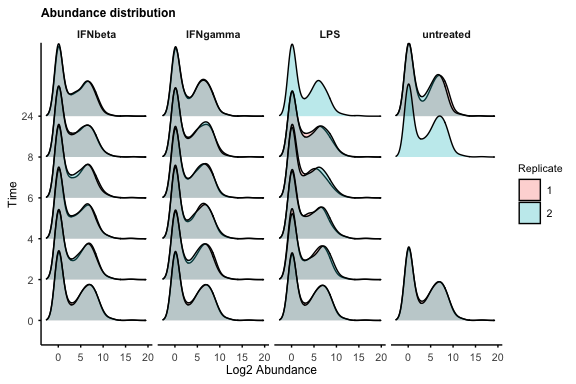

If distributions differ drastically, consider global normalisation
(e.g., quantile, median) *before* using TiDEomics.

For data with missing values (e.g., proteomics),
[`plot_ID()`](https://hte123.github.io/TiDEomics/reference/plot_ID.md)
and
[`plot_missing()`](https://hte123.github.io/TiDEomics/reference/plot_missing.md)
can be used to check missingness patterns.

### Normalisation to Time 0

[`normalise_to_start()`](https://hte123.github.io/TiDEomics/reference/normalise_to_start.md)
subtracts the mean of the time-0 replicates (or the first available time
point if the feature is missing at time point 0). Use this when aiming
to study *relative changes* from baseline.

``` r

data_obj <- normalise_to_start(data_obj)
```

Both original and time-0 normalised data are stored in the
`SummarizedExperiment` object and downstream functions allow to specify
which to use for each analysis (`assay = 1` for original, `assay = 2`
for time-0 normalised).

**When not to normalise**: Use original data when absolute abundance
differences across groups are of interest (e.g., constitutively
different baseline levels).

### Splitting groups and merging replicates

Use
[`split_groups()`](https://hte123.github.io/TiDEomics/reference/split_groups.md)
to obtain group-specific `SummarizedExperiment` objects and
[`merge_replicates()`](https://hte123.github.io/TiDEomics/reference/merge_replicates.md)
to average replicates for analyses / visualisation that require single
time series for features, including
[`calc_feature_property()`](https://hte123.github.io/TiDEomics/reference/calc_feature_property.md),
[`run_Trendy()`](https://hte123.github.io/TiDEomics/reference/run_Trendy.md),
[`plot_modules_v()`](https://hte123.github.io/TiDEomics/reference/plot_modules_v.md)
and
[`plot_modules_h()`](https://hte123.github.io/TiDEomics/reference/plot_modules_h.md).

``` r

data_obj_list <- split_groups(data_obj)
```

``` r

data_obj_merged_list <- merge_replicates(data_obj_list)
```

``` r

data_obj_merged <- merge_groups(data_obj_merged_list)
```

### Sample relationships (correlation, PCA, UMAP)

Correlation matrix can be plotted with
[`plot_cor_matrix()`](https://hte123.github.io/TiDEomics/reference/plot_cor_matrix.md)
to check sample relationships and potential batch effects.

``` r

plot_cor_matrix(data_obj,
    method = "spearman",
    label_rep = TRUE, label_batch = TRUE,
    cellwidth = 2, cellheight = 2
)
```

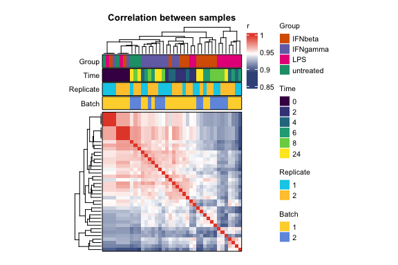

High within-replicate correlation and clustering by `Group` or `Time`
increase confidence in data quality and downstream analysis. If batch
effects are present, consider batch correction before using TiDEomics.

There are multiple functions for PCA and UMAP:

- Use
  [`plot_pca()`](https://hte123.github.io/TiDEomics/reference/plot_pca.md)
  to visualise sample relationships in 2D. Output loadings can be used
  to identify features driving the principal components.

- Use
  [`plot_pca_3D()`](https://hte123.github.io/TiDEomics/reference/plot_pca_3D.md)
  to visualise sample relationships in 3D.

- Use
  [`PCAtools::eigencorplot()`](https://rdrr.io/pkg/PCAtools/man/eigencorplot.html)
  to correlate PCs with Group and Time.

- Use
  [`plot_umap()`](https://hte123.github.io/TiDEomics/reference/plot_umap.md)
  for UMAP and set `seed` for reproducibility.

Features with missing values (NA) are automatically excluded from PCA
and UMAP. Consider imputation (e.g., group-wise minimum imputation with
[`split_groups()`](https://hte123.github.io/TiDEomics/reference/split_groups.md),
[`impute_groups()`](https://hte123.github.io/TiDEomics/reference/impute_groups.md)
and
[`merge_groups()`](https://hte123.github.io/TiDEomics/reference/merge_groups.md))
to include features with missing values in PCA and UMAP.

``` r

PC <- plot_pca(data_obj,
    plot = TRUE,
    # pc1 = 1, pc2 = 2, # default to plot PC1 and PC2
    plot_screeplot = TRUE,
    plot_loadings = FALSE,
    plot_morepc = TRUE,
    circle = FALSE,
    morepc = 1:5
)
#> Warning: Using `size` aesthetic for lines was deprecated in ggplot2 3.4.0.
#> ℹ Please use `linewidth` instead.
#> ℹ The deprecated feature was likely used in the PCAtools package.
#>   Please report the issue to the authors.
#> This warning is displayed once per session.
#> Call `lifecycle::last_lifecycle_warnings()` to see where this warning was
#> generated.
```

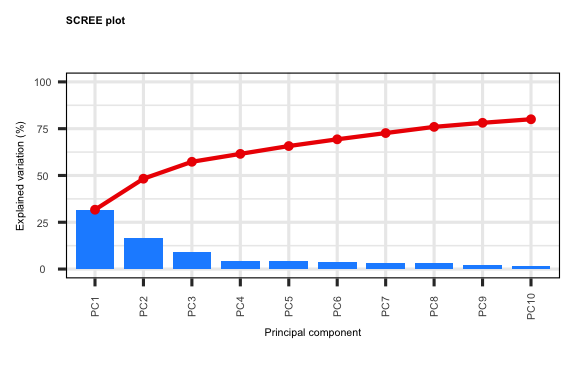

    #> Warning: Using size for a discrete variable is not advised.

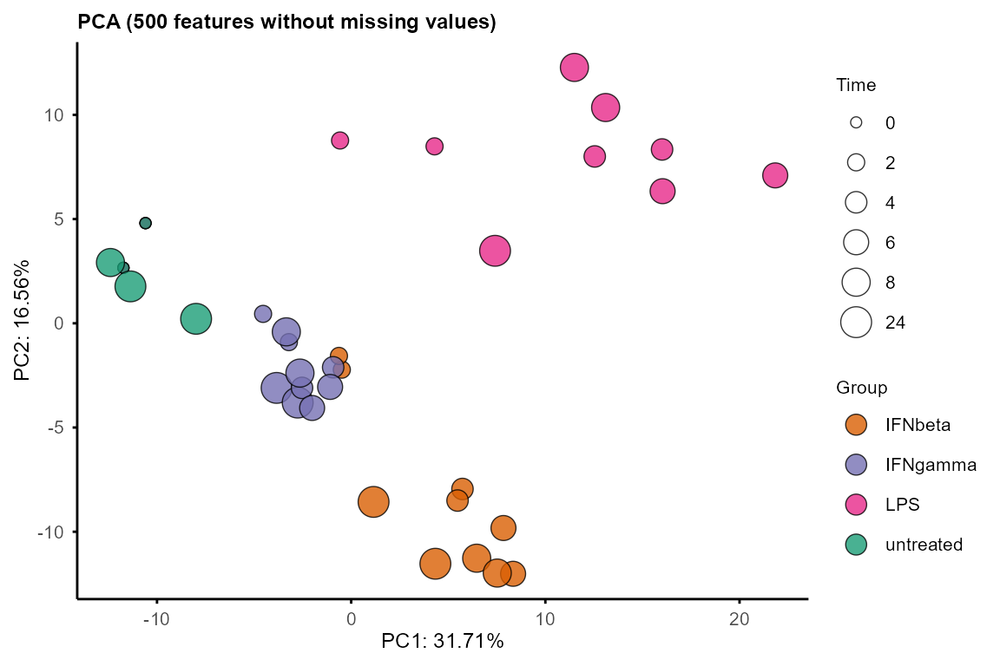

    #> Scale for colour is already present.
    #> Adding another scale for colour, which will replace the existing scale.
    #> Scale for colour is already present.
    #> Adding another scale for colour, which will replace the existing scale.
    #> Scale for colour is already present.
    #> Adding another scale for colour, which will replace the existing scale.
    #> Scale for colour is already present.
    #> Adding another scale for colour, which will replace the existing scale.
    #> Scale for colour is already present.
    #> Adding another scale for colour, which will replace the existing scale.
    #> Scale for colour is already present.
    #> Adding another scale for colour, which will replace the existing scale.
    #> Scale for colour is already present.
    #> Adding another scale for colour, which will replace the existing scale.
    #> Scale for colour is already present.
    #> Adding another scale for colour, which will replace the existing scale.
    #> Scale for colour is already present.
    #> Adding another scale for colour, which will replace the existing scale.
    #> Scale for colour is already present.
    #> Adding another scale for colour, which will replace the existing scale.

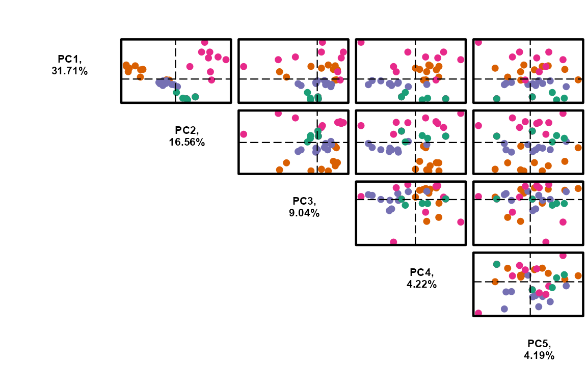

``` r

plot_pca_3D(PC, pcs = 1:3)
#> Warning: `line.width` does not currently support multiple values.
#> Warning: `line.width` does not currently support multiple values.
#> Warning: `line.width` does not currently support multiple values.
#> Warning: `line.width` does not currently support multiple values.
```

Note: the 3D plot may not display properly in some html, but should work
in an interactive R session.

``` r

PCAtools::eigencorplot(PC,
    metavars = c("Group", "Time"),
    components = paste0("PC", 1:5),
    col = colorRampPalette(c("#3C5488FF", "white", "#E64B35FF"))(100),
    colCorval = "black"
)
#> Warning in PCAtools::eigencorplot(PC, metavars = c("Group", "Time"), components
#> = paste0("PC", : Group is not numeric - please check the source data as
#> non-numeric variables will be coerced to numeric
```

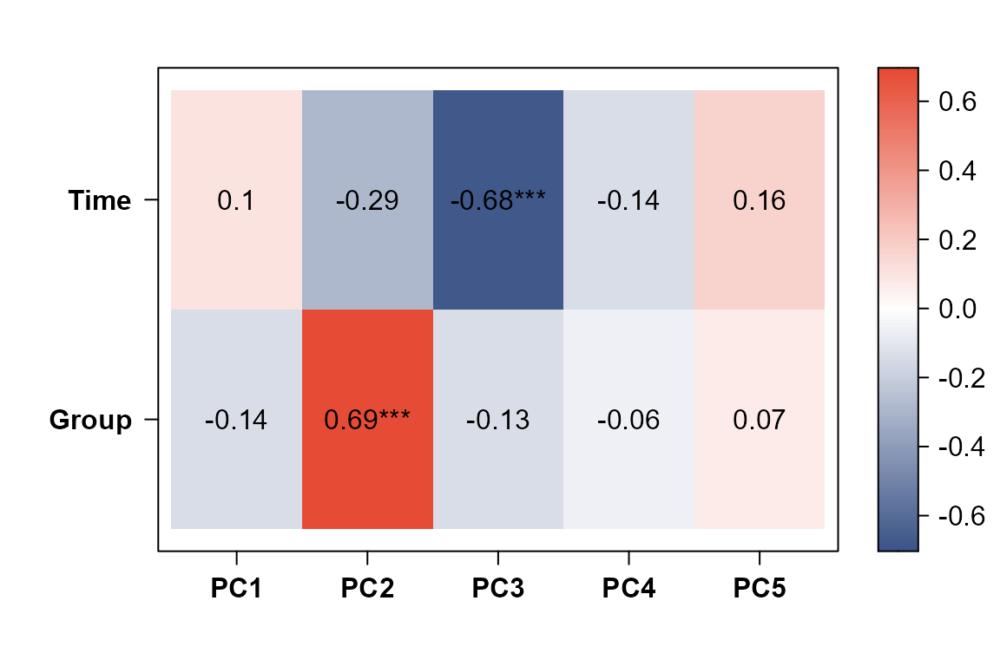

``` r

umap_layout <- plot_umap(data_obj, seed = 1234)
#> Using n_neighbors = 8
```

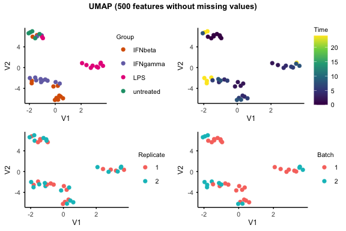

    #> Warning: Using size for a discrete variable is not advised.

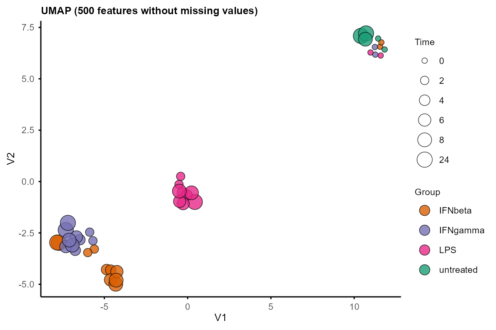

PCA and UMAP can also be performed separately on each group to explore
within-group structure and dynamics.

By default, when plotting PCA by group, circles and arrows are added to
show the trajectory of samples along time course. Set `circle = FALSE`
or `arrow = FALSE` to remove circles and arrows.

``` r

plot_pca_by_group(data_obj, circle = TRUE, arrow = TRUE)
#> Warning: Removed 1 row containing missing values or values outside the scale range
#> (`geom_segment()`).
#> Removed 1 row containing missing values or values outside the scale range
#> (`geom_segment()`).
#> Removed 1 row containing missing values or values outside the scale range
#> (`geom_segment()`).
#> Removed 1 row containing missing values or values outside the scale range
#> (`geom_segment()`).
#> Removed 1 row containing missing values or values outside the scale range
#> (`geom_segment()`).
```

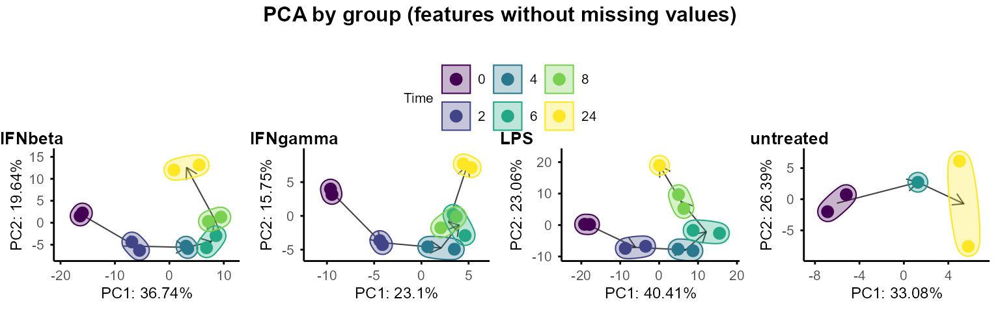

``` r

# same as plot_pca_by_group_list(data_obj_list, circle = TRUE, arrow = TRUE)

plot_umap_by_group(data_obj, seed = 1234) 
#> Using n_neighbors = 5
#> Using n_neighbors = 5
#> Using n_neighbors = 5
#> Using n_neighbors = 4
```

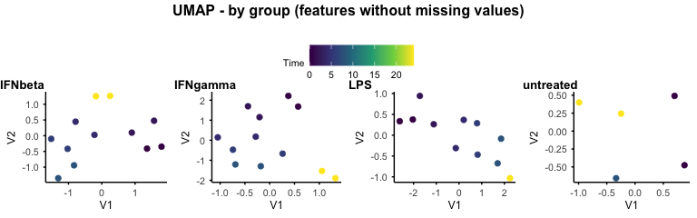

``` r

# same as plot_umap_by_group_list(data_obj_list)
```

### Pairwise differential expression

The two DE functions for pairwise comparison between time points and
groups are built based on the limma package (Ritchie et al. 2015).

[`DE_between_time()`](https://hte123.github.io/TiDEomics/reference/DE_between_time.md):

- Compare pairs of time points within each group.

- Output: Nested lists of DE statistics tables, including all features
  or only significant features.

- Use
  [`plot_DE_between_time()`](https://hte123.github.io/TiDEomics/reference/plot_DE_between_time.md)
  to summarise number of DE features per pair of time points per group.

[`DE_between_group()`](https://hte123.github.io/TiDEomics/reference/DE_between_group.md):

- Compare pairs of groups at each time point.

- Output: Nested lists of DE statistics tables, including all features
  or only significant features, and line plots summarising number of DE
  features (can be removed by setting `plot = FALSE`).

Common parameters for both functions:

- `assay`: index of assay to use (1 = original, 2 = time0-normalised if
  available)

- `filter`: minimal number of non-NA replicates for the feature to be
  included in DE testing (e.g., `filter = 1` means requiring features to
  have at least 1 non-NA value at both time points in the specific
  group, or in both groups at the specific time point).

- Default thresholds for DE are `p.adj < 0.05` and `|log2FC| > 1`.

Please note that the example data only has two replicates per time
point. More replicates are recommended for robust pairwise DE analysis.

DE_between_time():

``` r

DE_between_time_out <- DE_between_time(data_obj, assay = 1, filter = 1)
#> Comparing group IFNbeta time 2 to 0: keeping 500 of 500 features (100.0%)
#> Comparing group IFNbeta time 4 to 0: keeping 500 of 500 features (100.0%)
#> Comparing group IFNbeta time 6 to 0: keeping 500 of 500 features (100.0%)
#> Comparing group IFNbeta time 8 to 0: keeping 500 of 500 features (100.0%)
#> Comparing group IFNbeta time 24 to 0: keeping 500 of 500 features (100.0%)
#> Comparing group IFNbeta time 4 to 2: keeping 500 of 500 features (100.0%)
#> Comparing group IFNbeta time 6 to 2: keeping 500 of 500 features (100.0%)
#> Comparing group IFNbeta time 8 to 2: keeping 500 of 500 features (100.0%)
#> Comparing group IFNbeta time 24 to 2: keeping 500 of 500 features (100.0%)
#> Comparing group IFNbeta time 6 to 4: keeping 500 of 500 features (100.0%)
#> Comparing group IFNbeta time 8 to 4: keeping 500 of 500 features (100.0%)
#> Comparing group IFNbeta time 24 to 4: keeping 500 of 500 features (100.0%)
#> Comparing group IFNbeta time 8 to 6: keeping 500 of 500 features (100.0%)
#> Comparing group IFNbeta time 24 to 6: keeping 500 of 500 features (100.0%)
#> Comparing group IFNbeta time 24 to 8: keeping 500 of 500 features (100.0%)
#> Comparing group IFNgamma time 2 to 0: keeping 500 of 500 features (100.0%)
#> Comparing group IFNgamma time 4 to 0: keeping 500 of 500 features (100.0%)
#> Comparing group IFNgamma time 6 to 0: keeping 500 of 500 features (100.0%)
#> Comparing group IFNgamma time 8 to 0: keeping 500 of 500 features (100.0%)
#> Comparing group IFNgamma time 24 to 0: keeping 500 of 500 features (100.0%)
#> Comparing group IFNgamma time 4 to 2: keeping 500 of 500 features (100.0%)
#> Comparing group IFNgamma time 6 to 2: keeping 500 of 500 features (100.0%)
#> Comparing group IFNgamma time 8 to 2: keeping 500 of 500 features (100.0%)
#> Comparing group IFNgamma time 24 to 2: keeping 500 of 500 features (100.0%)
#> Comparing group IFNgamma time 6 to 4: keeping 500 of 500 features (100.0%)
#> Comparing group IFNgamma time 8 to 4: keeping 500 of 500 features (100.0%)
#> Comparing group IFNgamma time 24 to 4: keeping 500 of 500 features (100.0%)
#> Comparing group IFNgamma time 8 to 6: keeping 500 of 500 features (100.0%)
#> Comparing group IFNgamma time 24 to 6: keeping 500 of 500 features (100.0%)
#> Comparing group IFNgamma time 24 to 8: keeping 500 of 500 features (100.0%)
#> Comparing group LPS time 2 to 0: keeping 500 of 500 features (100.0%)
#> Comparing group LPS time 4 to 0: keeping 500 of 500 features (100.0%)
#> Comparing group LPS time 6 to 0: keeping 500 of 500 features (100.0%)
#> Comparing group LPS time 8 to 0: keeping 500 of 500 features (100.0%)
#> Comparing group LPS time 24 to 0: keeping 500 of 500 features (100.0%)
#> Comparing group LPS time 4 to 2: keeping 500 of 500 features (100.0%)
#> Comparing group LPS time 6 to 2: keeping 500 of 500 features (100.0%)
#> Comparing group LPS time 8 to 2: keeping 500 of 500 features (100.0%)
#> Comparing group LPS time 24 to 2: keeping 500 of 500 features (100.0%)
#> Comparing group LPS time 6 to 4: keeping 500 of 500 features (100.0%)
#> Comparing group LPS time 8 to 4: keeping 500 of 500 features (100.0%)
#> Comparing group LPS time 24 to 4: keeping 500 of 500 features (100.0%)
#> Comparing group LPS time 8 to 6: keeping 500 of 500 features (100.0%)
#> Comparing group LPS time 24 to 6: keeping 500 of 500 features (100.0%)
#> Comparing group LPS time 24 to 8: keeping 500 of 500 features (100.0%)
#> Comparing group untreated time 8 to 0: keeping 500 of 500 features (100.0%)
#> Comparing group untreated time 24 to 0: keeping 500 of 500 features (100.0%)
#> Comparing group untreated time 24 to 8: keeping 500 of 500 features (100.0%)
```

``` r

DE_between_time_out$all_list$IFNbeta$`t2-t0` %>% head()
```

```
#>         Feature Comparison   Group Cond1 Cond2 RNA_IFNbeta_0h_R1_1
#> 1 1700003E16Rik      t2-t0 IFNbeta     0     2            1.000000
#> 2 1700016A09Rik      t2-t0 IFNbeta     0     2            0.000000
#> 3 1700017L05Rik      t2-t0 IFNbeta     0     2            0.000000
#> 4 1700028K03Rik      t2-t0 IFNbeta     0     2            0.000000
#> 5 1700100I10Rik      t2-t0 IFNbeta     0     2            0.000000
#> 6 2900005J15Rik      t2-t0 IFNbeta     0     2            3.906891
#>   RNA_IFNbeta_0h_R2_1 RNA_IFNbeta_2h_R1_1 RNA_IFNbeta_2h_R2_1     logFC
#> 1            0.000000            0.000000                   0 -0.500000
#> 2            0.000000            0.000000                   0  0.000000
#> 3            0.000000            0.000000                   0  0.000000
#> 4            0.000000            0.000000                   0  0.000000
#> 5            0.000000            0.000000                   0  0.000000
#> 6            4.954196            1.584963                   2 -2.638062
#>      P.Value adj.P.Val
#> 1 0.37354008 0.6997161
#> 2 1.00000000 1.0000000
#> 3 1.00000000 1.0000000
#> 4 1.00000000 1.0000000
#> 5 1.00000000 1.0000000
#> 6 0.02497426 0.2656975
```

``` r

DE_between_time_out$de_list$IFNbeta$`t2-t0` %>% head()
```

```
#>    Feature Comparison   Group Cond1 Cond2     logFC    adj.P.Val
#> 1 Snord83b      t2-t0 IFNbeta     0     2 -1.584963 0.0005228236
```

``` r

plot_DE_between_time(data_obj,
    de_list = DE_between_time_out$de_list,
    fontsize = 8, value = FALSE, nrow = 1, heatmap_width = 3
)
#> Warning: The input is a data frame-like object, convert it to a matrix.
#> Warning: The input is a data frame-like object, convert it to a matrix.
#> Warning: The input is a data frame-like object, convert it to a matrix.
#> Warning: The input is a data frame-like object, convert it to a matrix.
#> Warning: Note: not all columns in the data frame are numeric. The data frame
#> will be converted into a character matrix.
```

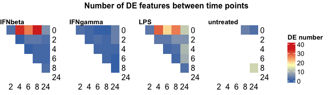

DE_between_group():

``` r

DE_between_group_out <- DE_between_group(data_obj, assay = 2, filter = 1)
#> Comparing group IFNgamma to IFNbeta at Time 0: keeping 500 of 500 features (100.0%)
#> Warning: Zero sample variances detected, have been offset away from zero
#> Comparing group IFNgamma to IFNbeta at Time 2: keeping 500 of 500 features (100.0%)
#> Warning: Zero sample variances detected, have been offset away from zero
#> Comparing group IFNgamma to IFNbeta at Time 4: keeping 500 of 500 features (100.0%)
#> Warning: Zero sample variances detected, have been offset away from zero
#> Comparing group IFNgamma to IFNbeta at Time 6: keeping 500 of 500 features (100.0%)
#> Warning: Zero sample variances detected, have been offset away from zero
#> Comparing group IFNgamma to IFNbeta at Time 8: keeping 500 of 500 features (100.0%)
#> Warning: Zero sample variances detected, have been offset away from zero
#> Comparing group IFNgamma to IFNbeta at Time 24: keeping 500 of 500 features (100.0%)
#> Warning: Zero sample variances detected, have been offset away from zero
#> Comparing group LPS to IFNbeta at Time 0: keeping 500 of 500 features (100.0%)
#> Warning: Zero sample variances detected, have been offset away from zero
#> Comparing group LPS to IFNbeta at Time 2: keeping 500 of 500 features (100.0%)
#> Warning: Zero sample variances detected, have been offset away from zero
#> Comparing group LPS to IFNbeta at Time 4: keeping 500 of 500 features (100.0%)
#> Warning: Zero sample variances detected, have been offset away from zero
#> Comparing group LPS to IFNbeta at Time 6: keeping 500 of 500 features (100.0%)
#> Warning: Zero sample variances detected, have been offset away from zero
#> Comparing group LPS to IFNbeta at Time 8: keeping 500 of 500 features (100.0%)
#> Warning: Zero sample variances detected, have been offset away from zero
#> Comparing group LPS to IFNbeta at Time 24: keeping 500 of 500 features (100.0%)
#> Warning: Zero sample variances detected, have been offset away from zero
#> Comparing group untreated to IFNbeta at Time 0: keeping 500 of 500 features (100.0%)
#> Warning: Zero sample variances detected, have been offset away from zero
#> Comparing group untreated to IFNbeta at Time 8: keeping 500 of 500 features (100.0%)
#> Warning: Zero sample variances detected, have been offset away from zero
#> Comparing group untreated to IFNbeta at Time 24: keeping 500 of 500 features (100.0%)
#> Warning: Zero sample variances detected, have been offset away from zero
#> Comparing group IFNbeta to IFNgamma at Time 0: keeping 500 of 500 features (100.0%)
#> Warning: Zero sample variances detected, have been offset away from zero
#> Comparing group IFNbeta to IFNgamma at Time 2: keeping 500 of 500 features (100.0%)
#> Warning: Zero sample variances detected, have been offset away from zero
#> Comparing group IFNbeta to IFNgamma at Time 4: keeping 500 of 500 features (100.0%)
#> Warning: Zero sample variances detected, have been offset away from zero
#> Comparing group IFNbeta to IFNgamma at Time 6: keeping 500 of 500 features (100.0%)
#> Warning: Zero sample variances detected, have been offset away from zero
#> Comparing group IFNbeta to IFNgamma at Time 8: keeping 500 of 500 features (100.0%)
#> Warning: Zero sample variances detected, have been offset away from zero
#> Comparing group IFNbeta to IFNgamma at Time 24: keeping 500 of 500 features (100.0%)
#> Warning: Zero sample variances detected, have been offset away from zero
#> Comparing group LPS to IFNgamma at Time 0: keeping 500 of 500 features (100.0%)
#> Warning: Zero sample variances detected, have been offset away from zero
#> Comparing group LPS to IFNgamma at Time 2: keeping 500 of 500 features (100.0%)
#> Warning: Zero sample variances detected, have been offset away from zero
#> Comparing group LPS to IFNgamma at Time 4: keeping 500 of 500 features (100.0%)
#> Warning: Zero sample variances detected, have been offset away from zero
#> Comparing group LPS to IFNgamma at Time 6: keeping 500 of 500 features (100.0%)
#> Warning: Zero sample variances detected, have been offset away from zero
#> Comparing group LPS to IFNgamma at Time 8: keeping 500 of 500 features (100.0%)
#> Warning: Zero sample variances detected, have been offset away from zero
#> Comparing group LPS to IFNgamma at Time 24: keeping 500 of 500 features (100.0%)
#> Warning: Zero sample variances detected, have been offset away from zero
#> Comparing group untreated to IFNgamma at Time 0: keeping 500 of 500 features (100.0%)
#> Warning: Zero sample variances detected, have been offset away from zero
#> Comparing group untreated to IFNgamma at Time 8: keeping 500 of 500 features (100.0%)
#> Warning: Zero sample variances detected, have been offset away from zero
#> Comparing group untreated to IFNgamma at Time 24: keeping 500 of 500 features (100.0%)
#> Warning: Zero sample variances detected, have been offset away from zero
#> Comparing group IFNbeta to LPS at Time 0: keeping 500 of 500 features (100.0%)
#> Warning: Zero sample variances detected, have been offset away from zero
#> Comparing group IFNbeta to LPS at Time 2: keeping 500 of 500 features (100.0%)
#> Warning: Zero sample variances detected, have been offset away from zero
#> Comparing group IFNbeta to LPS at Time 4: keeping 500 of 500 features (100.0%)
#> Warning: Zero sample variances detected, have been offset away from zero
#> Comparing group IFNbeta to LPS at Time 6: keeping 500 of 500 features (100.0%)
#> Warning: Zero sample variances detected, have been offset away from zero
#> Comparing group IFNbeta to LPS at Time 8: keeping 500 of 500 features (100.0%)
#> Warning: Zero sample variances detected, have been offset away from zero
#> Comparing group IFNbeta to LPS at Time 24: keeping 500 of 500 features (100.0%)
#> Warning: Zero sample variances detected, have been offset away from zero
#> Comparing group IFNgamma to LPS at Time 0: keeping 500 of 500 features (100.0%)
#> Warning: Zero sample variances detected, have been offset away from zero
#> Comparing group IFNgamma to LPS at Time 2: keeping 500 of 500 features (100.0%)
#> Warning: Zero sample variances detected, have been offset away from zero
#> Comparing group IFNgamma to LPS at Time 4: keeping 500 of 500 features (100.0%)
#> Warning: Zero sample variances detected, have been offset away from zero
#> Comparing group IFNgamma to LPS at Time 6: keeping 500 of 500 features (100.0%)
#> Warning: Zero sample variances detected, have been offset away from zero
#> Comparing group IFNgamma to LPS at Time 8: keeping 500 of 500 features (100.0%)
#> Warning: Zero sample variances detected, have been offset away from zero
#> Comparing group IFNgamma to LPS at Time 24: keeping 500 of 500 features (100.0%)
#> Warning: Zero sample variances detected, have been offset away from zero
#> Comparing group untreated to LPS at Time 0: keeping 500 of 500 features (100.0%)
#> Warning: Zero sample variances detected, have been offset away from zero
#> Comparing group untreated to LPS at Time 8: keeping 500 of 500 features (100.0%)
#> Warning: Zero sample variances detected, have been offset away from zero
#> Comparing group untreated to LPS at Time 24: keeping 500 of 500 features (100.0%)
#> Warning: Zero sample variances detected, have been offset away from zero
#> Comparing group IFNbeta to untreated at Time 0: keeping 500 of 500 features (100.0%)
#> Warning: Zero sample variances detected, have been offset away from zero
#> Comparing group IFNbeta to untreated at Time 8: keeping 500 of 500 features (100.0%)
#> Warning: Zero sample variances detected, have been offset away from zero
#> Comparing group IFNbeta to untreated at Time 24: keeping 500 of 500 features (100.0%)
#> Warning: Zero sample variances detected, have been offset away from zero
#> Comparing group IFNgamma to untreated at Time 0: keeping 500 of 500 features (100.0%)
#> Warning: Zero sample variances detected, have been offset away from zero
#> Comparing group IFNgamma to untreated at Time 8: keeping 500 of 500 features (100.0%)
#> Warning: Zero sample variances detected, have been offset away from zero
#> Comparing group IFNgamma to untreated at Time 24: keeping 500 of 500 features (100.0%)
#> Warning: Zero sample variances detected, have been offset away from zero
#> Comparing group LPS to untreated at Time 0: keeping 500 of 500 features (100.0%)
#> Warning: Zero sample variances detected, have been offset away from zero
#> Comparing group LPS to untreated at Time 8: keeping 500 of 500 features (100.0%)
#> Warning: Zero sample variances detected, have been offset away from zero
#> Comparing group LPS to untreated at Time 24: keeping 500 of 500 features (100.0%)
#> Warning: Zero sample variances detected, have been offset away from zero
```

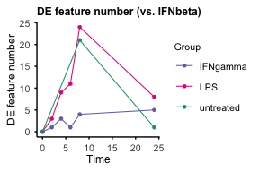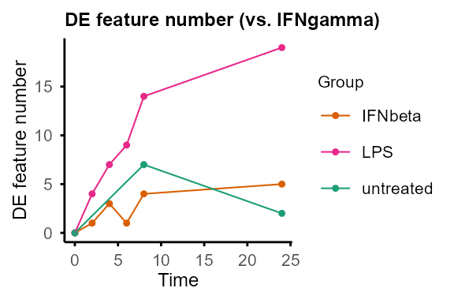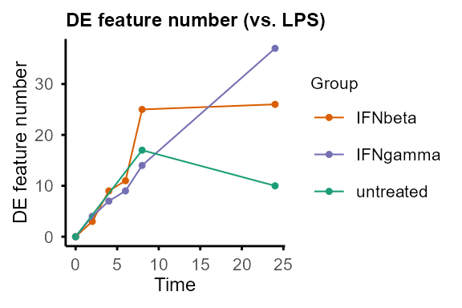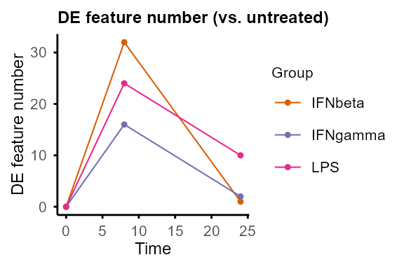

``` r

DE_between_group_out$all_list$`IFNgamma-untreated`$`24` %>% head()
```

```
#>         Feature         Comparison Time     Cond1    Cond2
#> 1 1700003E16Rik IFNgamma-untreated   24 untreated IFNgamma
#> 2 1700016A09Rik IFNgamma-untreated   24 untreated IFNgamma
#> 3 1700017L05Rik IFNgamma-untreated   24 untreated IFNgamma
#> 4 1700028K03Rik IFNgamma-untreated   24 untreated IFNgamma
#> 5 1700100I10Rik IFNgamma-untreated   24 untreated IFNgamma
#> 6 2900005J15Rik IFNgamma-untreated   24 untreated IFNgamma
#>   RNA_untreated_24h_R1_2 RNA_untreated_24h_R2_2 RNA_IFNgamma_24h_R1_2
#> 1             -0.5000000             -0.5000000            -0.5000000
#> 2              0.0000000              1.0000000             0.0000000
#> 3              0.0000000              0.0000000             0.0000000
#> 4              1.0000000              0.0000000             0.0000000
#> 5              0.0000000              0.0000000             0.0000000
#> 6             -0.7301037              0.0930185            -0.9711118
#>   RNA_IFNgamma_24h_R2_2         logFC   P.Value adj.P.Val
#> 1             -0.500000 -1.665335e-16 1.0000000 1.0000000
#> 2              1.000000  0.000000e+00 1.0000000 1.0000000
#> 3              0.000000  0.000000e+00 1.0000000 1.0000000
#> 4              0.000000 -5.000000e-01 0.3712106 0.7365967
#> 5              0.000000  0.000000e+00 1.0000000 1.0000000
#> 6             -1.845581 -1.089804e+00 0.1636461 0.6234187
```

``` r

DE_between_group_out$de_list$`IFNgamma-untreated` %>% head()
```

```
#>         Feature         Comparison Time     Cond1    Cond2     logFC  adj.P.Val
#> 1 1700003E16Rik IFNgamma-untreated    8 untreated IFNgamma -1.000000 0.01628919
#> 2 3110009E18Rik IFNgamma-untreated    8 untreated IFNgamma -1.169925 0.01628919
#> 3 4930447F24Rik IFNgamma-untreated    8 untreated IFNgamma -1.000000 0.01628919
#> 4         Acta1 IFNgamma-untreated    8 untreated IFNgamma -2.321928 0.01628919
#> 5          Cd69 IFNgamma-untreated    8 untreated IFNgamma  4.906762 0.01799269
#> 6          Ctsh IFNgamma-untreated    8 untreated IFNgamma  1.112589 0.03569877
```

Output of
[`DE_between_group()`](https://hte123.github.io/TiDEomics/reference/DE_between_group.md)and
[`DE_between_time()`](https://hte123.github.io/TiDEomics/reference/DE_between_time.md)
can be plotted with
[`plot_volcano()`](https://hte123.github.io/TiDEomics/reference/plot_volcano.md)
to visualise DE features of selected group(s) and time point(s).

``` r

plot_volcano(DE_between_group_out,
    group1 = "untreated", group2 = "IFNgamma", time = 24,
    logFC_thres = 0.5, adjP_thres = 0.05, label = TRUE)
```

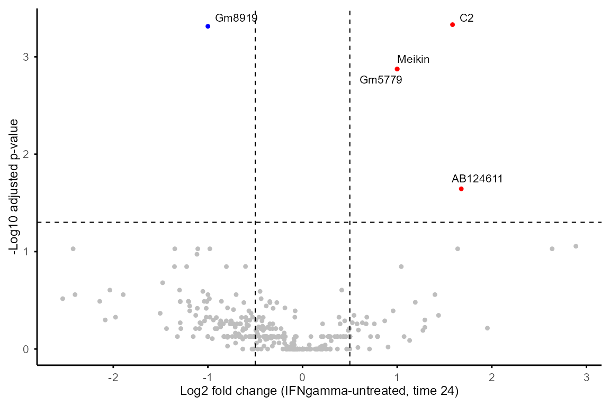

### Feature properties and classification

[`calc_feature_property()`](https://hte123.github.io/TiDEomics/reference/calc_feature_property.md)
computes per-feature properties:

- `P_trend`: calculated with
  [`randtests::bartels.rank.test()`](https://rdrr.io/pkg/randtests/man/bartels.rank.test.html),
  testing for non-randomness of the time profile (i.e., whether the
  feature shows a significant overall trend across time points).

- `Max_FC`: maximum fold change across time points, calculated as the
  difference between the feature’s maximum and minimum abundance across
  time points. This captures the overall magnitude of change across the
  time course, regardless of the specific time points at which changes
  occur.

- `Max_FC_time`: the difference between time points with maximum and
  minimum abundance, providing information about the direction (up or
  down) and duration of changing.

- `Exp_threshold`: user-set value threshold for a feature to be
  considered expressed in a sample. This can be used to filter features
  based on expression level, e.g. setting `threshold = 0` means that
  only values \> 0 (log2(raw count + 1) \> 0, i.e. raw count \> 0 in the
  tutorial dataset) are considered expressed. The default is NULL, which
  means all non-NA values are considered expressed.

- `T_total`, `T_exp` and `Exp_ratio`: number of total time points,
  number of expressed time points with values \> `Exp_threshold` (or
  non-NA values if `threshold = NULL`), and proportion of expressed time
  points, which can be used to filter features based on completeness or
  expression level.

The property values can be used to classify features into different
categories (e.g., non-random vs. random, differentially expressed
vs. stable) for downstream analysis and interpretation. For example,
features with `P_trend < 0.05` and `Max_FC >= 1` can be candidates for
non-randomly overall-changing DE features.

Note:

- When replicates are present, the input should be the mean of
  replicates at each time point, output of
  [`merge_replicates()`](https://hte123.github.io/TiDEomics/reference/merge_replicates.md).

- The function is set to require at least 3 values \> threshold to
  calculate `P_trend`.

``` r

data_obj_merged_list <- calc_feature_property(data_obj_merged_list,
    threshold = 0)
property_tb <- summarise_feature_property(data_obj_merged_list)

head(property_tb)
```

```
#>         Feature   Group Exp_threshold T_exp T_total    P_trend    Max_FC
#> 1 1700003E16Rik IFNbeta             0     1       6         NA 0.5000000
#> 2 1700016A09Rik IFNbeta             0     2       6         NA 0.5000000
#> 3 1700017L05Rik IFNbeta             0     0       6         NA        NA
#> 4 1700028K03Rik IFNbeta             0     2       6         NA 1.0000000
#> 5 1700100I10Rik IFNbeta             0     1       6         NA 0.7924813
#> 6 2900005J15Rik IFNbeta             0     5       6 0.09452103 4.4305435
#>   Max_FC_time Exp_ratio
#> 1          -1 0.1666667
#> 2           4 0.3333333
#> 3          NA 0.0000000
#> 4           5 0.3333333
#> 5           4 0.1666667
#> 6          -3 0.8333333
```

Features expressed in only a subset of groups can be extracted with
[`group_specific_features()`](https://hte123.github.io/TiDEomics/reference/group_specific_features.md)
based on the output table of
[`summarise_feature_property()`](https://hte123.github.io/TiDEomics/reference/summarise_feature_property.md).

``` r

group_specific_features(property_tb, groups = c("untreated"),
    genename = FALSE, GO = FALSE
)
#> Filtering criteria: >=50% values >0 in >=1 of groups: untreated
```

```
#> [1] "4930447F24Rik" "Itga7"         "Kcnj16"        "Otos"         
#> [5] "Sult4a1"       "Umodl1"
```

### Segmented regression analysis

`run_Trendy` fits segmented linear models to the time course for each
feature to estimate breakpoints with Trendy package (Bacher et al.
2018), see [Trendy
documentation](https://bioconductor.org/packages/release/bioc/html/Trendy.html)
for details.

**Notes**:

- The function requires complete input (no NA). When data contains
  missing values (e.g. proteomics), use
  [`impute_groups()`](https://hte123.github.io/TiDEomics/reference/impute_groups.md)
  to impute with group-specific minimum value, or restrict to features
  with complete data.

- If `feature` is not specified, the function will run on all features
  filtered by expression / missing rate, which requires running
  [`calc_feature_property()`](https://hte123.github.io/TiDEomics/reference/calc_feature_property.md)
  before
  [`impute_groups()`](https://hte123.github.io/TiDEomics/reference/impute_groups.md).

- Number of time points needed = \[# segments\] x \[minimum number of
  samples in a segment\]. For example, when \# segments = 2 (maxK = 1)
  and minNumInSeg = 2, at least 4 time points are needed.

``` r

data_obj_merged_imp_list <- impute_groups(data_obj_merged_list)
```

A subset of features is used for demonstration as
[`run_Trendy()`](https://hte123.github.io/TiDEomics/reference/run_Trendy.md)
can be time-consuming.

``` r

set.seed(1234)
random_features <- sample(rownames(data_obj_merged_imp_list[[1]]), 50)

example_res_list <- run_Trendy(data_obj_merged_imp_list,
    feature = random_features,
    minExp = 0.5,
    maxK = 1,
    minNumInSeg = 2, meanCut = 0, NCores = 2
)
#> Max number of breakpoints: 1
#> Min mean expression: 0
#> Min number of samples in each segment: 2
#> Running Trendy for group: IFNbeta
#> Using 50 specified features present in the data.
#> Warning in BiocParallel::MulticoreParam(workers = NCores): MulticoreParam() not
#> supported on Windows, use SnowParam()
```

```
#> breakpoint estimate(s): 9.519174 
#> breakpoint estimate(s): 8.885903 
#> breakpoint estimate(s): 8.885903
#> Running Trendy for group: IFNgamma
#> Using 50 specified features present in the data.
#> Warning in BiocParallel::MulticoreParam(workers = NCores): MulticoreParam() not
#> supported on Windows, use SnowParam()
```

```
#> breakpoint estimate(s): 8.885903 
#> breakpoint estimate(s): 9.519174 
#> breakpoint estimate(s): 8.885903 
#> breakpoint estimate(s): 9.519174 
#> breakpoint estimate(s): 9.519174 
#> breakpoint estimate(s): 9.519174
#> Running Trendy for group: LPS
#> Using 50 specified features present in the data.
#> Warning in BiocParallel::MulticoreParam(workers = NCores): MulticoreParam() not
#> supported on Windows, use SnowParam()
```

```
#> breakpoint estimate(s): 9.519174
#> Running Trendy for group: untreated
#> Trendy analysis is not performed for group untreated: number of time points (3) less than 2 * minNumInSeg
```

Use
[`plot_segments()`](https://hte123.github.io/TiDEomics/reference/plot_segments.md)to
plot the fitted segments and breakpoints for selected features.

``` r

plot_segments(data_obj_merged_imp_list,
    example_res_list,
    feature = c("Zfp639", "Tk1"), # example features
    ylab = "Log2 (raw count + 1)"
)
#> Plotting segmented regression for group: IFNbeta
```

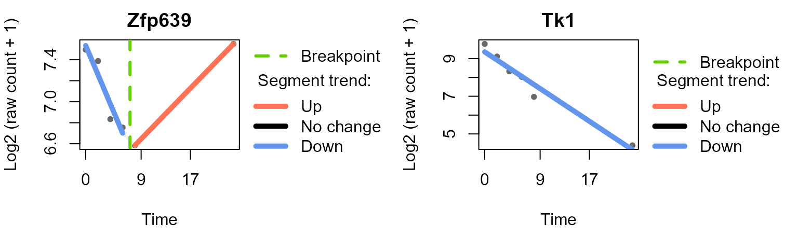

    #> Plotting segmented regression for group: IFNgamma

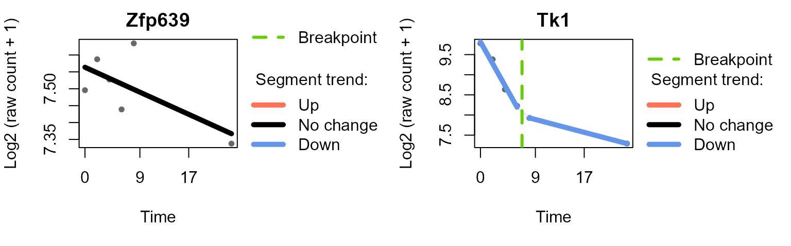

    #> Plotting segmented regression for group: LPS

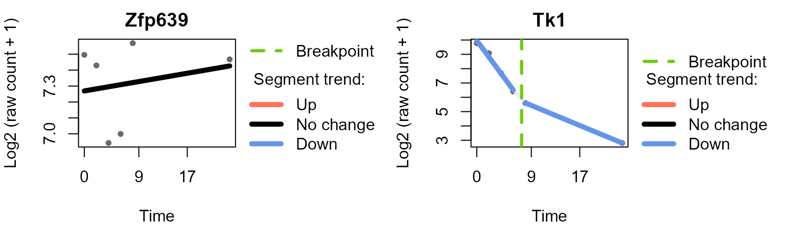

Plot the distribution of breakpoints across time points with
[`plot_breakpoints()`](https://hte123.github.io/TiDEomics/reference/plot_breakpoints.md)
in each group, and summarise the temporal patterns (combination of
trends of each segment) of features with
[`summarise_Trendy()`](https://hte123.github.io/TiDEomics/reference/summarise_Trendy.md)
and
[`extract_segment_trends()`](https://hte123.github.io/TiDEomics/reference/extract_segment_trends.md).

``` r

plot_breakpoints(example_res_list)
#> Warning in (function (..., deparse.level = 1) : number of columns of result is
#> not a multiple of vector length (arg 3)
#> Warning in (function (..., deparse.level = 1) : number of columns of result is
#> not a multiple of vector length (arg 7)
#> Warning in (function (..., deparse.level = 1) : number of columns of result is
#> not a multiple of vector length (arg 9)
```

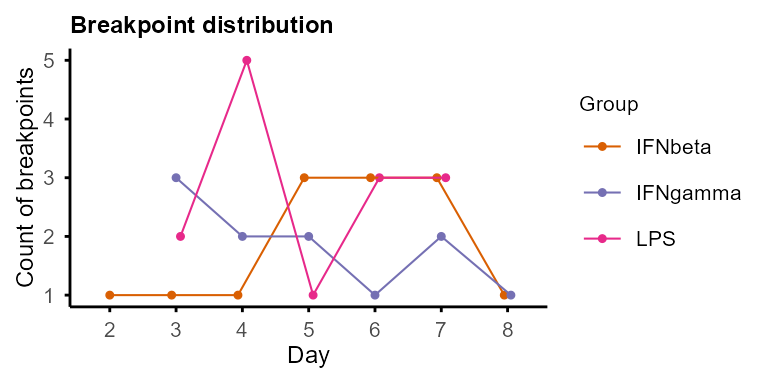

``` r


trendy_summary <- summarise_Trendy(example_res_list)
#> Warning in (function (..., deparse.level = 1) : number of columns of result is
#> not a multiple of vector length (arg 3)
#> Warning in (function (..., deparse.level = 1) : number of columns of result is
#> not a multiple of vector length (arg 7)
#> Warning in (function (..., deparse.level = 1) : number of columns of result is
#> not a multiple of vector length (arg 9)
trendy_summary %>% head()
```

```
#>                 Group Feature Segment1.Slope Segment2.Slope Segment1.Trend
#> IFNbeta.Epn2  IFNbeta    Epn2     -0.7499700      0.1615600           down
#> IFNbeta.Ska1  IFNbeta    Ska1     -0.4762800     -0.1115800           down
#> IFNbeta.Tk1   IFNbeta     Tk1     -0.2165968             NA           down
#> IFNbeta.Aunip IFNbeta   Aunip     -1.0743000     -0.0666780           down
#> IFNbeta.Gmeb1 IFNbeta   Gmeb1     -0.1286400     -0.0034104           down
#> IFNbeta.Ncdn  IFNbeta    Ncdn     -0.3442400      0.0387170           down
#>               Segment2.Trend Segment1.Pvalue Segment2.Pvalue Breakpoint
#> IFNbeta.Epn2              up    0.0197197791      0.03607479   6.374062
#> IFNbeta.Ska1            down    0.0509625300      0.04419412   4.815924
#> IFNbeta.Tk1             <NA>    0.0006053725              NA         NA
#> IFNbeta.Aunip           down    0.0618339689      0.08776893   2.346122
#> IFNbeta.Gmeb1         stable    0.0592481304      0.30678219   4.142336
#> IFNbeta.Ncdn          stable    0.0732773034      0.12722374   5.139547
#>               AdjustedR2 X0.Trend X2.Trend X4.Trend X6.Trend X8.Trend X24.Trend
#> IFNbeta.Epn2   0.9864273       -1       -1       -1       -1        1         1
#> IFNbeta.Ska1   0.9797872       -1       -1       -1       -1       -1        -1
#> IFNbeta.Tk1    0.9501150       -1       -1       -1       -1       -1        -1
#> IFNbeta.Aunip  0.9497074       -1       -1       -1       -1       -1        -1
#> IFNbeta.Gmeb1  0.9171326       -1       -1       -1        0        0         0
#> IFNbeta.Ncdn   0.8857370       -1       -1       -1        0        0         0
#>                   Pattern
#> IFNbeta.Epn2      down_up
#> IFNbeta.Ska1    down_down
#> IFNbeta.Tk1          down
#> IFNbeta.Aunip   down_down
#> IFNbeta.Gmeb1 down_stable
#> IFNbeta.Ncdn  down_stable
```

``` r

trendy_list <- extract_segment_trends(trendy_summary)
trendy_list$IFNbeta
```

```
#> $down_up
#> [1] "Epn2"   "Zfp639" "Trub1"  "Zfp109"
#> 
#> $down_down
#> [1] "Ska1"  "Aunip"
#> 
#> $down
#> [1] "Tk1"   "Prkcb"
#> 
#> $down_stable
#> [1] "Gmeb1" "Ncdn"  "Fbxo3" "Rrs1" 
#> 
#> $up
#> [1] "A930001C03Rik" "Pmaip1"       
#> 
#> $stable_stable
#> [1] "Gle1"    "Atp5mk"  "Gm12251"
```

### Variance decomposition

Variance of each protein is decomposed into `Time`, `Group` and
`Residual` contributions to characterise their differential expression
patterns.

- High `Time` contribution: time-dependent features, dynamic along time
  course consistently across groups. May be good candidates for
  [`run_Trendy()`](https://hte123.github.io/TiDEomics/reference/run_Trendy.md)
  or other time-focused analysis.

- High `Group` contribution: group-dependent features, stable along time
  but differentially expressed between groups. May be baseline
  biological markers.

- High `Residual`: noisy, consider excluding for further analysis
  (e.g. WGCNA) or interpretation.

The function
[`decomp_variance()`](https://hte123.github.io/TiDEomics/reference/decomp_variance.md)
is based on `PALMO::lmeVariance()`(Vasaikar et al. 2023) to return a
table of variance decomposition results.

``` r

# filter genes for variance decomposition: 
# at least 50% values > 0 (raw count > 0) in at least 2 groups
decomp_filter_genes <- group_specific_features(property_tb,
    filter_ratio = 0.5,
    group_pct = 2 / 4,
    GO = FALSE, genename = FALSE
)
#> Filtering criteria: >=50% values >0 in >=2 of groups: IFNbeta, IFNgamma, LPS, untreated

var_decomp <- decomp_variance(data_obj,
    features = decomp_filter_genes,
    variables = c("Time", "Group"), # default
    assay = 1, core = 2
)

plot_variance(var_decomp, rank = "Time", top_n = 20)
#> Features not specified. Plotting top 20 features ranked by Time.
```

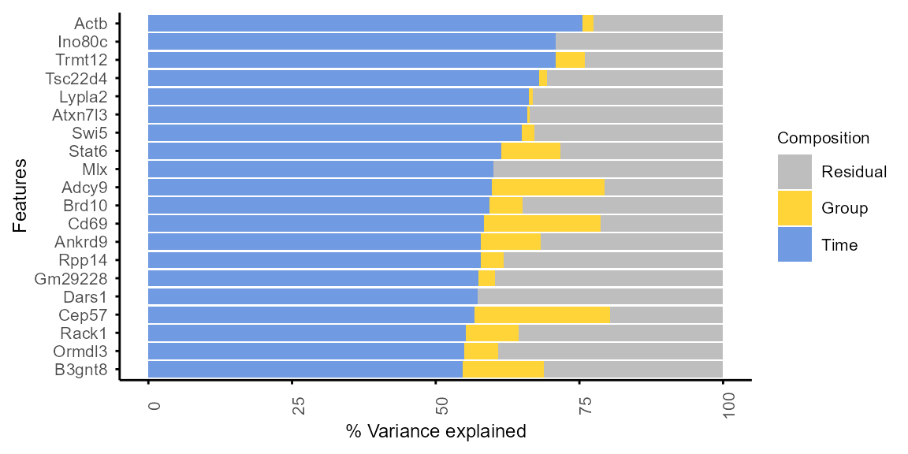

``` r

plot_variance(var_decomp, rank = "Group", top_n = 20)
#> Features not specified. Plotting top 20 features ranked by Group.
```

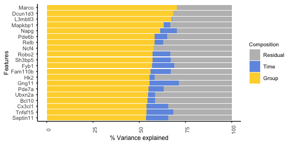

### WGCNA (co-expression modules)

Detailed tutorials of weighted gene correlation network analysis
([WGCNA](https://cran.r-project.org/web/packages/WGCNA/index.html))(Langfelder
and Horvath 2008, 2012) can be found
[online](https://github.com/edo98811/WGCNA_official_documentation/). The
following is a brief demonstration of how to prepare input and run WGCNA
with TiDEomics functions.

**Filtering strategies**:

- Features with too many missing values can be removed, with
  [`WGCNA::goodGenes()`](https://rdrr.io/pkg/WGCNA/man/goodGenes.html)
  included in the
  [`prepare_WGCNA()`](https://hte123.github.io/TiDEomics/reference/prepare_WGCNA.md)
  function, or pre-filter with the calculated feature property (output
  of
  [`calc_feature_property()`](https://hte123.github.io/TiDEomics/reference/calc_feature_property.md)
  and
  [`summarise_feature_property()`](https://hte123.github.io/TiDEomics/reference/summarise_feature_property.md)).

&nbsp;

- Residual variance can be used to exclude noisy features.

- It is not recommended to filter by differential expression before
  WGCNA, see [WGCNA package
  FAQ](https://edo98811.github.io/WGCNA_official_documentation/faq.html).

``` r

# Example filtering by residual variance < Q3
var_res_q3 <- quantile(var_decomp$Residual, 0.75, na.rm = TRUE)
filter_wgcna <- var_decomp %>% dplyr::filter(Residual < var_res_q3) %>% 
    dplyr::pull(Feature)

data_obj_wgcna <- data_obj[filter_wgcna, ]
```

**Prepare data format and choose power**:

[`prepare_WGCNA()`](https://hte123.github.io/TiDEomics/reference/prepare_WGCNA.md)
prepares the input for WGCNA and helps to choose the soft-thresholding
power. Check the scale-free topology fit indices to confirm that the
chosen power is appropriate.

Reasonable powers are less than 15 for unsigned or signed hybrid
networks, and less than 30 for signed networks, to reach scale-free
topology fit index \> 0.8, and mean connectivity (mean.k) not too high
(in the hundreds or above). See [WGCNA package
FAQ](https://edo98811.github.io/WGCNA_official_documentation/faq.html)
for details.

``` r

WGCNA_input <- prepare_WGCNA(data_obj_wgcna, assay = 2,
    powers = seq(1, 30),
    networkType = "signed", RsquaredCut = 0.8
)
```

```
#> Allowing multi-threading with up to 24 threads.
#> pickSoftThreshold: will use block size 258.
#>  pickSoftThreshold: calculating connectivity for given powers...
#>    ..working on genes 1 through 258 of 258
#>    Power SFT.R.sq   slope truncated.R.sq mean.k. median.k. max.k.
#> 1      1 0.608000  3.5000        0.59600 147.000   154.000 172.00
#> 2      2 0.442000  1.3100        0.31000  92.900    98.500 125.00
#> 3      3 0.188000  0.4220       -0.04460  62.700    65.900  95.50
#> 4      4 0.000653  0.0133       -0.00791  44.400    45.900  75.10
#> 5      5 0.037700 -0.0970        0.50100  32.600    32.700  60.50
#> 6      6 0.098300 -0.1880        0.77100  24.500    23.600  50.10
#> 7      7 0.152000 -0.2800        0.85700  18.900    17.500  42.00
#> 8      8 0.280000 -0.4080        0.91400  14.800    13.100  35.60
#> 9      9 0.443000 -0.5790        0.92500  11.700    10.100  30.40
#> 10    10 0.440000 -0.7510        0.82400   9.420     7.870  26.20
#> 11    11 0.522000 -0.8220        0.89800   7.660     6.160  22.70
#> 12    12 0.608000 -0.9140        0.90700   6.290     4.940  19.80
#> 13    13 0.661000 -0.9840        0.91000   5.210     4.020  17.30
#> 14    14 0.719000 -1.0600        0.93900   4.350     3.350  15.20
#> 15    15 0.733000 -1.1500        0.92500   3.660     2.790  13.40
#> 16    16 0.767000 -1.1600        0.95100   3.100     2.330  11.90
#> 17    17 0.791000 -1.1700        0.97000   2.640     1.920  10.60
#> 18    18 0.792000 -1.2500        0.94700   2.260     1.610   9.41
#> 19    19 0.801000 -1.2400        0.94600   1.940     1.370   8.41
#> 20    20 0.811000 -1.2500        0.93100   1.680     1.170   7.53
#> 21    21 0.825000 -1.2600        0.93800   1.460     0.982   6.75
#> 22    22 0.829000 -1.2600        0.94200   1.270     0.834   6.07
#> 23    23 0.852000 -1.2600        0.95500   1.110     0.712   5.47
#> 24    24 0.220000 -2.7400        0.14200   0.977     0.610   5.00
#> 25    25 0.225000 -2.7800        0.14800   0.861     0.524   4.58
#> 26    26 0.229000 -2.8200        0.15600   0.761     0.447   4.21
#> 27    27 0.232000 -2.8100        0.16500   0.675     0.384   3.87
#> 28    28 0.236000 -2.8100        0.17500   0.601     0.332   3.57
#> 29    29 0.239000 -2.8300        0.18100   0.536     0.292   3.30
#> 30    30 0.861000 -1.4800        0.96100   0.479     0.252   3.05
```

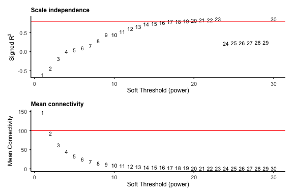

``` r

WGCNA_input$fitIndices
```

```
#>    Power     SFT.R.sq       slope truncated.R.sq     mean.k.   median.k.
#> 1      1 0.6079174966  3.50141118    0.596399318 146.9560935 153.8774704
#> 2      2 0.4416170866  1.30825710    0.310025081  92.8647687  98.4712976
#> 3      3 0.1875036391  0.42182558   -0.044560324  62.7435830  65.8755985
#> 4      4 0.0006527105  0.01325868   -0.007913788  44.4288278  45.8528971
#> 5      5 0.0376571372 -0.09704721    0.500936162  32.5666775  32.6806478
#> 6      6 0.0983156497 -0.18763423    0.771116065  24.5156194  23.6416683
#> 7      7 0.1523707806 -0.28033121    0.856845633  18.8516205  17.5405447
#> 8      8 0.2796083357 -0.40817464    0.913771897  14.7521903  13.1333643
#> 9      9 0.4429990671 -0.57943781    0.925464307  11.7157881  10.0753854
#> 10    10 0.4400256370 -0.75095234    0.823541850   9.4230221   7.8711980
#> 11    11 0.5218754698 -0.82163109    0.897919351   7.6631863   6.1630855
#> 12    12 0.6077162818 -0.91376318    0.906607532   6.2931499   4.9448928
#> 13    13 0.6606607188 -0.98373101    0.910304390   5.2132607   4.0171768
#> 14    14 0.7190565686 -1.05973485    0.939278066   4.3526608   3.3451586
#> 15    15 0.7332110898 -1.14995611    0.924740122   3.6600386   2.7890143
#> 16    16 0.7667399976 -1.16203458    0.950727982   3.0976378   2.3334773
#> 17    17 0.7913813258 -1.17437355    0.969907320   2.6372790   1.9212388
#> 18    18 0.7923620068 -1.24690613    0.946673462   2.2576619   1.6114542
#> 19    19 0.8007640710 -1.24215007    0.945614751   1.9425012   1.3685125
#> 20    20 0.8113157730 -1.24968682    0.931385527   1.6792151   1.1695347
#> 21    21 0.8253118995 -1.25933967    0.937684478   1.4579909   0.9823716
#> 22    22 0.8290347980 -1.25621420    0.942323196   1.2711081   0.8339364
#> 23    23 0.8522915118 -1.25593557    0.954882302   1.1124436   0.7123971
#> 24    24 0.2199325121 -2.73640004    0.141587867   0.9771045   0.6101687
#> 25    25 0.2251287342 -2.77559497    0.147911118   0.8611542   0.5240043
#> 26    26 0.2290864755 -2.81862051    0.155670771   0.7614043   0.4472175
#> 27    27 0.2321010375 -2.81265833    0.165481182   0.6752574   0.3835119
#> 28    28 0.2357808295 -2.81493861    0.175230785   0.6005850   0.3321386
#> 29    29 0.2393200648 -2.82910089    0.181344658   0.5356338   0.2918323
#> 30    30 0.8608349880 -1.48136392    0.960904775   0.4789521   0.2519321
#>        max.k.
#> 1  172.027365
#> 2  124.724805
#> 3   95.501684
#> 4   75.132377
#> 5   60.522010
#> 6   50.085229
#> 7   41.989580
#> 8   35.573309
#> 9   30.401003
#> 10  26.173195
#> 11  22.676894
#> 12  19.756557
#> 13  17.296125
#> 14  15.207412
#> 15  13.422368
#> 16  11.887754
#> 17  10.561415
#> 18   9.409607
#> 19   8.405054
#> 20   7.525509
#> 21   6.752683
#> 22   6.071425
#> 23   5.472852
#> 24   5.003183
#> 25   4.584540
#> 26   4.210180
#> 27   3.874399
#> 28   3.572347
#> 29   3.299886
#> 30   3.053470
picked_power <- WGCNA_input$powerEstimate
picked_power
```

```
#> [1] 19
```

**Run WGCNA**:

Use
[`run_WGCNA()`](https://hte123.github.io/TiDEomics/reference/run_WGCNA.md)
with the output of
[`prepare_WGCNA()`](https://hte123.github.io/TiDEomics/reference/prepare_WGCNA.md),
and visualise the resulting modules with
[`plot_WGCNA()`](https://hte123.github.io/TiDEomics/reference/plot_WGCNA.md).

[`run_WGCNA()`](https://hte123.github.io/TiDEomics/reference/run_WGCNA.md)
is a wrapper of
[`WGCNA::blockwiseModules()`](https://rdrr.io/pkg/WGCNA/man/blockwiseModules.html),
which runs the WGCNA analysis and returns the module assignment for each
feature. Parameters for
[`WGCNA::blockwiseModules()`](https://rdrr.io/pkg/WGCNA/man/blockwiseModules.html)
can be set with
[`run_WGCNA()`](https://hte123.github.io/TiDEomics/reference/run_WGCNA.md),
e.g., `corType` for correlation method.

``` r

net <- run_WGCNA(WGCNA_input,
    power = picked_power,
    # corType = "pearson", # other option is "bicor"
    numericLabels = TRUE
)
```

```
#> Allowing multi-threading with up to 24 threads.

plot_WGCNA(net, fontsize = 8)
#> Warning: The input is a data frame-like object, convert it to a matrix.
```

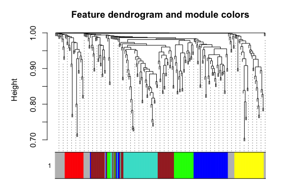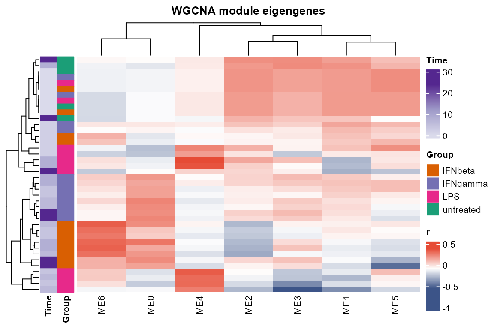

    #> Warning in par(usr): argument 1 does not name a graphical parameter
    #> Warning in par(usr): argument 1 does not name a graphical parameter
    #> Warning in par(usr): argument 1 does not name a graphical parameter
    #> Warning in par(usr): argument 1 does not name a graphical parameter
    #> Warning in par(usr): argument 1 does not name a graphical parameter
    #> Warning in par(usr): argument 1 does not name a graphical parameter
    #> Warning in par(usr): argument 1 does not name a graphical parameter
    #> Warning in par(usr): argument 1 does not name a graphical parameter
    #> Warning in par(usr): argument 1 does not name a graphical parameter
    #> Warning in par(usr): argument 1 does not name a graphical parameter
    #> Warning in par(usr): argument 1 does not name a graphical parameter
    #> Warning in par(usr): argument 1 does not name a graphical parameter
    #> Warning in par(usr): argument 1 does not name a graphical parameter
    #> Warning in par(usr): argument 1 does not name a graphical parameter
    #> Warning in par(usr): argument 1 does not name a graphical parameter
    #> Warning in par(usr): argument 1 does not name a graphical parameter
    #> Warning in par(usr): argument 1 does not name a graphical parameter
    #> Warning in par(usr): argument 1 does not name a graphical parameter
    #> Warning in par(usr): argument 1 does not name a graphical parameter
    #> Warning in par(usr): argument 1 does not name a graphical parameter
    #> Warning in par(usr): argument 1 does not name a graphical parameter
    #> Warning in par(usr): argument 1 does not name a graphical parameter
    #> Warning in par(usr): argument 1 does not name a graphical parameter
    #> Warning in par(usr): argument 1 does not name a graphical parameter
    #> Warning in par(usr): argument 1 does not name a graphical parameter
    #> Warning in par(usr): argument 1 does not name a graphical parameter
    #> Warning in par(usr): argument 1 does not name a graphical parameter

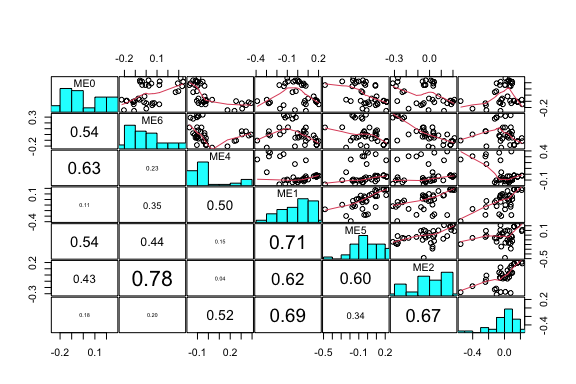

    #> Warning in par(usr): argument 1 does not name a graphical parameter

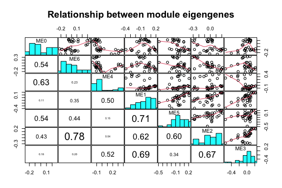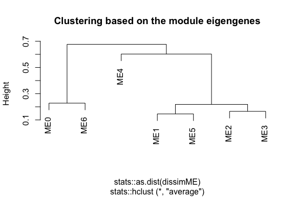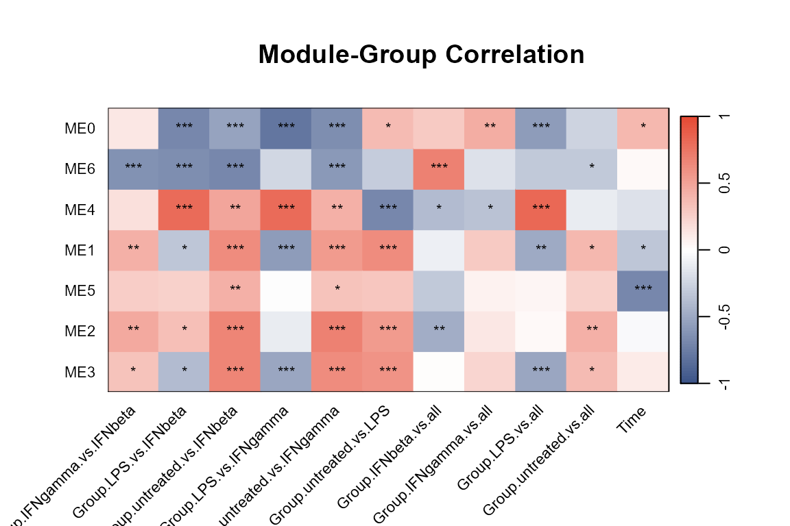

**Extract modules**: show module sizes

``` r

gene_module <- data.frame(Module = as.factor(net$colors)) %>%
    tibble::rownames_to_column("Feature") %>%
    dplyr::arrange(Module)

gene_module %>%
    dplyr::group_by(Module) %>%
    dplyr::summarise(n = dplyr::n())
```

```
#> # A tibble: 7 × 2
#>   Module     n
#>   <fct>  <int>
#> 1 0         31
#> 2 1         47
#> 3 2         47
#> 4 3         45
#> 5 4         36
#> 6 5         29
#> 7 6         23
```

**Plot module profiles**:

``` r

plot_modules_v(gene_module %>% dplyr::filter(Module != 0), 
    data_obj_merged, scale = TRUE,
    ylabel = "Z-score of log2 (raw count + 1)",
    height_ratio = 2
)
#> Warning: Removed 681 rows containing non-finite outside the scale range
#> (`stat_summary()`).
```

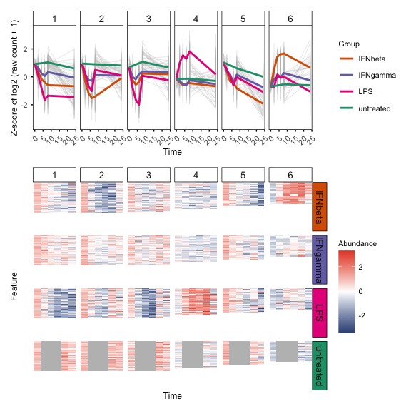

### Enrichment of GO terms and drugs

Functions in TiDEomics wrap
[`clusterProfiler::enrichGO()`](https://rdrr.io/pkg/clusterProfiler/man/enrichGO.html)
and
[`clusterProfiler::gseGO()`](https://rdrr.io/pkg/clusterProfiler/man/gseGO.html)(Yu
2024; Xu et al. 2024; Wu et al. 2021; Yu et al. 2012) to run GO
enrichment efficiently on gene sets and ranked gene list.

For ranked gene list (e.g., ranked by Time or Group contribution from
variance decomposition), use
[`enrichGO_rank()`](https://hte123.github.io/TiDEomics/reference/enrichGO_rank.md)
and plot with
[`enrichplot::gseaplot2()`](https://rdrr.io/pkg/enrichplot/man/gseaplot2.html).

``` r

gse_group <- enrichGO_rank(var_decomp, 
    gene_rank_by = "Group", 
    OrgDb = org.Mm.eg.db,
    keyType = "SYMBOL", category = "BP",
    go_rank_by = "p.adjust")
#> 
#> Warning in gsea(geneList = geneList, gene_sets = geneSets, minGSSize =
#> minGSSize, : There were 3591 pathways for which P-values were not calculated
#> properly due to unbalanced gene-level statistic values. For such pathways
#> pvalue, NES and log2err are set to NA. You can try to increase nPermSimple.
#> Warning in calculate_qvalue(gsea_res$pvalue): Invalid p-values detected (NA,
#> non-finite, <0, or >1). qvalue will be computed on valid p-values only.
#> Warning in enrichit::gsea_gson(geneList = geneList, exponent = exponent, : NA
#> values detected in gene set IDs. Replacing with string 'NA'.
#> Warning in enrichit::gsea_gson(geneList = geneList, exponent = exponent, :
#> Duplicate gene set IDs detected: NA... (Total 1). Unique suffixes added.
#> Removing NA ID gene sets.

enrichplot::gseaplot2(gse_group, geneSetID = 1:3, base_size = 8) 
```

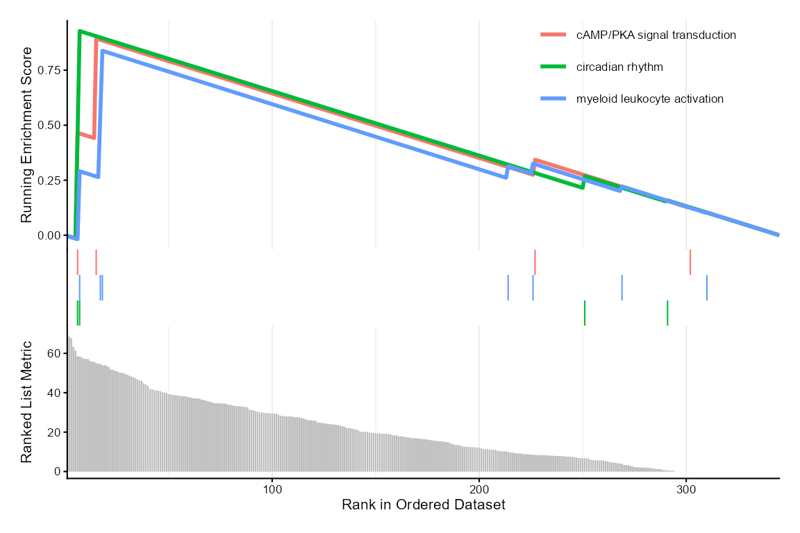

For multiple defined gene sets (e.g. WGCNA modules, DE genes by feature
classification), use
[`enrichGO_list()`](https://hte123.github.io/TiDEomics/reference/enrichGO_list.md)
and plot with
[`plot_GO()`](https://hte123.github.io/TiDEomics/reference/plot_GO.md).

Optionally, use `simplify = TRUE` with
[`enrichGO_list()`](https://hte123.github.io/TiDEomics/reference/enrichGO_list.md)
to simplify the GO results by removing redundant terms (default: FALSE).

``` r

background_wgcna <- gene_module$Feature
module_list <- gene_module %>%
    dplyr::filter(Module != 0) %>%
    split(as.character(.$Module)) %>%
    lapply(`[[`, "Feature")

go_list <- enrichGO_list(
    gene_list = module_list, OrgDb = org.Mm.eg.db,
    universe = background_wgcna,
    pvalueCutoff = 0.9, # get more results for demonstration
    qvalueCutoff = 0.9,
    simplify = FALSE,
    keyType = "SYMBOL"
)
#> GO category not specified. Using all three: BP, MF, CC.
#> Performing GO enrichment for category: BP
#> Processing gene list: 1
#> 'select()' returned 1:1 mapping between keys and columns
#> 'select()' returned 1:1 mapping between keys and columns
#> Warning in bitr(gene, fromType = fromType, toType = "ENTREZID", OrgDb = OrgDb):
#> 0.78% of input gene IDs are fail to map...
#> Processing gene list: 2
#> 'select()' returned 1:1 mapping between keys and columns
#> 'select()' returned 1:1 mapping between keys and columns
#> Warning in bitr(gene, fromType = fromType, toType = "ENTREZID", OrgDb = OrgDb):
#> 0.78% of input gene IDs are fail to map...
#> Processing gene list: 3
#> 'select()' returned 1:1 mapping between keys and columns
#> Warning in bitr(gene, fromType = fromType, toType = "ENTREZID", OrgDb = OrgDb):
#> 4.44% of input gene IDs are fail to map...
#> 'select()' returned 1:1 mapping between keys and columns
#> Warning in bitr(gene, fromType = fromType, toType = "ENTREZID", OrgDb = OrgDb):
#> 0.78% of input gene IDs are fail to map...
#> Processing gene list: 4
#> 'select()' returned 1:1 mapping between keys and columns
#> 'select()' returned 1:1 mapping between keys and columns
#> Warning in bitr(gene, fromType = fromType, toType = "ENTREZID", OrgDb = OrgDb):
#> 0.78% of input gene IDs are fail to map...
#> Processing gene list: 5
#> 'select()' returned 1:1 mapping between keys and columns
#> 'select()' returned 1:1 mapping between keys and columns
#> Warning in bitr(gene, fromType = fromType, toType = "ENTREZID", OrgDb = OrgDb):
#> 0.78% of input gene IDs are fail to map...
#> Processing gene list: 6
#> 'select()' returned 1:1 mapping between keys and columns
#> 'select()' returned 1:1 mapping between keys and columns
#> Warning in bitr(gene, fromType = fromType, toType = "ENTREZID", OrgDb = OrgDb):
#> 0.78% of input gene IDs are fail to map...
#> Performing GO enrichment for category: MF
#> Processing gene list: 1
#> 'select()' returned 1:1 mapping between keys and columns
#> 'select()' returned 1:1 mapping between keys and columns
#> Warning in bitr(gene, fromType = fromType, toType = "ENTREZID", OrgDb = OrgDb):
#> 0.78% of input gene IDs are fail to map...
#> Processing gene list: 2
#> 'select()' returned 1:1 mapping between keys and columns
#> 'select()' returned 1:1 mapping between keys and columns
#> Warning in bitr(gene, fromType = fromType, toType = "ENTREZID", OrgDb = OrgDb):
#> 0.78% of input gene IDs are fail to map...
#> Processing gene list: 3
#> 'select()' returned 1:1 mapping between keys and columns
#> Warning in bitr(gene, fromType = fromType, toType = "ENTREZID", OrgDb = OrgDb):
#> 4.44% of input gene IDs are fail to map...
#> 'select()' returned 1:1 mapping between keys and columns
#> Warning in bitr(gene, fromType = fromType, toType = "ENTREZID", OrgDb = OrgDb):
#> 0.78% of input gene IDs are fail to map...
#> Processing gene list: 4
#> 'select()' returned 1:1 mapping between keys and columns
#> 'select()' returned 1:1 mapping between keys and columns
#> Warning in bitr(gene, fromType = fromType, toType = "ENTREZID", OrgDb = OrgDb):
#> 0.78% of input gene IDs are fail to map...
#> Processing gene list: 5
#> 'select()' returned 1:1 mapping between keys and columns
#> 'select()' returned 1:1 mapping between keys and columns
#> Warning in bitr(gene, fromType = fromType, toType = "ENTREZID", OrgDb = OrgDb):
#> 0.78% of input gene IDs are fail to map...
#> Processing gene list: 6
#> 'select()' returned 1:1 mapping between keys and columns
#> 'select()' returned 1:1 mapping between keys and columns
#> Warning in bitr(gene, fromType = fromType, toType = "ENTREZID", OrgDb = OrgDb):
#> 0.78% of input gene IDs are fail to map...
#> Performing GO enrichment for category: CC
#> Processing gene list: 1
#> 'select()' returned 1:1 mapping between keys and columns
#> 'select()' returned 1:1 mapping between keys and columns
#> Warning in bitr(gene, fromType = fromType, toType = "ENTREZID", OrgDb = OrgDb):
#> 0.78% of input gene IDs are fail to map...
#> Processing gene list: 2
#> 'select()' returned 1:1 mapping between keys and columns
#> 'select()' returned 1:1 mapping between keys and columns
#> Warning in bitr(gene, fromType = fromType, toType = "ENTREZID", OrgDb = OrgDb):
#> 0.78% of input gene IDs are fail to map...
#> Processing gene list: 3
#> 'select()' returned 1:1 mapping between keys and columns
#> Warning in bitr(gene, fromType = fromType, toType = "ENTREZID", OrgDb = OrgDb):
#> 4.44% of input gene IDs are fail to map...
#> 'select()' returned 1:1 mapping between keys and columns
#> Warning in bitr(gene, fromType = fromType, toType = "ENTREZID", OrgDb = OrgDb):
#> 0.78% of input gene IDs are fail to map...
#> Processing gene list: 4
#> 'select()' returned 1:1 mapping between keys and columns
#> 'select()' returned 1:1 mapping between keys and columns
#> Warning in bitr(gene, fromType = fromType, toType = "ENTREZID", OrgDb = OrgDb):
#> 0.78% of input gene IDs are fail to map...
#> Processing gene list: 5
#> 'select()' returned 1:1 mapping between keys and columns
#> 'select()' returned 1:1 mapping between keys and columns
#> Warning in bitr(gene, fromType = fromType, toType = "ENTREZID", OrgDb = OrgDb):
#> 0.78% of input gene IDs are fail to map...
#> Processing gene list: 6
#> 'select()' returned 1:1 mapping between keys and columns
#> 'select()' returned 1:1 mapping between keys and columns
#> Warning in bitr(gene, fromType = fromType, toType = "ENTREZID", OrgDb = OrgDb):
#> 0.78% of input gene IDs are fail to map...
#> Merging GO enrichment results across gene lists for each category.
plot_GO(go_list$all, plot_dotplot = TRUE, 
    plot_emapplot = FALSE,
    plot_cnetplot = FALSE,
    showCategory_dotplot = 3)
```

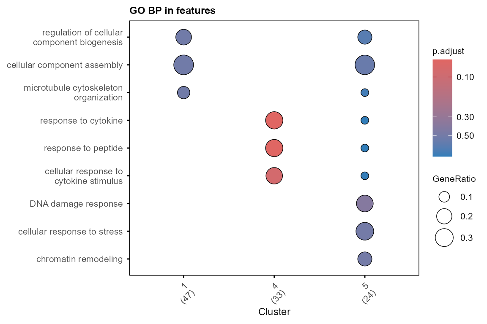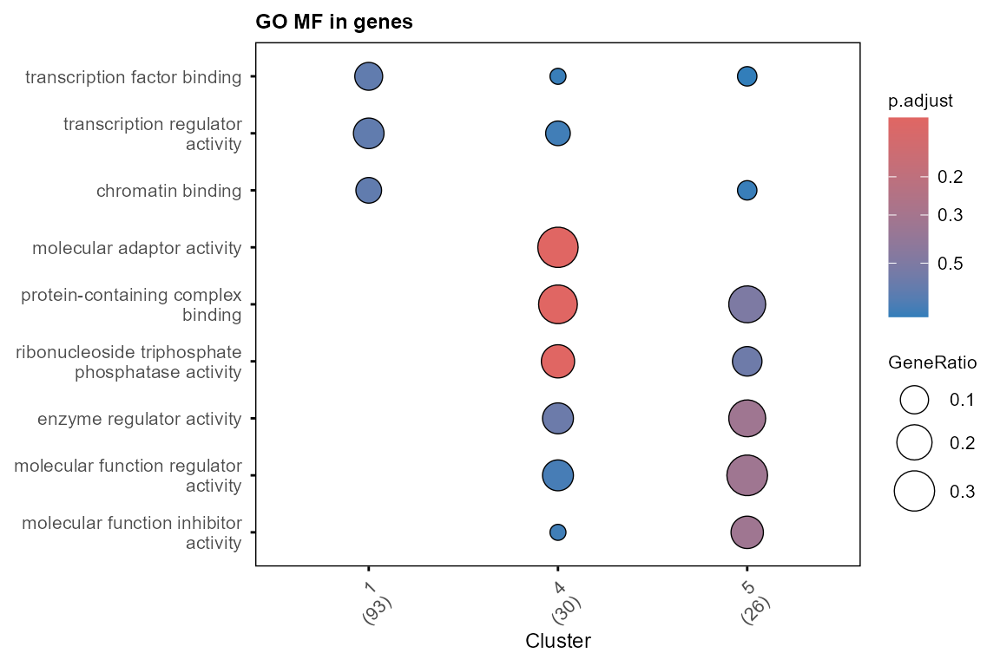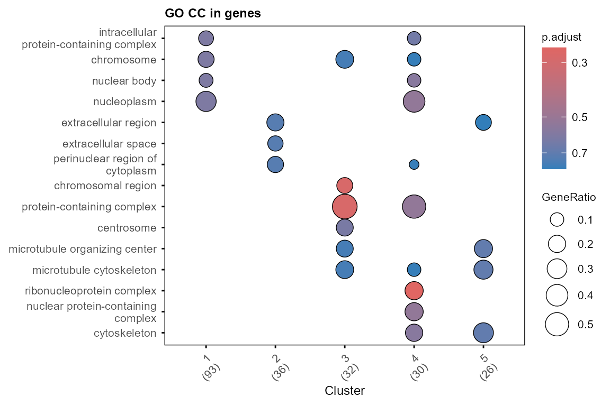

Enriched GO terms can be added to the module profile plot with
[`plot_modules_h()`](https://hte123.github.io/TiDEomics/reference/plot_modules_h.md),
which is similar to
[`plot_modules_v()`](https://hte123.github.io/TiDEomics/reference/plot_modules_v.md)
above but horizontally aligned with annotation of the modules with their
top enriched GO terms. The plotting function is adapted from ClusterGVis
package (Zhang et al. 2026).

``` r

plot_modules_h(gene_module %>% dplyr::filter(Module != 0), 
    data_obj_merged, scale = TRUE,
    ylabel = "Z-score of log2 (raw count + 1)",
    go_list = go_list$all,
    go_category = "BP",
    heatmap_width = 6,
    heatmap_height = 8
)
#> Warning: Removed 141 rows containing non-finite outside the scale range
#> (`stat_summary()`).
#> Removed 141 rows containing non-finite outside the scale range
#> (`stat_summary()`).
#> Warning: Removed 135 rows containing non-finite outside the scale range
#> (`stat_summary()`).
#> Warning: Removed 108 rows containing non-finite outside the scale range
#> (`stat_summary()`).
#> Warning: Removed 87 rows containing non-finite outside the scale range
#> (`stat_summary()`).
#> Warning: Removed 69 rows containing non-finite outside the scale range
#> (`stat_summary()`).
```

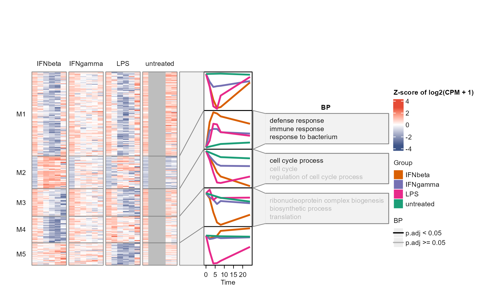

With human genes, use
[`enrich_drug_list()`](https://hte123.github.io/TiDEomics/reference/enrich_drug_list.md)
for drug enrichment with `enrichR` package. Input should be gene
symbols. Available drug databases can be checked with
[`enrichR::listEnrichrDbs()`](https://rdrr.io/pkg/enrichR/man/listEnrichrDbs.html).

### Universal: plot features of interest

Selected features can be plotted with
[`plot_trend()`](https://hte123.github.io/TiDEomics/reference/plot_trend.md),
which shows the mean and standard deviation of replicates at each time
point. Input should be the output of
[`calc_mean_sd()`](https://hte123.github.io/TiDEomics/reference/calc_mean_sd.md),
which calculates the mean and standard deviation of replicates for each
feature at each time point.

``` r

table_mean_sd_list <- calc_mean_sd(data_obj)
table_mean_sd_orig <- table_mean_sd_list$orig
table_mean_sd_norm <- table_mean_sd_list$norm0

plot_trend(table_mean_sd_orig, features = c("Fosb", "Il23a", "Cd69", "Actb"),
    title = "Example features")
#> Group not specified. Plotting all groups: IFNbeta, IFNgamma, LPS, untreated
#> Warning: Removed 12 rows containing missing values or values outside the scale range
#> (`geom_point()`).
```

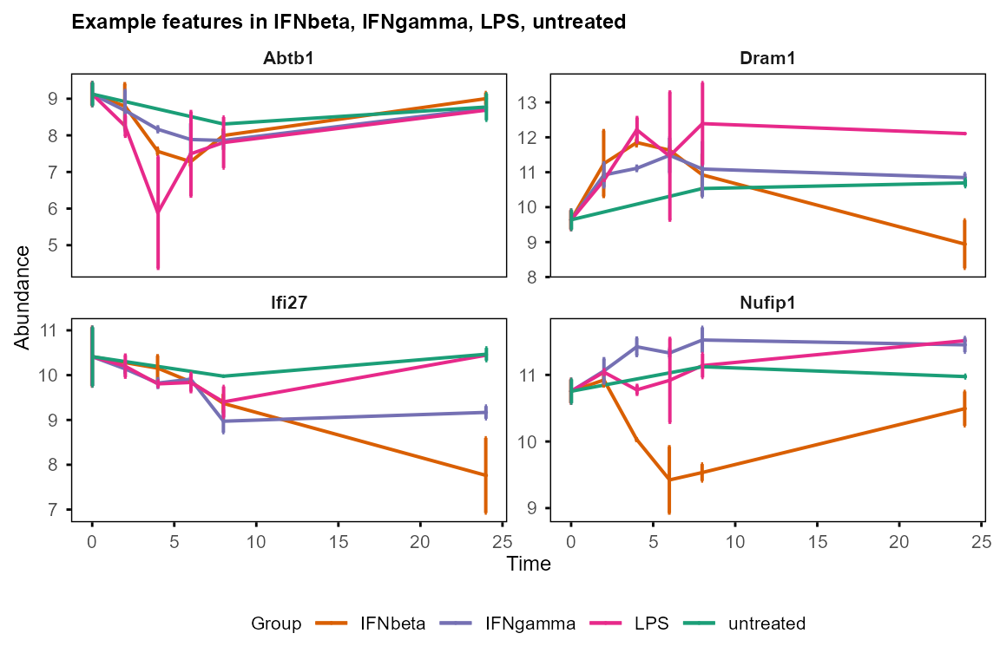

``` r

plot_trend(table_mean_sd_norm, features = c("Fosb", "Il23a", "Cd69", "Actb"),
    title = "Example features with time 0 normalisation")
#> Group not specified. Plotting all groups: IFNbeta, IFNgamma, LPS, untreated
#> Warning: Removed 12 rows containing missing values or values outside the scale range
#> (`geom_point()`).
```

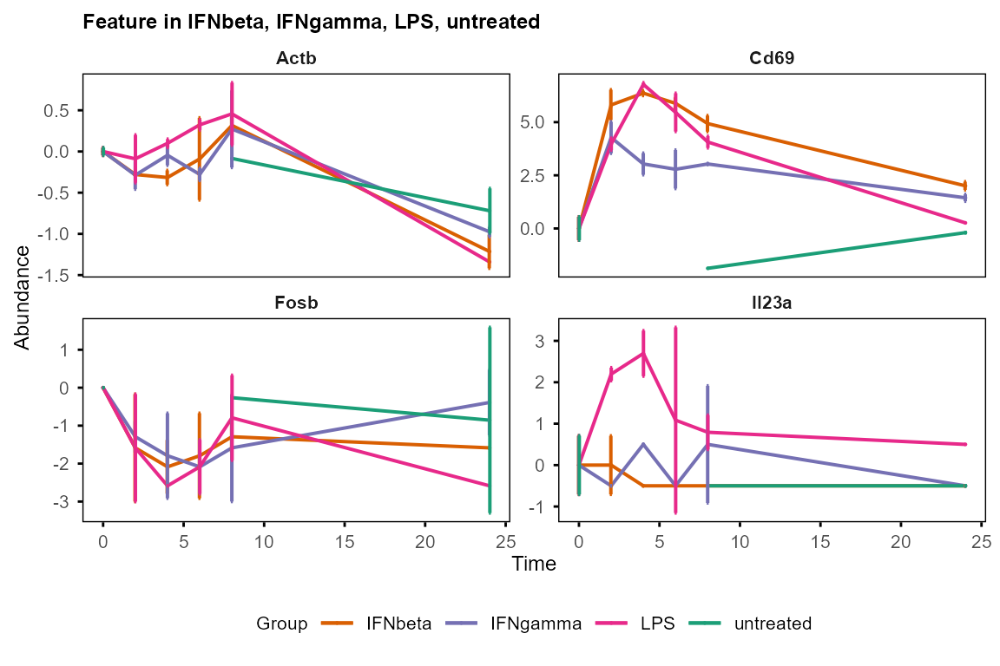

Visualisation of features with high & low residual variance justify the
filtering strategy for WGCNA input.

``` r

plot_trend(table_mean_sd_orig,
    features = var_decomp %>%
        dplyr::arrange(Residual) %>% head(12) %>% dplyr::pull(Feature),
    title = "Features with lowest residual variance"
)
#> Group not specified. Plotting all groups: IFNbeta, IFNgamma, LPS, untreated
#> Warning: Removed 36 rows containing missing values or values outside the scale range
#> (`geom_point()`).
```

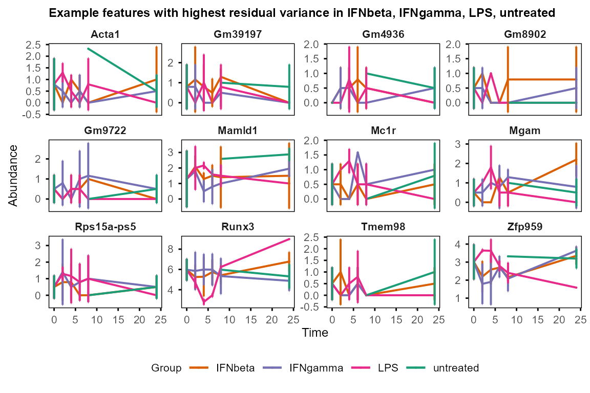

``` r


plot_trend(table_mean_sd_orig,
    features = var_decomp %>%
        dplyr::arrange(desc(Residual)) %>% head(12) %>% dplyr::pull(Feature),
    title = "Features with highest residual variance"
)
#> Group not specified. Plotting all groups: IFNbeta, IFNgamma, LPS, untreated
#> Warning: Removed 36 rows containing missing values or values outside the scale range
#> (`geom_point()`).
```

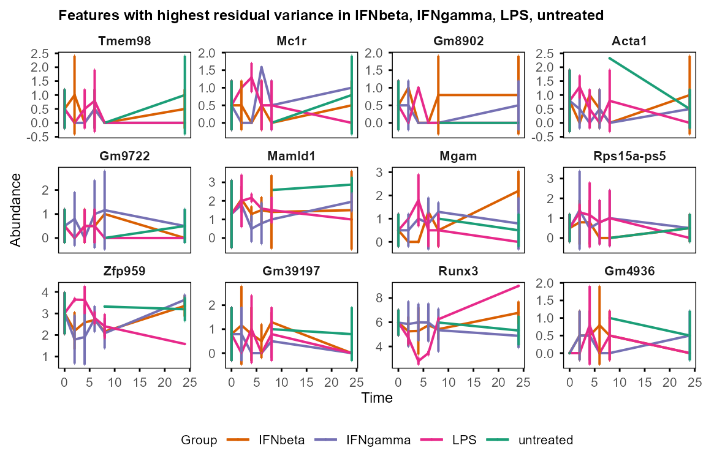

## Common usage scenarios

- Which features change over time in each sample group? →
  [`DE_between_time()`](https://hte123.github.io/TiDEomics/reference/DE_between_time.md),
  [`calc_feature_property()`](https://hte123.github.io/TiDEomics/reference/calc_feature_property.md),
  [`run_Trendy()`](https://hte123.github.io/TiDEomics/reference/run_Trendy.md).

- Which features differ between groups at the same time point? →
  [`DE_between_group()`](https://hte123.github.io/TiDEomics/reference/DE_between_group.md)
  (For time 0, use `assay = 1`; for later time points, use `assay = 1`
  for original input data, or use `assay = 2` for change-from-baseline).

- What is the temporal pattern for individual features? →
  [`run_Trendy()`](https://hte123.github.io/TiDEomics/reference/run_Trendy.md) +
  [`summarise_Trendy()`](https://hte123.github.io/TiDEomics/reference/summarise_Trendy.md) +
  [`extract_segment_trends()`](https://hte123.github.io/TiDEomics/reference/extract_segment_trends.md).

- Which features are noisy vs biologically driven? →
  [`decomp_variance()`](https://hte123.github.io/TiDEomics/reference/decomp_variance.md) +
  [`plot_variance()`](https://hte123.github.io/TiDEomics/reference/plot_variance.md),
  noisiness can be represented by `Residual` variance.

- What co-expression modules are present and what are their temporal
  profiles? →
  [`prepare_WGCNA()`](https://hte123.github.io/TiDEomics/reference/prepare_WGCNA.md) +
  [`run_WGCNA()`](https://hte123.github.io/TiDEomics/reference/run_WGCNA.md) +
  [`plot_modules_v()`](https://hte123.github.io/TiDEomics/reference/plot_modules_v.md)
  or
  [`plot_modules_h()`](https://hte123.github.io/TiDEomics/reference/plot_modules_h.md).

- What biological processes are associated with the genes of interest
  (e.g. co-expression modules, differentially expressed genes in each
  sample group)? →
  [`enrichGO_list()`](https://hte123.github.io/TiDEomics/reference/enrichGO_list.md) +
  [`plot_GO()`](https://hte123.github.io/TiDEomics/reference/plot_GO.md).

- What biological processes are associated with the genes ranked by
  their property (e.g. time or group contributed variance)? →
  [`enrichGO_rank()`](https://hte123.github.io/TiDEomics/reference/enrichGO_rank.md).

- How to normalise the data? →
  [`normalise_to_start()`](https://hte123.github.io/TiDEomics/reference/normalise_to_start.md)
  to focus on changes from baseline; apply global normalisation
  (quantile, median) and batch correction when appropriate, before
  [`create_input()`](https://hte123.github.io/TiDEomics/reference/create_input.md).

- How to handle missing values? →
  [`impute_groups()`](https://hte123.github.io/TiDEomics/reference/impute_groups.md)
  for `run_Trendy`.
  [`plot_pca()`](https://hte123.github.io/TiDEomics/reference/plot_pca.md)
  and
  [`plot_umap()`](https://hte123.github.io/TiDEomics/reference/plot_umap.md)
  automatically excluded features with missing values.
  [`prepare_WGCNA()`](https://hte123.github.io/TiDEomics/reference/prepare_WGCNA.md)
  filter out features with too many missing values.

## Session information

``` r

sessionInfo()
```

```
#> R version 4.6.0 (2026-04-24 ucrt)
#> Platform: x86_64-w64-mingw32/x64
#> Running under: Windows 11 x64 (build 26100)
#> 
#> Matrix products: default
#>   LAPACK version 3.12.1
#> 
#> locale:
#> [1] LC_COLLATE=English_United Kingdom.utf8 
#> [2] LC_CTYPE=English_United Kingdom.utf8   
#> [3] LC_MONETARY=English_United Kingdom.utf8
#> [4] LC_NUMERIC=C                           
#> [5] LC_TIME=English_United Kingdom.utf8    
#> 
#> time zone: Europe/London
#> tzcode source: internal
#> 
#> attached base packages:
#> [1] stats4    stats     graphics  grDevices utils     datasets  methods  
#> [8] base     
#> 
#> other attached packages:
#>  [1] org.Mm.eg.db_3.23.0         AnnotationDbi_1.75.0       
#>  [3] SummarizedExperiment_1.43.0 Biobase_2.73.0             
#>  [5] GenomicRanges_1.65.0        Seqinfo_1.3.0              
#>  [7] IRanges_2.47.0              S4Vectors_0.51.0           
#>  [9] BiocGenerics_0.59.0         generics_0.1.4             
#> [11] MatrixGenerics_1.25.0       matrixStats_1.5.0          
#> [13] magrittr_2.0.5              TiDEomics_0.99.0           
#> [15] BiocStyle_2.41.0           
#> 
#> loaded via a namespace (and not attached):
#>   [1] segmented_2.2-1           fs_2.1.0                 
#>   [3] bitops_1.0-9              enrichplot_1.33.0        
#>   [5] httr_1.4.8                RColorBrewer_1.1-3       
#>   [7] doParallel_1.0.17         ggsci_5.0.0              
#>   [9] dynamicTreeCut_1.63-1     tools_4.6.0              
#>  [11] backports_1.5.1           utf8_1.2.6               
#>  [13] R6_2.6.1                  lazyeval_0.2.3           
#>  [15] GetoptLong_1.1.1          withr_3.0.2              
#>  [17] gridExtra_2.3             preprocessCore_1.75.0    
#>  [19] WGCNA_1.74                cli_3.6.6                
#>  [21] textshaping_1.0.5         scatterpie_0.2.6         
#>  [23] labeling_0.4.3            sass_0.4.10              
#>  [25] S7_0.2.2                  ggridges_0.5.7           
#>  [27] pbapply_1.7-4             askpass_1.2.1            
#>  [29] pkgdown_2.2.0             systemfonts_1.3.2        
#>  [31] yulab.utils_0.2.4         gson_0.1.0               
#>  [33] foreign_0.8-91            DOSE_4.7.0               
#>  [35] limma_3.69.0              rstudioapi_0.18.0        
#>  [37] impute_1.87.0             RSQLite_2.4.6            
#>  [39] gridGraphics_0.5-1        shape_1.4.6.1            
#>  [41] gtools_3.9.5              crosstalk_1.2.2          
#>  [43] car_3.1-5                 dplyr_1.2.1              
#>  [45] GO.db_3.23.1              Matrix_1.7-5             
#>  [47] abind_1.4-8               PCAtools_2.25.0          
#>  [49] lifecycle_1.0.5           yaml_2.3.12              
#>  [51] carData_3.0-6             qvalue_2.45.0            
#>  [53] gplots_3.3.0              SparseArray_1.13.0       
#>  [55] grid_4.6.0                blob_1.3.0               
#>  [57] promises_1.5.0            dqrng_0.4.1              
#>  [59] crayon_1.5.3              ggtangle_0.1.2           
#>  [61] lattice_0.22-9            beachmat_2.29.0          
#>  [63] cowplot_1.2.0             KEGGREST_1.53.0          
#>  [65] pillar_1.11.1             knitr_1.51               
#>  [67] ComplexHeatmap_2.29.0     rjson_0.2.23             
#>  [69] boot_1.3-32               codetools_0.2-20         
#>  [71] glue_1.8.1                ggiraph_0.9.6            
#>  [73] fontLiberation_0.1.0      ggfun_0.2.0              
#>  [75] data.table_1.18.2.1       treeio_1.37.0            
#>  [77] vctrs_0.7.3               png_0.1-9                
#>  [79] Rdpack_2.6.6              gtable_0.3.6             
#>  [81] cachem_1.1.0              xfun_0.57                
#>  [83] rbibutils_2.4.1           S4Arrays_1.13.0          
#>  [85] mime_0.13                 reformulas_0.4.4         
#>  [87] survival_3.8-6            aisdk_1.1.0              
#>  [89] iterators_1.0.14          statmod_1.5.1            
#>  [91] nlme_3.1-169              ggtree_4.3.0             
#>  [93] fontquiver_0.2.1          bit64_4.8.0              
#>  [95] bslib_0.10.0              irlba_2.3.7              
#>  [97] KernSmooth_2.23-26        otel_0.2.0               
#>  [99] rpart_4.1.27              colorspace_2.1-2         
#> [101] DBI_1.3.0                 Hmisc_5.2-5              
#> [103] nnet_7.3-20               tidyselect_1.2.1         
#> [105] processx_3.9.0            bit_4.6.0                
#> [107] compiler_4.6.0            httr2_1.2.2              
#> [109] htmlTable_2.5.0           fontBitstreamVera_0.1.1  
#> [111] randtests_1.0.2           desc_1.4.3               
#> [113] DelayedArray_0.39.0       plotly_4.12.0            
#> [115] bookdown_0.46             checkmate_2.3.4          
#> [117] scales_1.4.0              caTools_1.18.3           
#> [119] callr_3.7.6               rappdirs_0.3.4           
#> [121] stringr_1.6.0             digest_0.6.39            
#> [123] minqa_1.2.8               rmarkdown_2.31           
#> [125] XVector_0.53.0            htmltools_0.5.9          
#> [127] pkgconfig_2.0.3           base64enc_0.1-6          
#> [129] lme4_2.0-1                umap_0.2.10.0            
#> [131] sparseMatrixStats_1.25.0  fastmap_1.2.0            
#> [133] rlang_1.2.0               GlobalOptions_0.1.4      
#> [135] htmlwidgets_1.6.4         shiny_1.13.0             
#> [137] DelayedMatrixStats_1.35.0 ggh4x_0.3.1              
#> [139] farver_2.1.2              jquerylib_0.1.4          
#> [141] jsonlite_2.0.0            BiocParallel_1.47.0      
#> [143] GOSemSim_2.39.0           BiocSingular_1.29.0      
#> [145] Formula_1.2-5             ggplotify_0.1.3          
#> [147] patchwork_1.3.2           Rcpp_1.1.1-1.1           
#> [149] gdtools_0.5.0             ape_5.8-1                
#> [151] ggnewscale_0.5.2          reticulate_1.46.0        
#> [153] stringi_1.8.7             MASS_7.3-65              
#> [155] plyr_1.8.9                shinyFiles_0.9.3         
#> [157] parallel_4.6.0            ggrepel_0.9.8            
#> [159] Biostrings_2.81.0         splines_4.6.0            
#> [161] circlize_0.4.18           igraph_2.3.0             
#> [163] ggpubr_0.6.3              fastcluster_1.3.0        
#> [165] enrichit_0.1.4            ggsignif_0.6.4           
#> [167] reshape2_1.4.5            ScaledMatrix_1.21.0      
#> [169] evaluate_1.0.5            BiocManager_1.30.27      
#> [171] nloptr_2.2.1              foreach_1.5.2            
#> [173] tweenr_2.0.3              httpuv_1.6.17            
#> [175] tidyr_1.3.2               openssl_2.4.0            
#> [177] purrr_1.2.2               polyclip_1.10-7          
#> [179] clue_0.3-68               ggplot2_4.0.3            
#> [181] Trendy_1.35.0             ggforce_0.5.0            
#> [183] rsvd_1.0.5                broom_1.0.12             
#> [185] xtable_1.8-8              tidytree_0.4.7           
#> [187] RSpectra_0.16-2           tidydr_0.0.6             
#> [189] rstatix_0.7.3             later_1.4.8              
#> [191] viridisLite_0.4.3         ragg_1.5.2               
#> [193] tibble_3.3.1              aplot_0.2.9              
#> [195] clusterProfiler_4.21.0    memoise_2.0.1            
#> [197] cluster_2.1.8.2
```

## References

Bacher, Rhonda, Ning Leng, Li-Fang Chu, et al. 2018. “Trendy: Segmented
Regression Analysis of Expression Dynamics in High-Throughput Ordered
Profiling Experiments.” *BMC Bioinformatics*.
<https://bmcbioinformatics.biomedcentral.com/articles/10.1186/s12859-018-2405-x>.

Gu, Zuguang. 2022. “Complex Heatmap Visualization.” *iMeta*, ahead of
print. <https://doi.org/10.1002/imt2.43>.

Gu, Zuguang, Roland Eils, and Matthias Schlesner. 2016. “Complex
Heatmaps Reveal Patterns and Correlations in Multidimensional Genomic
Data.” *Bioinformatics*, ahead of print.
<https://doi.org/10.1093/bioinformatics/btw313>.

Huber, W., Carey, et al. 2015. “Orchestrating High-Throughput Genomic
Analysis with Bioconductor.” *Nature Methods* 12 (2): 115–21.
[http://www.nature.com/nmeth/journal/v12/n2/full/nmeth.3252.html](http://www.nature.com/nmeth/journal/v12/n2/full/nmeth.3252.md).

Langfelder, Peter, and Steve Horvath. 2008. “WGCNA: An r Package for
Weighted Correlation Network Analysis.” *BMC Bioinformatics*, no. 1:
559. <https://link.springer.com/article/10.1186/1471-2105-9-559>.

Langfelder, Peter, and Steve Horvath. 2012. “Fast R Functions for Robust
Correlations and Hierarchical Clustering.” *Journal of Statistical
Software* 46 (11): 1–17. <https://www.jstatsoft.org/v46/i11/>.

Ritchie, Matthew E, Belinda Phipson, Di Wu, et al. 2015. “limma Powers
Differential Expression Analyses for RNA-Sequencing and Microarray
Studies.” *Nucleic Acids Research* 43 (7): e47.
<https://doi.org/10.1093/nar/gkv007>.

Traxler, Peter, Stephan Reichl, Lukas Folkman, et al. 2025. “Integrated
Time-Series Analysis and High-Content CRISPR Screening Delineate the
Dynamics of Macrophage Immune Regulation.” *Cell Systems* 16 (8):
101346. https://doi.org/<https://doi.org/10.1016/j.cels.2025.101346>.

Vasaikar, Suhas V, Adam K Savage, Qiuyu Gong, et al. 2023. “A
Comprehensive Platform for Analyzing Longitudinal Multi-Omics Data.”
*Nature Communications* 14 (1): 1684.
<https://www.nature.com/articles/s41467-023-37432-w>.

Wickham, Hadley. 2016. *Ggplot2: Elegant Graphics for Data Analysis*.
Springer-Verlag New York. <https://ggplot2.tidyverse.org>.

Wu, Tianzhi, Erqiang Hu, Shuangbin Xu, et al. 2021. “clusterProfiler
4.0: A Universal Enrichment Tool for Interpreting Omics Data.” *The
Innovation* 2 (3): 100141. <https://doi.org/10.1016/j.xinn.2021.100141>.

Xu, Shuangbin, Erqiang Hu, Yantong Cai, et al. 2024. “Using
clusterProfiler to Characterize Multiomics Data.” *Nature Protocols* 19
(11): 3292–320. <https://doi.org/10.1038/s41596-024-01020-z>.

Yu, Guangchuang. 2024. “Thirteen Years of clusterProfiler.” *The
Innovation* 5 (6): 100722. <https://doi.org/10.1016/j.xinn.2024.100722>.

Yu, Guangchuang, Li-Gen Wang, Yanyan Han, and Qing-Yu He. 2012.
“clusterProfiler: An r Package for Comparing Biological Themes Among
Gene Clusters.” *OMICS: A Journal of Integrative Biology* 16 (5):
284–87. <https://doi.org/10.1089/omi.2011.0118>.

Zhang, Jun, Hongyuan Li, Wenjun Tao, and Jun Zhou. 2026. “ClusterGVis:
An Advanced Visualization and Clustering Tool for Gene Expression
Analysis.” *Genomics, Proteomics & Bioinformatics*, January, qzag005.
<https://doi.org/10.1093/gpbjnl/qzag005>.
