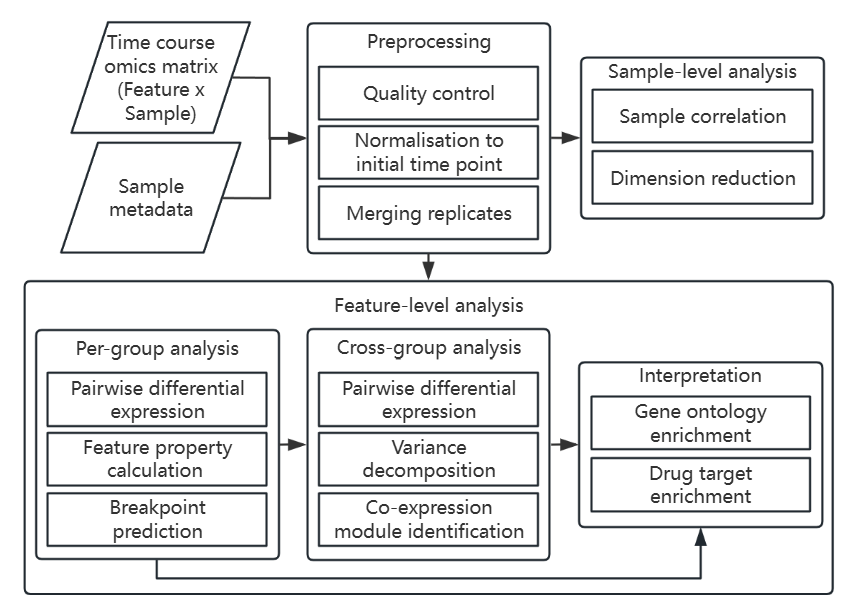

# TiDEomics: Time-course Differential Expression analysis of omics data

`TiDEomics` provides an integrated framework for **Ti**me-course
**D**ifferential **E**xpression analysis of **omics** data with
**multiple experimental groups / conditions**.

`TiDEomics` enables:

- Analysis of feature x sample format data from different omics
  technologies.
- Comparison of multiple (more than two) time courses systematically.
- Filtering of features by residual variance, accounting for group and
  temporal structure.
- Identification of features (e.g. genes, proteins) and pathways
  differentially expressed by **time**, **group**, and **both** factors
  (time x group interactions).
- Integration of quality control, data processing, sample-level and
  feature-level analysis, tailored for time-course multi-condition data.
- Functional enrichment with high-quality visualisation.

Existing time-course analysis tools typically focus on a single analysis
step or are limited to two-group designs or transcriptomics input, and
do not provide an integrated workflow.



Example applications include:

- Transcriptomics analysis of a cell type’s response to different
  stimuli over time.
- Proteomics analysis of wild type and multiple mutant cell lines
  sampled at several time points.

`TiDEomics` supports datasets with missing values (e.g. mass
spectrometry-based proteomics), and operates on `SummarizedExperiment`
objects to ensure compatibility with the Bioconductor ecosystem.

`TiDEomics` supports both independent-sample designs (e.g. cell culture)
and repeated-measures designs (e.g. patient longitudinal studies, via
`subject_col` in
[`create_input()`](https://hte123.github.io/TiDEomics/reference/create_input.md)).
Downstream functions auto-detect the data structure.

## Installation

Get the latest stable `R` release from
[CRAN](http://cran.r-project.org/). Then install `TiDEomics` from
[Bioconductor](http://bioconductor.org/) using the following code:

``` r
if (!requireNamespace("BiocManager", quietly = TRUE)) {
    install.packages("BiocManager")
}

BiocManager::install("TiDEomics")
```

The development version can be installed from
[GitHub](https://github.com/hte123/TiDEomics) with:

``` r
if (!require("remotes", quietly = TRUE)) install.packages("remotes")

remotes::install_github("hte123/TiDEomics")
```

## Example

For detailed examples and explanations, please refer to the
[tutorial](https://hte123.github.io/TiDEomics/articles/TiDEomics.html),
applications and other package documentation.

## Citation

Below is the citation output from using `citation('TiDEomics')` in R.
Please run this yourself to check for any updates on how to cite
**TiDEomics**.

``` r
print(citation("TiDEomics"), bibtex = TRUE)
#> To cite package 'TiDEomics' in publications use:
#> 
#>   He T (2026). _TiDEomics: Time-course Differential Expression analysis
#>   of omics data_. R package version 0.99.2,
#>   <https://github.com/hte123/TiDEomics>.
#> 
#> A BibTeX entry for LaTeX users is
#> 
#>   @Manual{,
#>     title = {TiDEomics: Time-course Differential Expression analysis of omics data},
#>     author = {Tianen He},
#>     year = {2026},
#>     note = {R package version 0.99.2},
#>     url = {https://github.com/hte123/TiDEomics},
#>   }
```

Please note that the `TiDEomics` was only made possible thanks to many
other R and bioinformatics software authors, which are cited either in
the vignettes and/or the paper(s) describing this package.

## Code of Conduct

Please note that the `TiDEomics` project is released with a [Contributor
Code of Conduct](http://bioconductor.org/about/code-of-conduct/). By
contributing to this project, you agree to abide by its terms.

## Development tools

- Continuous code testing is possible thanks to [GitHub
  actions](https://www.tidyverse.org/blog/2020/04/usethis-1-6-0/)
  through *[usethis](https://CRAN.R-project.org/package=usethis)*,
  *[remotes](https://CRAN.R-project.org/package=remotes)*, and
  *[rcmdcheck](https://CRAN.R-project.org/package=rcmdcheck)* customized
  to use [Bioconductor’s docker
  containers](https://www.bioconductor.org/help/docker/) and
  *[BiocCheck](https://bioconductor.org/packages/3.24/BiocCheck)*.
- Code coverage assessment is possible thanks to
  [codecov](https://codecov.io/gh) and
  *[covr](https://CRAN.R-project.org/package=covr)*.
- The [documentation website](http://hte123.github.io/TiDEomics) is
  automatically updated thanks to
  *[pkgdown](https://CRAN.R-project.org/package=pkgdown)*.
- The code is styled automatically thanks to
  *[styler](https://CRAN.R-project.org/package=styler)*.
- The documentation is formatted thanks to
  *[devtools](https://CRAN.R-project.org/package=devtools)* and
  *[roxygen2](https://CRAN.R-project.org/package=roxygen2)*.

This package was developed using
*[biocthis](https://bioconductor.org/packages/3.24/biocthis)*.
